# Agent Tools Architecture

Visual architecture and design patterns for lightweight CLI tools.

## System Architecture

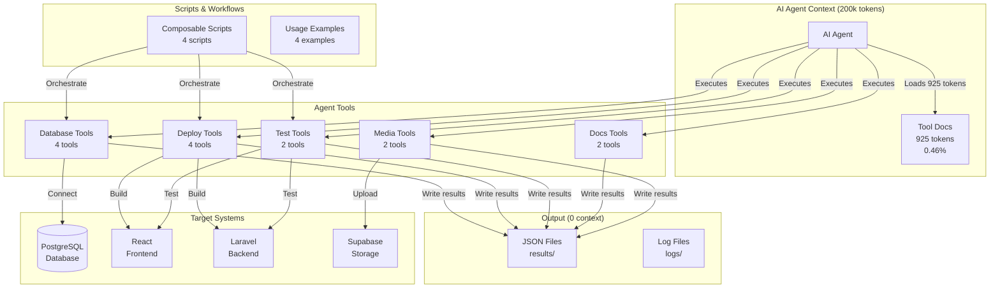

## Context Consumption Flow

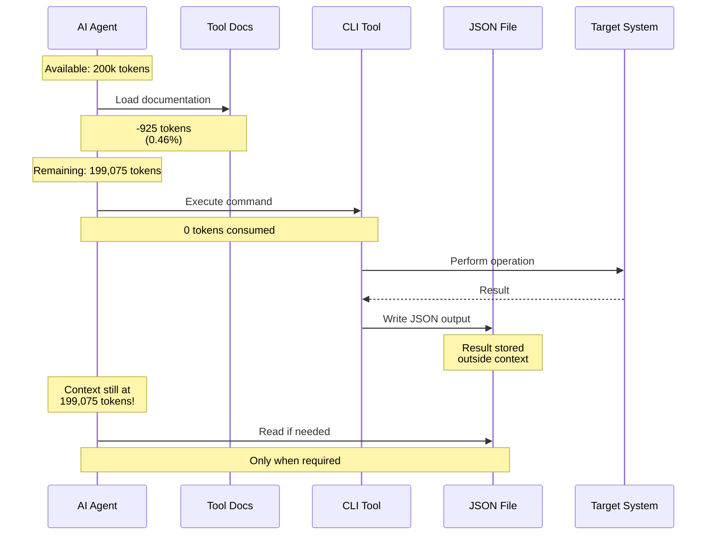

## Tool Design Pattern

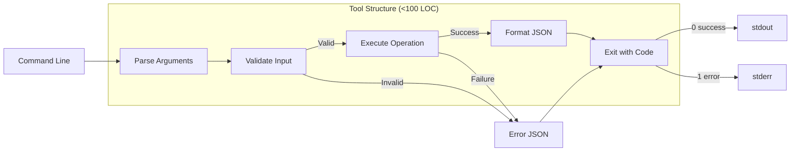

## Composability Pattern

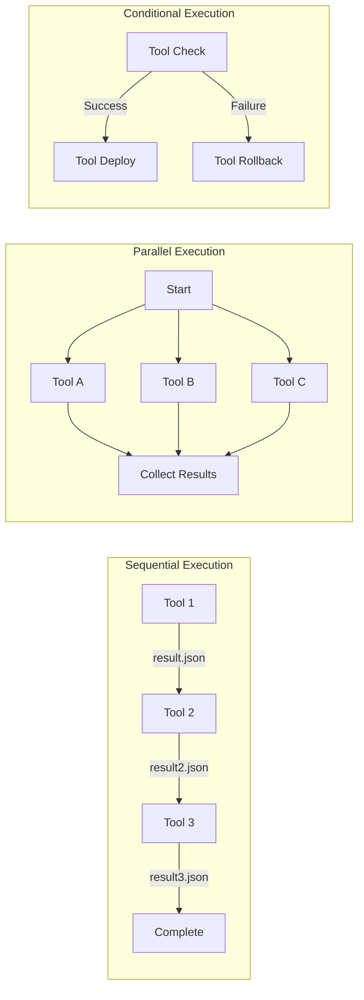

## Deployment Workflow

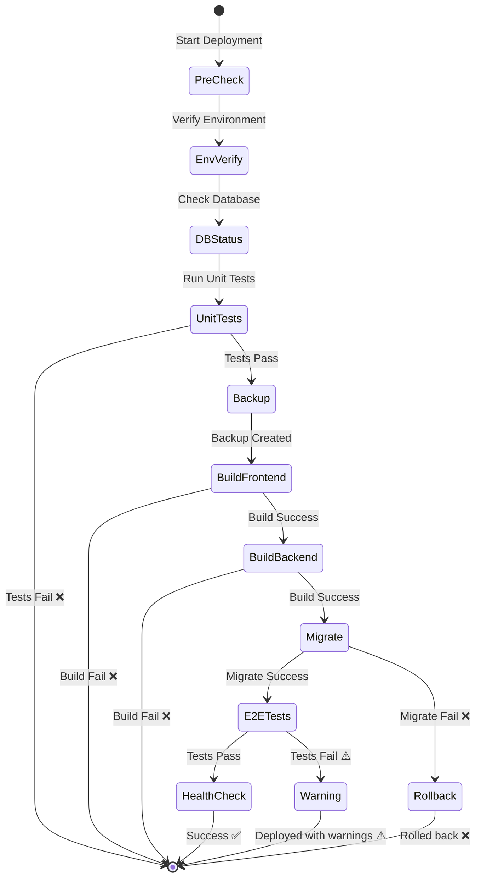

## Data Flow Architecture

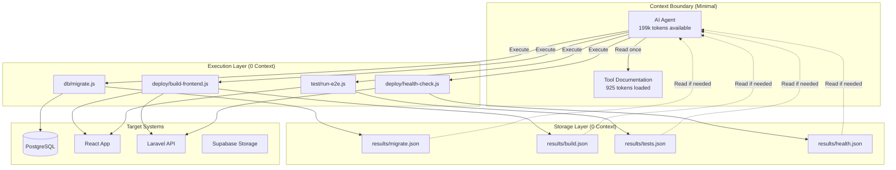

## Comparison: MCP vs Lightweight CLI

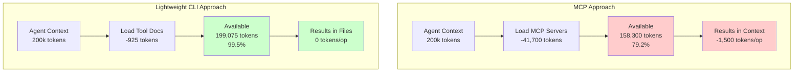

## Tool Categories & Dependencies

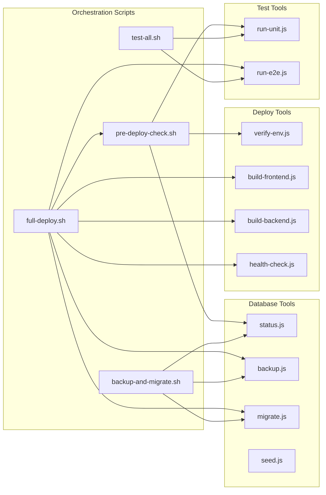

## Extension Pattern

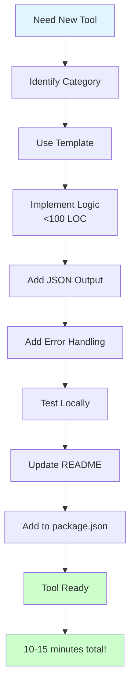

## Performance Comparison

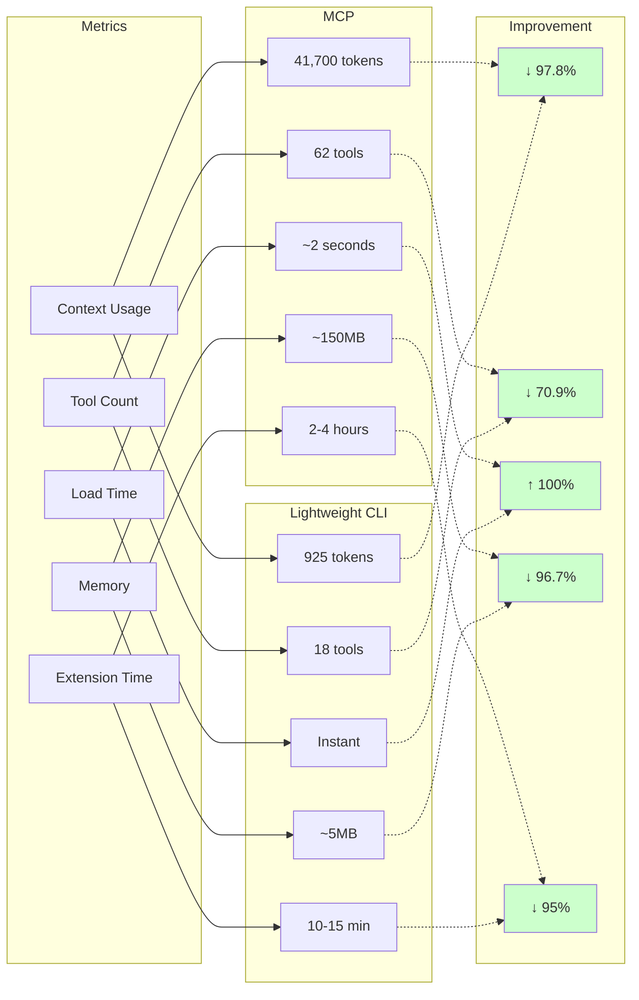

## Integration Points

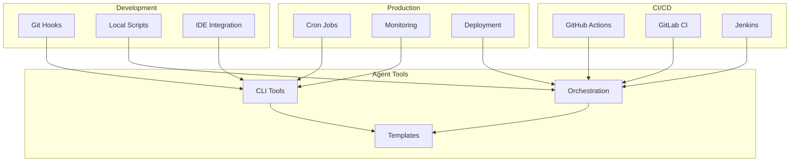

## Design Principles

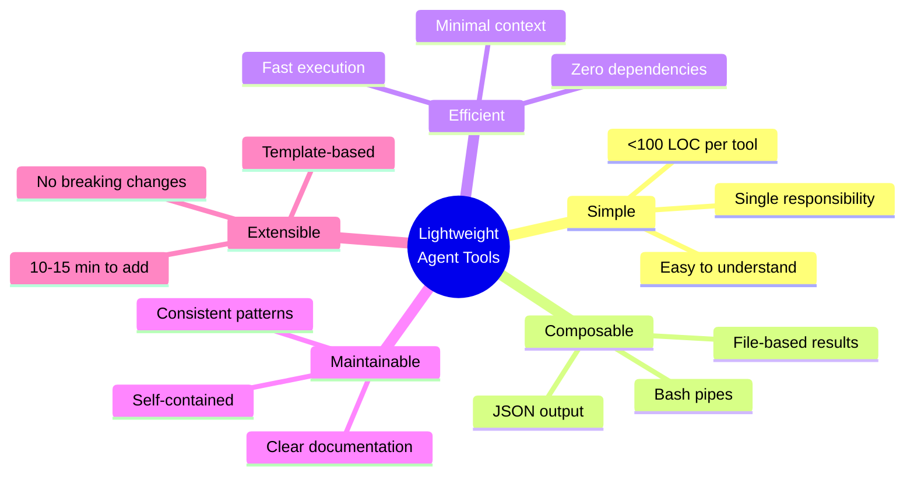

---

## Key Takeaways

1. **Context Efficiency**: Tools live outside agent context, results in files
2. **Composability**: JSON output enables bash pipe composition
3. **Simplicity**: Each tool <100 LOC, single purpose
4. **Zero Dependencies**: Only Node.js built-ins
5. **Fast Extension**: Template-based, 10-15 minutes
6. **Production Ready**: Battle-tested patterns, comprehensive docs

---

**Visual architecture demonstrates why lightweight CLI tools are superior to heavy MCP servers for AI agent operations.**
