# Бизнес-процессы и роли КФА (Кыргызская Финансовая Ассоциация)

> **Версия документа:** 1.0
> **Дата создания:** 2025-10-23
> **Статус:** Актуально

---

## 📑 Оглавление

1. [Введение](#введение)
2. [Иерархия ролей](#иерархия-ролей)
3. [Типы членства](#типы-членства)
4. [Детальное описание ролей](#детальное-описание-ролей)
5. [Бизнес-процессы](#бизнес-процессы)
6. [Матрица прав доступа](#матрица-прав-доступа)
7. [Жизненный цикл пользователя](#жизненный-цикл-пользователя)
8. [API endpoints и авторизация](#api-endpoints-и-авторизация)

---

## Введение

Данный документ описывает структуру ролей, бизнес-процессы и права доступа в системе Кыргызской Финансовой Ассоциации (КФА). Документ предназначен для разработчиков, бизнес-аналитиков и менеджеров проекта.

### Основные цели системы

- **Управление членством** в профессиональной финансовой ассоциации
- **Сертификация специалистов** по международным стандартам CFA
- **Образовательная платформа** для повышения квалификации
- **Управление документооборотом** и платежами

---

## Иерархия ролей

### Диаграмма иерархии

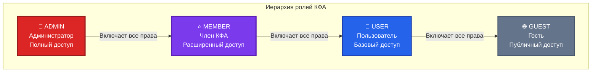

### Принцип наследования прав

Каждая роль **наследует все права** нижестоящих ролей:

- **ADMIN** = MEMBER права + дополнительные администраторские
- **MEMBER** = USER права + дополнительные членские
- **USER** = GUEST права + дополнительные авторизованные

---

## Типы членства

### Виды членства в КФА

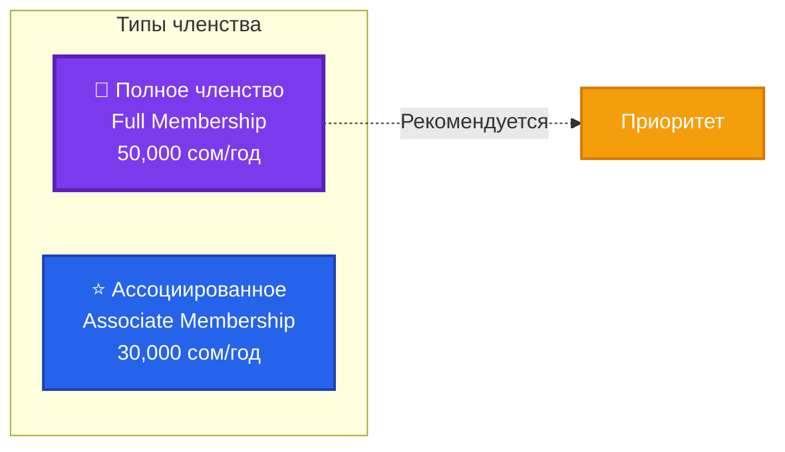

### Сравнение типов членства

| Параметр             | Полное членство      | Ассоциированное       |
| -------------------- | -------------------- | --------------------- |
| **Стоимость**        | 50,000 сом/год       | 30,000 сом/год        |
| **Голосование**      | ✅ Да                | ❌ Нет                |
| **Сертификация CFA** | ✅ Полный доступ     | ✅ Базовый доступ     |
| **Обучение**         | ✅ Все курсы         | ✅ Ограниченный набор |
| **Конференции**      | ✅ Бесплатный доступ | ⚠️ Скидка 50%         |
| **Нетворкинг**       | ✅ VIP доступ        | ✅ Стандартный        |
| **Публикации**       | ✅ Неограниченно     | ⚠️ До 3 в год         |

---

## Детальное описание ролей

### 1. 👤 USER (Пользователь)

#### Общая информация

- **Дефолтная роль**: Да (присваивается при регистрации)
- **Требования**: Email и пароль
- **Статус**: Базовый авторизованный пользователь

#### Возможности USER

##### ✅ ЧТО МОЖЕТ делать USER

**Просмотр контента:**

- ✅ Читать новости и статьи
- ✅ Просматривать публичные события
- ✅ Читать документы и стандарты КФА
- ✅ Просматривать список членов

**Личный кабинет:**

- ✅ Редактировать свой профиль (`/dashboard/profile`)
- ✅ Управлять настройками аккаунта
- ✅ Менять пароль и email
- ✅ Просматривать свою активность

**Взаимодействие:**

- ✅ Задавать вопросы (FAQ)
- ✅ Подавать заявку на членство
- ✅ Регистрироваться на публичные события

##### ❌ ЧТО НЕ МОЖЕТ делать USER

**Контент:**

- ❌ Создавать новости
- ❌ Публиковать статьи
- ❌ Создавать или редактировать события
- ❌ Удалять любой контент

**Dashboard разделы:**

- ❌ Доступ к `/dashboard` (главный dashboard)
- ❌ Доступ к `/dashboard/payments`
- ❌ Доступ к `/dashboard/documents`
- ❌ Доступ к `/dashboard/certificates`
- ❌ Доступ к `/dashboard/education`
- ❌ Доступ к `/dashboard/admin`

**Управление:**

- ❌ Управление другими пользователями
- ❌ Модерация контента
- ❌ Доступ к аналитике

#### Переход из USER в MEMBER

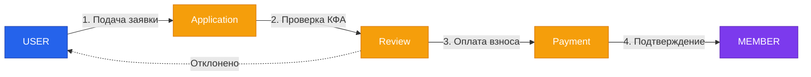

---

### 2. ⭐ MEMBER (Член КФА)

#### Общая информация

- **Статус**: Оплаченное членство в КФА
- **Типы**: Full Member / Associate Member
- **Требования**: Одобренная заявка + оплата взноса
- **Продление**: Ежегодное

#### Возможности MEMBER

##### ✅ ЧТО МОЖЕТ делать MEMBER

**Все права USER +**

**Создание контента:**

- ✅ Создавать новости (`POST /api/news`)
- ✅ Редактировать свои новости (`PUT /api/news/{id}`)
- ✅ Создавать статьи
- ✅ Предлагать события

**Dashboard доступ:**

- ✅ Главный dashboard (`/dashboard`)
- ✅ Управление платежами (`/dashboard/payments`)
- ✅ Управление документами (`/dashboard/documents`)
- ✅ Управление сертификатами (`/dashboard/certificates`)
- ✅ Образовательная платформа (`/dashboard/education`)

**Платежи и документы:**

- ✅ Просмотр истории платежей
- ✅ Скачивание счетов и квитанций
- ✅ Загрузка документов
- ✅ Электронная подпись документов

**Сертификация:**

- ✅ Регистрация на экзамены CFA
- ✅ Доступ к обучающим материалам
- ✅ Получение сертификатов
- ✅ Подтверждение квалификации

**Обучение:**

- ✅ Доступ ко всем курсам
- ✅ Участие в вебинарах
- ✅ Доступ к записям мероприятий
- ✅ Скачивание учебных материалов

**Нетворкинг:**

- ✅ Доступ к каталогу членов с контактами
- ✅ Участие в закрытых мероприятиях
- ✅ Приоритетная регистрация на события
- ✅ Доступ к профессиональному сообществу

##### ❌ ЧТО НЕ МОЖЕТ делать MEMBER

**Удаление контента:**

- ❌ Удалять новости (`DELETE /api/news/{id}`)
- ❌ Удалять события (`DELETE /api/events/{id}`)
- ❌ Удалять статьи других авторов

**Администрирование:**

- ❌ Доступ к admin панели (`/dashboard/admin`)
- ❌ Управление пользователями
- ❌ Модерация контента других членов
- ❌ Изменение настроек системы
- ❌ Доступ к аналитике и отчетам
- ❌ Управление финансами КФА

**Системные операции:**

- ❌ Изменение ролей пользователей
- ❌ Удаление пользователей
- ❌ Массовые операции

#### Виды членства MEMBER

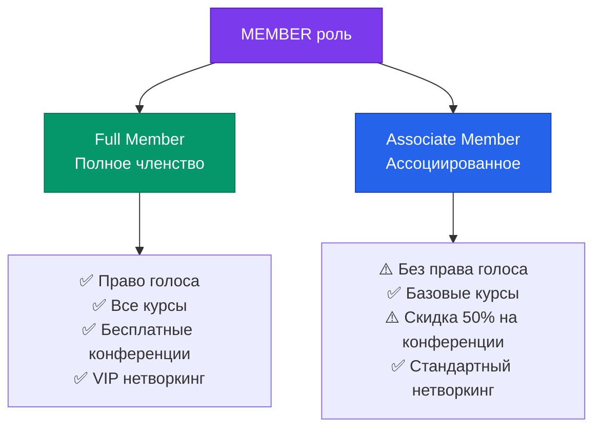

---

### 3. 👑 ADMIN (Администратор)

#### Общая информация

- **Статус**: Полный административный доступ
- **Назначение**: Вручную другим администратором
- **Ответственность**: Управление всей системой КФА

#### Возможности ADMIN

##### ✅ ЧТО МОЖЕТ делать ADMIN

**Все права MEMBER +**

**Управление контентом:**

- ✅ Полный CRUD доступ к новостям (Create, Read, Update, Delete)
- ✅ Полный CRUD доступ к событиям
- ✅ Полный CRUD доступ к документам
- ✅ Модерация и удаление любого контента
- ✅ Публикация/снятие с публикации

**Управление пользователями:**

- ✅ Просмотр всех пользователей
- ✅ Редактирование профилей пользователей
- ✅ Изменение ролей (user → member → admin)
- ✅ Блокировка/разблокировка пользователей
- ✅ Удаление пользователей (с осторожностью)
- ✅ Сброс паролей

**Обработка заявок:**

- ✅ Просмотр заявок на членство
- ✅ Одобрение/отклонение заявок
- ✅ Запрос дополнительных документов
- ✅ Связь с заявителями

**Финансы:**

- ✅ Просмотр всех платежей
- ✅ Подтверждение платежей вручную
- ✅ Возврат средств
- ✅ Генерация финансовых отчетов
- ✅ Управление тарифами и ценами

**Сертификация:**

- ✅ Управление программами сертификации
- ✅ Создание экзаменов
- ✅ Выдача/отзыв сертификатов
- ✅ Валидация квалификаций

**Образование:**

- ✅ Создание курсов и материалов
- ✅ Назначение преподавателей
- ✅ Управление расписанием
- ✅ Мониторинг прогресса обучающихся

**Аналитика и отчетность:**

- ✅ Доступ к статистике и метрикам
- ✅ Генерация отчетов
- ✅ Экспорт данных
- ✅ Аудит действий пользователей

**Системные настройки:**

- ✅ Конфигурация платформы
- ✅ Управление интеграциями
- ✅ Резервное копирование
- ✅ Обновление контента сайта

**Admin Dashboard:**

- ✅ Доступ к `/dashboard/admin`
- ✅ Управление всеми разделами
- ✅ Быстрые действия (Quick Actions)
- ✅ Мониторинг активности

##### ❌ ЧТО НЕ ДОЛЖЕН делать ADMIN (Рекомендации безопасности)

**Критические операции:**

- ⚠️ Удаление всех администраторов (должен остаться минимум 1)
- ⚠️ Массовое удаление пользователей без бэкапа
- ⚠️ Изменение финансовых транзакций напрямую в БД
- ⚠️ Раскрытие персональных данных членов

**Этические ограничения:**

- ❌ Злоупотребление правами доступа
- ❌ Несанкционированный доступ к личной информации
- ❌ Манипуляции с результатами экзаменов
- ❌ Коррупционные действия

---

## Бизнес-процессы

### Процесс регистрации и вступления в КФА

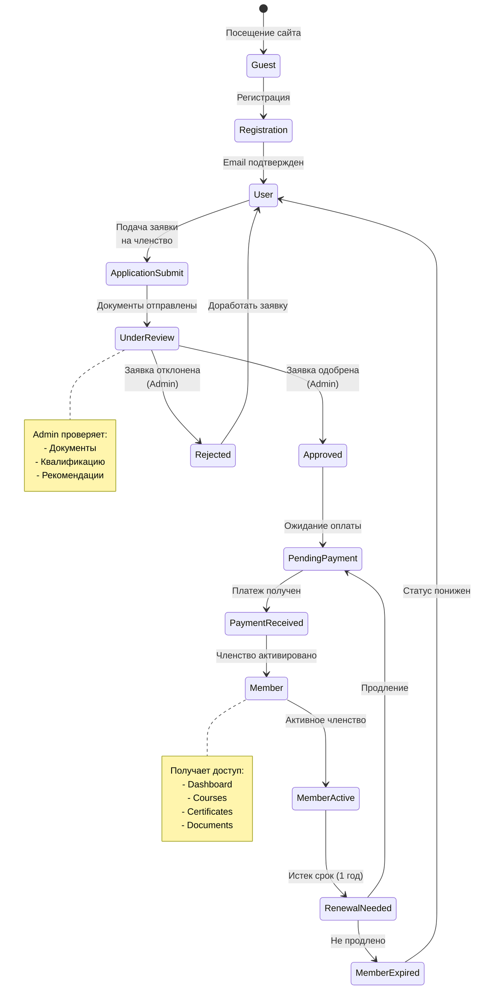

### Жизненный цикл заявки на членство

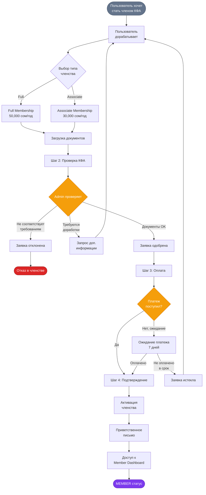

### Процесс сертификации CFA

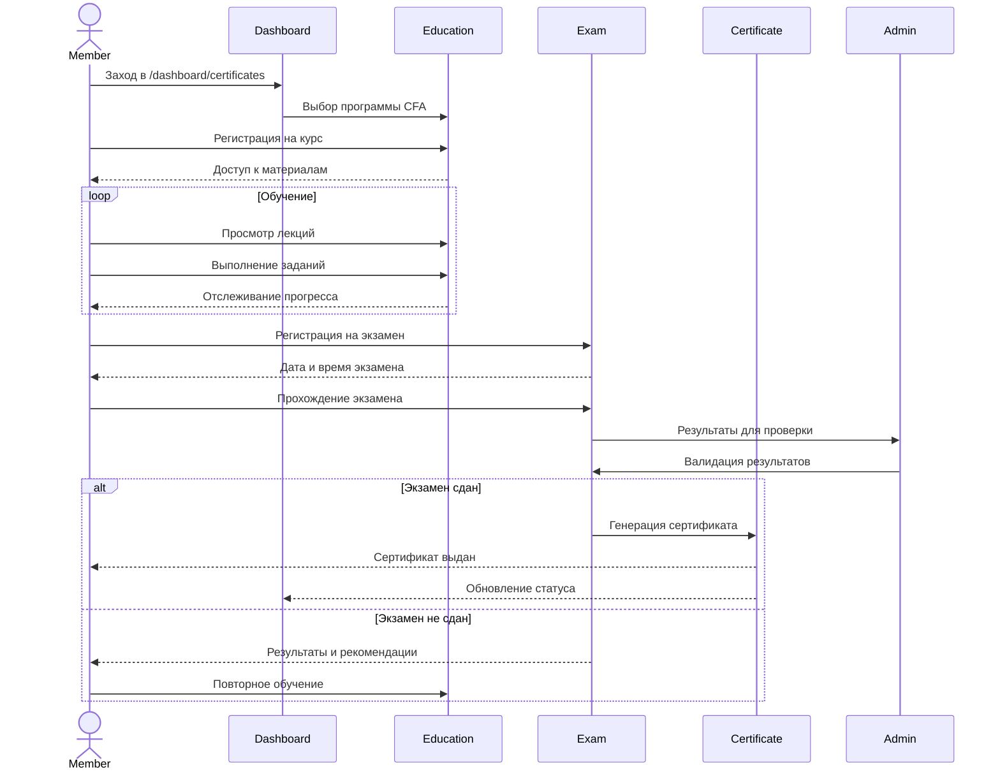

### Процесс управления платежами

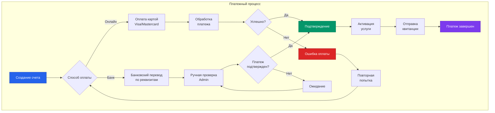

### Процесс создания и модерации контента

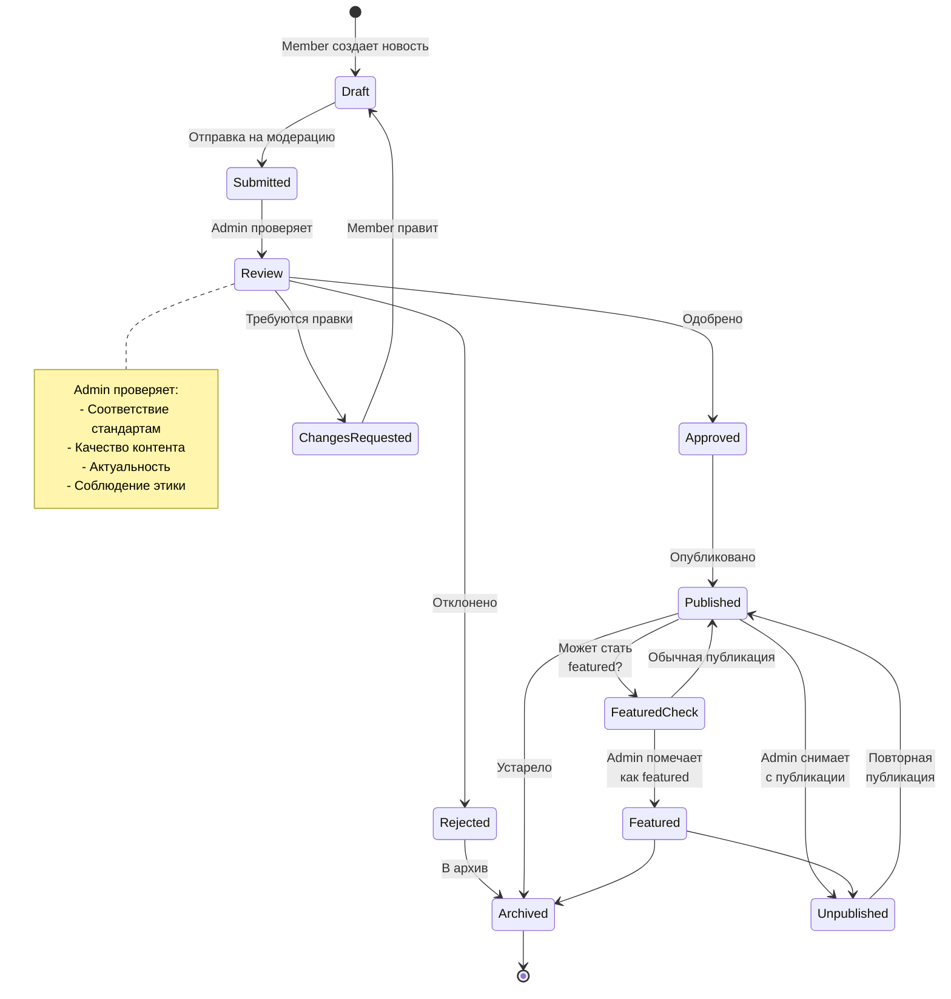

---

## Матрица прав доступа

### Frontend Routes (Страницы)

| Маршрут                     | GUEST | USER | MEMBER | ADMIN |
| --------------------------- | :---: | :--: | :----: | :---: |
| **Публичные страницы**      |
| `/` (Главная)               |  ✅   |  ✅  |   ✅   |  ✅   |
| `/about` (О нас)            |  ✅   |  ✅  |   ✅   |  ✅   |
| `/membership` (Членство)    |  ✅   |  ✅  |   ✅   |  ✅   |
| `/membership/join` (Заявка) |  ✅   |  ✅  |   ✅   |  ✅   |
| `/members` (Члены)          |  ✅   |  ✅  |   ✅   |  ✅   |
| `/news` (Новости)           |  ✅   |  ✅  |   ✅   |  ✅   |
| `/events` (События)         |  ✅   |  ✅  |   ✅   |  ✅   |
| `/education` (Образование)  |  ✅   |  ✅  |   ✅   |  ✅   |
| `/faq` (FAQ)                |  ✅   |  ✅  |   ✅   |  ✅   |
| **Аутентификация**          |
| `/auth/login`               |  ✅   |  ❌  |   ❌   |  ❌   |
| `/auth/register`            |  ✅   |  ❌  |   ❌   |  ❌   |
| `/auth/forgot-password`     |  ✅   |  ✅  |   ✅   |  ✅   |
| **Dashboard**               |
| `/dashboard/profile`        |  ❌   |  ✅  |   ✅   |  ✅   |
| `/dashboard`                |  ❌   |  ❌  |   ✅   |  ✅   |
| `/dashboard/payments`       |  ❌   |  ❌  |   ✅   |  ✅   |
| `/dashboard/documents`      |  ❌   |  ❌  |   ✅   |  ✅   |
| `/dashboard/certificates`   |  ❌   |  ❌  |   ✅   |  ✅   |
| `/dashboard/education`      |  ❌   |  ❌  |   ✅   |  ✅   |
| `/dashboard/admin`          |  ❌   |  ❌  |   ❌   |  ✅   |

### API Endpoints

#### News (Новости)

| Endpoint         | Method | GUEST | USER | MEMBER | ADMIN |
| ---------------- | ------ | :---: | :--: | :----: | :---: |
| `/api/news`      | GET    |  ✅   |  ✅  |   ✅   |  ✅   |
| `/api/news/{id}` | GET    |  ✅   |  ✅  |   ✅   |  ✅   |
| `/api/news`      | POST   |  ❌   |  ❌  |   ✅   |  ✅   |
| `/api/news/{id}` | PUT    |  ❌   |  ❌  |  ✅\*  |  ✅   |
| `/api/news/{id}` | DELETE |  ❌   |  ❌  |   ❌   |  ✅   |

_\*только свои новости_

#### Events (События)

| Endpoint                    | Method | GUEST | USER | MEMBER | ADMIN |
| --------------------------- | ------ | :---: | :--: | :----: | :---: |
| `/api/events`               | GET    |  ✅   |  ✅  |   ✅   |  ✅   |
| `/api/events/{id}`          | GET    |  ✅   |  ✅  |   ✅   |  ✅   |
| `/api/events`               | POST   |  ❌   |  ❌  |   ❌   |  ✅   |
| `/api/events/{id}`          | PUT    |  ❌   |  ❌  |   ❌   |  ✅   |
| `/api/events/{id}`          | DELETE |  ❌   |  ❌  |   ❌   |  ✅   |
| `/api/events/{id}/register` | POST   |  ❌   |  ✅  |   ✅   |  ✅   |

#### Users (Пользователи)

| Endpoint          | Method | GUEST | USER | MEMBER | ADMIN |
| ----------------- | ------ | :---: | :--: | :----: | :---: |
| `/api/user`       | GET    |  ❌   | ✅\* |  ✅\*  |  ✅   |
| `/api/user`       | PUT    |  ❌   | ✅\* |  ✅\*  |  ✅   |
| `/api/users`      | GET    |  ❌   |  ❌  |   ❌   |  ✅   |
| `/api/users/{id}` | GET    |  ❌   |  ❌  |   ❌   |  ✅   |
| `/api/users/{id}` | PUT    |  ❌   |  ❌  |   ❌   |  ✅   |
| `/api/users/{id}` | DELETE |  ❌   |  ❌  |   ❌   |  ✅   |

_\*только свой профиль_

#### Applications (Заявки)

| Endpoint                         | Method | GUEST | USER | MEMBER | ADMIN |
| -------------------------------- | ------ | :---: | :--: | :----: | :---: |
| `/api/applications`              | POST   |  ❌   |  ✅  |   ✅   |  ✅   |
| `/api/applications/my`           | GET    |  ❌   |  ✅  |   ✅   |  ✅   |
| `/api/applications`              | GET    |  ❌   |  ❌  |   ❌   |  ✅   |
| `/api/applications/{id}`         | GET    |  ❌   |  ❌  |   ❌   |  ✅   |
| `/api/applications/{id}/approve` | POST   |  ❌   |  ❌  |   ❌   |  ✅   |
| `/api/applications/{id}/reject`  | POST   |  ❌   |  ❌  |   ❌   |  ✅   |

#### Payments (Платежи)

| Endpoint                     | Method | GUEST | USER | MEMBER | ADMIN |
| ---------------------------- | ------ | :---: | :--: | :----: | :---: |
| `/api/payments/my`           | GET    |  ❌   |  ❌  |   ✅   |  ✅   |
| `/api/payments`              | GET    |  ❌   |  ❌  |   ❌   |  ✅   |
| `/api/payments`              | POST   |  ❌   |  ❌  |   ✅   |  ✅   |
| `/api/payments/{id}/confirm` | POST   |  ❌   |  ❌  |   ❌   |  ✅   |

#### Certificates (Сертификаты)

| Endpoint                        | Method | GUEST | USER | MEMBER | ADMIN |
| ------------------------------- | ------ | :---: | :--: | :----: | :---: |
| `/api/certificates/my`          | GET    |  ❌   |  ❌  |   ✅   |  ✅   |
| `/api/certificates/{id}/verify` | GET    |  ✅   |  ✅  |   ✅   |  ✅   |
| `/api/certificates`             | GET    |  ❌   |  ❌  |   ❌   |  ✅   |
| `/api/certificates`             | POST   |  ❌   |  ❌  |   ❌   |  ✅   |
| `/api/certificates/{id}/revoke` | POST   |  ❌   |  ❌  |   ❌   |  ✅   |

#### Courses (Курсы)

| Endpoint                     | Method | GUEST | USER | MEMBER | ADMIN |
| ---------------------------- | ------ | :---: | :--: | :----: | :---: |
| `/api/courses`               | GET    |  ✅   |  ✅  |   ✅   |  ✅   |
| `/api/courses/{id}`          | GET    |  ❌   |  ❌  |   ✅   |  ✅   |
| `/api/courses/{id}/enroll`   | POST   |  ❌   |  ❌  |   ✅   |  ✅   |
| `/api/courses/{id}/progress` | GET    |  ❌   |  ❌  |   ✅   |  ✅   |
| `/api/courses`               | POST   |  ❌   |  ❌  |   ❌   |  ✅   |
| `/api/courses/{id}`          | PUT    |  ❌   |  ❌  |   ❌   |  ✅   |
| `/api/courses/{id}`          | DELETE |  ❌   |  ❌  |   ❌   |  ✅   |

### Действия по сущностям

| Действие               | News | Events | Users | Applications | Payments | Certificates | Courses |
| ---------------------- | :--: | :----: | :---: | :----------: | :------: | :----------: | :-----: |
| **GUEST**              |
| Просмотр списка        |  ✅  |   ✅   |  ❌   |      ❌      |    ❌    |      ❌      |   ✅    |
| Просмотр деталей       |  ✅  |   ✅   |  ❌   |      ❌      |    ❌    |      ❌      |   ❌    |
| **USER**               |
| Просмотр списка        |  ✅  |   ✅   |  ❌   |     ✅\*     |    ❌    |      ❌      |   ✅    |
| Просмотр деталей       |  ✅  |   ✅   | ✅\*  |     ✅\*     |    ❌    |      ❌      |   ❌    |
| Создание               |  ❌  |   ❌   |  ❌   |      ✅      |    ❌    |      ❌      |   ❌    |
| Регистрация            |  ❌  |   ✅   |  ❌   |      ❌      |    ❌    |      ❌      |   ❌    |
| **MEMBER**             |
| Просмотр списка        |  ✅  |   ✅   |  ❌   |     ✅\*     |   ✅\*   |     ✅\*     |   ✅    |
| Просмотр деталей       |  ✅  |   ✅   | ✅\*  |     ✅\*     |   ✅\*   |     ✅\*     |   ✅    |
| Создание               |  ✅  |   ❌   |  ❌   |      ✅      |    ✅    |      ❌      |   ❌    |
| Редактирование         | ✅\* |   ❌   | ✅\*  |      ❌      |    ❌    |      ❌      |   ❌    |
| Удаление               |  ❌  |   ❌   |  ❌   |      ❌      |    ❌    |      ❌      |   ❌    |
| Запись на курс         |  ❌  |   ❌   |  ❌   |      ❌      |    ❌    |      ❌      |   ✅    |
| Регистрация на экзамен |  ❌  |   ❌   |  ❌   |      ❌      |    ❌    |      ✅      |   ❌    |
| **ADMIN**              |
| Просмотр списка        |  ✅  |   ✅   |  ✅   |      ✅      |    ✅    |      ✅      |   ✅    |
| Просмотр деталей       |  ✅  |   ✅   |  ✅   |      ✅      |    ✅    |      ✅      |   ✅    |
| Создание               |  ✅  |   ✅   |  ✅   |      ✅      |    ✅    |      ✅      |   ✅    |
| Редактирование         |  ✅  |   ✅   |  ✅   |      ✅      |    ✅    |      ✅      |   ✅    |
| Удаление               |  ✅  |   ✅   |  ✅   |      ✅      |    ✅    |      ✅      |   ✅    |
| Одобрение заявок       |  ❌  |   ❌   |  ❌   |      ✅      |    ❌    |      ❌      |   ❌    |
| Подтверждение платежей |  ❌  |   ❌   |  ❌   |      ❌      |    ✅    |      ❌      |   ❌    |
| Выдача сертификатов    |  ❌  |   ❌   |  ❌   |      ❌      |    ❌    |      ✅      |   ❌    |
| Изменение ролей        |  ❌  |   ❌   |  ✅   |      ❌      |    ❌    |      ❌      |   ❌    |

_\*только свои записи_

---

## Жизненный цикл пользователя

### Полная схема жизненного цикла

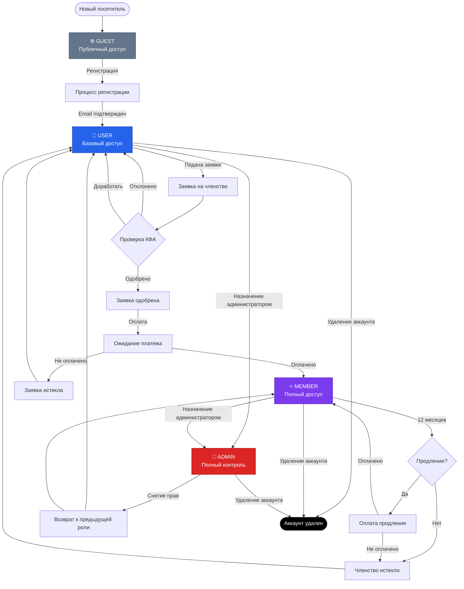

### Сценарии перехода между ролями

#### 1. Новый пользователь → MEMBER

```
1. Регистрация (GUEST → USER)
2. Подача заявки (USER подает заявку)
3. Проверка (Admin проверяет)
4. Оплата (USER оплачивает взнос)
5. Активация (USER → MEMBER)
```

#### 2. Продление членства

```
1. Уведомление (за 30 дней до истечения)
2. Напоминание (за 7 дней до истечения)
3. Оплата (MEMBER оплачивает продление)
4. Продление (MEMBER остается MEMBER)

ИЛИ

3. Не оплачено (срок истек)
4. Понижение (MEMBER → USER)
```

#### 3. Назначение администратора

```
1. Выбор кандидата (существующий MEMBER или USER)
2. Решение правления КФА
3. Назначение (Admin меняет роль)
4. Повышение (USER/MEMBER → ADMIN)
```

#### 4. Снятие прав администратора

```
1. Решение правления КФА
2. Снятие прав (Admin меняет роль)
3. Понижение (ADMIN → предыдущая роль)
```

---

## API Endpoints и авторизация

### Структура запросов

#### Аутентификация

Все защищенные endpoints требуют JWT токен в заголовке:

```http
Authorization: Bearer {jwt_token}
```

#### Формат ошибок

```json
{
  "message": "Forbidden",
  "status": 403,
  "error": "Insufficient permissions"
}
```

### Middleware и Guards

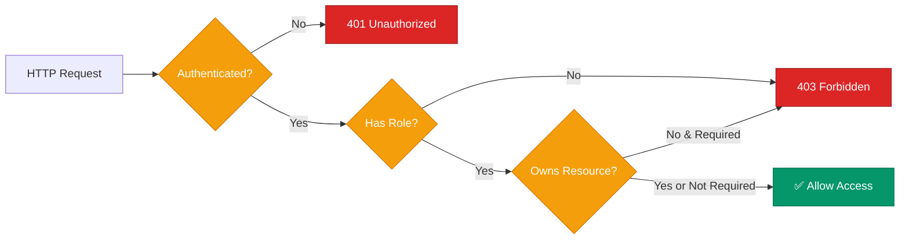

### Примеры запросов

#### Создание новости (MEMBER, ADMIN)

**Request:**

```http
POST /api/news
Authorization: Bearer {token}
Content-Type: application/json

{
  "title": "Новость о финансовом рынке",
  "slug": "news-financial-market",
  "content": "Содержание новости...",
  "published_at": "2025-10-23T12:00:00Z"
}
```

**Response (201 Created):**

```json
{
  "data": {
    "id": 123,
    "title": "Новость о финансовом рынке",
    "slug": "news-financial-market",
    "author": {
      "id": 456,
      "name": "Иван Петров"
    },
    "created_at": "2025-10-23T12:00:00Z"
  }
}
```

**Error Response (403 Forbidden - USER пытается создать):**

```json
{
  "message": "Forbidden",
  "error": "Only members can create news"
}
```

#### Удаление новости (только ADMIN)

**Request:**

```http
DELETE /api/news/123
Authorization: Bearer {admin_token}
```

**Response (200 OK):**

```json
{
  "message": "News deleted successfully"
}
```

**Error Response (403 Forbidden - MEMBER пытается удалить):**

```json
{
  "message": "Forbidden",
  "error": "Only admins can delete news"
}
```

---

## Взаимосвязи и зависимости

### Связь между сущностями

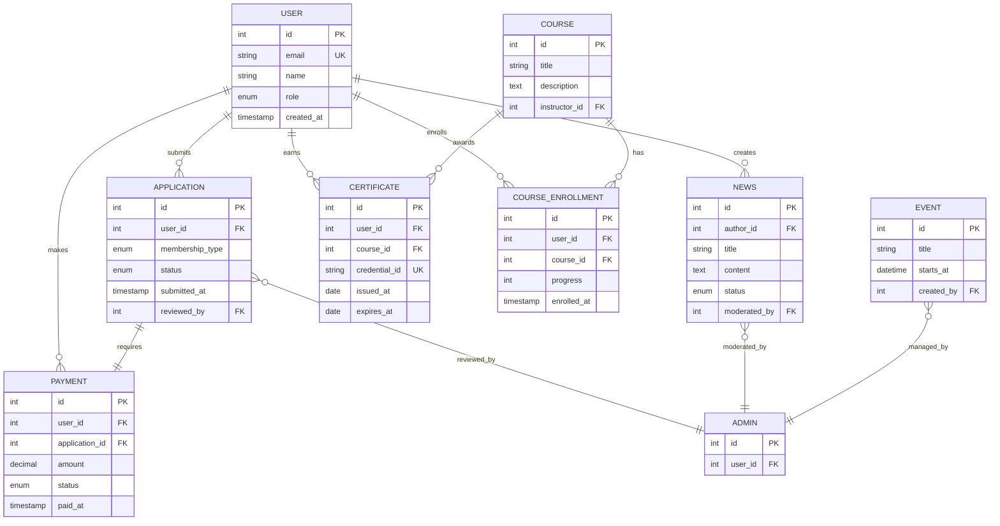

---

## Рекомендации для разработки

### Безопасность

1. **Всегда проверяйте роль на backend**, не доверяйте только frontend проверкам
2. **Используйте middleware** для проверки прав доступа
3. **Логируйте все действия ADMIN** для аудита
4. **Ограничивайте rate limit** для критических операций
5. **Шифруйте чувствительные данные** (пароли, персональные данные)

### Масштабируемость

1. **Используйте кэширование** для списков новостей, событий
2. **Индексируйте базу данных** по role, status, timestamps
3. **Пагинация обязательна** для всех списков
4. **Lazy loading** для dashboard страниц

### UX рекомендации

1. **Показывайте прогресс** процесса регистрации
2. **Уведомления** о статусе заявки и платежей
3. **Подсказки** для первого входа (onboarding)
4. **Персонализированный dashboard** в зависимости от роли

### Тестирование

1. **Unit тесты** для всех middleware проверок прав
2. **Integration тесты** для процесса регистрации
3. **E2E тесты** для критических путей (см. auth-roles.spec.ts)
4. **Security тесты** на попытки обхода авторизации

---

## Changelog

| Версия | Дата       | Изменения               |
| ------ | ---------- | ----------------------- |
| 1.0    | 2025-10-23 | Первая версия документа |

---

## Контакты

Для вопросов и предложений по улучшению документа:

- **Email**: dev@kfa.kg
- **Telegram**: @kfa_dev

---

_Документ создан для проекта Кыргызская Финансовая Ассоциация (КФА)_
