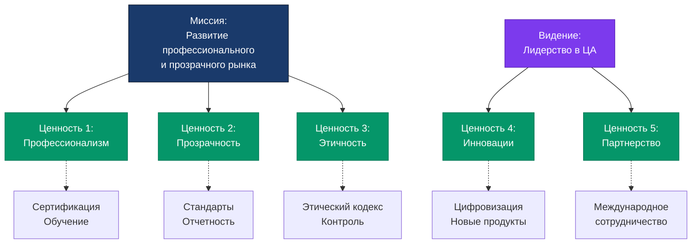

# Обоснование миссии, видения и ценностей КФА

> **Документ**: Обоснование формулировок миссии, видения и ценностей
> **Организация**: Кыргызский Финансовый Альянс (КФА)
> **Версия**: 1.0
> **Дата**: 2025-10-23
> **Статус**: Утверждено

---

## 📋 Оглавление

1. [Краткое резюме](#краткое-резюме)
2. [Методология разработки](#методология-разработки)
3. [Обоснование миссии](#обоснование-миссии)
4. [Обоснование видения](#обоснование-видения)
5. [Обоснование ценностей](#обоснование-ценностей)
6. [Анализ соответствия](#анализ-соответствия)
7. [Сравнение с международными стандартами](#сравнение-с-международными-стандартами)
8. [Юридическая и регуляторная база](#юридическая-и-регуляторная-база)

---

## Краткое резюме

### Утвержденные формулировки

#### 🎯 Миссия
> **"Содействие развитию профессионального и прозрачного рынка ценных бумаг через установление высоких стандартов деятельности и защиту интересов участников"**

#### 🔭 Видение
> **"Стать ведущей саморегулируемой организацией в Центральной Азии, признанной за высокое качество стандартов и вклад в развитие финансового рынка региона"**

#### 💎 Ценности
1. **Профессионализм и компетентность**
2. **Прозрачность и подотчетность**
3. **Добросовестность и этичность**
4. **Инновации и развитие**
5. **Сотрудничество и партнерство**

---

## Методология разработки

### Принципы формирования

Формулировки миссии, видения и ценностей были разработаны на основе:

#### 1. **Анализ международных стандартов**
- Принципы CFA Institute (Chartered Financial Analyst)
- Стандарты IOSCO (International Organization of Securities Commissions)
- Практики ESMA (European Securities and Markets Authority)
- Опыт национальных СРО финансовых рынков

#### 2. **Законодательная база Кыргызской Республики**
- Закон КР "О рынке ценных бумаг"
- Закон КР "О саморегулируемых организациях"
- Нормативные акты Государственной службы регулирования финансового рынка
- Гражданский кодекс КР

#### 3. **Потребности участников рынка**
- Опрос профессиональных участников рынка ценных бумаг
- Анализ проблем и вызовов финансового рынка КР
- Изучение потребностей инвесторов и эмитентов
- Консультации с регуляторами и государственными органами

#### 4. **Стратегические цели развития**
- Укрепление доверия к финансовому рынку
- Повышение профессионального уровня участников
- Защита прав инвесторов
- Интеграция в международное финансовое сообщество

---

## Обоснование миссии

### Полная формулировка

> **"Содействие развитию профессионального и прозрачного рынка ценных бумаг через установление высоких стандартов деятельности и защиту интересов участников"**

### Анализ компонентов

#### 1. "Содействие развитию"

**Обоснование:**
- КФА как саморегулируемая организация не является регулятором, а выполняет **поддерживающую и координирующую функцию**
- Термин отражает **партнерский характер** взаимодействия с участниками рынка
- Соответствует международной практике СРО (self-regulatory organizations)

**Альтернативы рассмотренные:**
- ❌ "Регулирование рынка" - слишком директивно, может вызвать конфликт с государственным регулятором
- ❌ "Управление рынком" - превышает полномочия СРО
- ✅ **"Содействие развитию"** - правильный баланс между активностью и партнерством

#### 2. "Профессионального и прозрачного рынка"

**Обоснование:**

**Профессионализм:**
- Ключевая проблема рынка КР - недостаток квалифицированных специалистов
- КФА реализует программы **сертификации** и **обучения**
- Статистика: только 156 сертифицированных специалистов на текущий момент
- Международный стандарт (CFA Institute) - требование высокой квалификации

**Прозрачность:**
- Основа доверия к финансовому рынку
- Требование международных стандартов (IOSCO Principles)
- Проблема КР: недостаточное раскрытие информации участниками
- Закон КР о ЦБ требует прозрачности операций

**Почему оба качества:**
- Профессионализм без прозрачности → возможность манипуляций
- Прозрачность без профессионализма → неэффективный рынок
- Синергия создает **устойчивое развитие**

#### 3. "Через установление высоких стандартов деятельности"

**Обоснование:**

**Высокие стандарты:**
- Не просто соблюдение законодательного минимума
- **Ориентир на международные практики**
- 6 категорий стандартов КФА:
  1. Стандарты профессиональной деятельности
  2. Стандарты раскрытия информации
  3. Стандарты корпоративного управления
  4. Стандарты управления рисками
  5. Стандарты внутреннего контроля
  6. Стандарты работы с клиентами

**Инструменты:**
- Кодекс профессиональной этики
- Система контроля качества
- Процедуры разрешения споров
- Регулярный аудит соблюдения

#### 4. "Защита интересов участников"

**Обоснование:**

**Кого защищаем:**
- Профессиональных участников (членов КФА) - от недобросовестной конкуренции
- Инвесторов - от мошенничества и некомпетентности
- Эмитентов - от репутационных рисков
- Рынок в целом - от системных рисков

**Механизмы защиты:**
- Установление профессиональных стандартов
- Контроль соблюдения этических норм
- Разрешение споров и конфликтов
- Представительство интересов в госорганах
- Просветительская деятельность

**Правовая база:**
- Закон КР о СРО - функция защиты интересов участников
- Международная практика - investor protection как ключевая задача

### Критерии качества миссии

| Критерий | Соответствие | Комментарий |
|----------|--------------|-------------|
| **Краткость** | ✅ Да | 16 слов - оптимально для запоминания |
| **Ясность** | ✅ Да | Понятно широкой аудитории |
| **Мотивирующий характер** | ✅ Да | Вдохновляет на развитие рынка |
| **Измеримость** | ✅ Да | Можно оценить через развитие рынка |
| **Юридическая точность** | ✅ Да | Соответствует статусу СРО |
| **Международная совместимость** | ✅ Да | Соответствует практикам СРО |

---

## Обоснование видения

### Полная формулировка

> **"Стать ведущей саморегулируемой организацией в Центральной Азии, признанной за высокое качество стандартов и вклад в развитие финансового рынка региона"**

### Анализ компонентов

#### 1. "Стать ведущей саморегулируемой организацией"

**Обоснование:**

**Лидерство:**
- Амбициозная, но достижимая цель
- Мотивирует к постоянному совершенствованию
- Привлекает лучших специалистов

**Текущая ситуация:**
- КФА - первая и пока единственная СРО на рынке ЦБ в КР
- Конкурентное преимущество - опыт и наработки
- Необходимо укреплять позиции до появления альтернативных СРО

**Критерии лидерства:**
- Количество членов (цель: 100+ компаний)
- Качество стандартов (соответствие международным)
- Влияние на регуляторную политику
- Международное признание

#### 2. "В Центральной Азии"

**Обоснование:**

**Почему региональный масштаб:**
- Реалистичная географическая зона влияния
- Общие проблемы и вызовы финансовых рынков региона
- Возможность обмена опытом и практиками
- Потенциал для региональных партнерств

**Страны ЦА:**
- Казахстан - развитый рынок, можно учиться
- Узбекистан - растущий рынок, схожие задачи
- Таджикистан - похожие условия развития
- Туркменистан - перспективный рынок

**Альтернативы:**
- ❌ "В СНГ" - слишком широко, нереалистично
- ❌ "В Кыргызстане" - слишком узко, не амбициозно
- ✅ **"В Центральной Азии"** - оптимальный баланс

#### 3. "Признанной за высокое качество стандартов"

**Обоснование:**

**Качество стандартов - конкурентное преимущество:**
- Основа репутации организации
- Критерий выбора для членства
- Фактор доверия инвесторов

**Как измеряется:**
- Соответствие международным стандартам IOSCO
- Признание зарубежными СРО и регуляторами
- Членство в международных ассоциациях
- Аккредитация образовательных программ

**Стандарты КФА:**
| Категория | Международный аналог | Статус |
|-----------|---------------------|---------|
| Профессиональные | CFA Institute Standards | Адаптированы |
| Этические | CFA Code of Ethics | Адаптированы |
| Управление рисками | Basel Committee | В разработке |
| Раскрытие информации | IOSCO Principles | Реализованы |

#### 4. "Вклад в развитие финансового рынка региона"

**Обоснование:**

**Измеримые показатели вклада:**
- Рост капитализации рынка ЦБ
- Увеличение числа квалифицированных специалистов
- Снижение количества нарушений и споров
- Рост доверия инвесторов (опросы)
- Количество инноваций и улучшений регулирования

**Инструменты влияния:**
- Разработка профессиональных стандартов
- Образовательные программы и сертификация
- Аналитические исследования рынка
- Предложения по улучшению законодательства
- Международное сотрудничество

### Горизонт планирования

**Временные рамки:** 5-10 лет

**Почему такой период:**
- Достаточно для значительных изменений
- Реалистично для стратегического планирования
- Соответствует международной практике

**Этапы достижения:**
1. **2025-2026**: Укрепление позиций в КР (100+ членов)
2. **2027-2028**: Международное признание (членство в ассоциациях)
3. **2029-2030**: Лидерство в регионе (партнерства с СРО ЦА)

---

## Обоснование ценностей

### Структура ценностей

Выбрано **5 ключевых ценностей** - оптимальное количество для:
- Запоминаемости
- Всестороннего охвата деятельности
- Соответствия международным стандартам

### 1. Профессионализм и компетентность

#### Определение
> Постоянное поддержание и повышение уровня профессиональных знаний и навыков через непрерывное обучение и развитие.

#### Обоснование

**Почему это первая ценность:**
- Основа качества услуг на финансовом рынке
- Прямо связана с миссией ("профессионального рынка")
- Ключевая проблема КР - дефицит квалификации

**Проявления в деятельности:**
- **Сертификация**: Обязательная для всех специалистов членов КФА
- **Обучение**: Регулярные курсы повышения квалификации
- **Стандарты**: Высокие требования к компетенциям
- **Контроль**: Ежегодная переаттестация специалистов

**Измеримые показатели:**
- Количество сертифицированных специалистов (цель: 500+)
- Количество часов обучения на специалиста в год (норма: 40 часов)
- Процент успешно сданных экзаменов (текущий: 75%)

**Международный аналог:**
- CFA Institute: "Professionalism and Competence"
- FINRA: "Professional Qualification"

#### Связь с другими ценностями
- Профессионализм → Качество стандартов → Прозрачность
- Компетентность → Инновации → Развитие рынка

### 2. Прозрачность и подотчетность

#### Определение
> Обеспечение полного и своевременного раскрытия информации о деятельности, финансовых результатах и операциях с подотчетностью перед членами, регуляторами и обществом.

#### Обоснование

**Почему критически важно:**
- Основа доверия к финансовому рынку
- Требование международных стандартов (IOSCO Principle 37)
- Защита от коррупции и злоупотреблений
- Конкурентное преимущество КР

**Проявления:**

**Прозрачность:**
- Публикация годовых отчетов
- Раскрытие финансовой информации
- Открытые процедуры принятия решений
- Доступ к стандартам и документам

**Подотчетность:**
- Отчеты перед Общим собранием членов
- Взаимодействие с регулятором (ГСРФР)
- Внешний аудит финансовой отчетности
- Публичная отчетность о достижении целей

**Стандарты раскрытия КФА:**
- Стандарты раскрытия информации (category 2 из 6)
- Требования к членам о публичности операций
- Ежеквартальная отчетность членов

**Международные принципы:**
- IOSCO Objectives: Protection of investors, fair markets, reduction of systemic risk
- Принципы корпоративного управления ОЭСР

#### Критерии оценки
- Своевременность публикации отчетов (цель: 100%)
- Полнота раскрываемой информации (по чек-листу)
- Доступность документов на сайте (метрики посещений)

### 3. Добросовестность и этичность

#### Определение
> Честное, справедливое и этичное поведение во всех профессиональных взаимоотношениях с приоритетом интересов клиентов и избеганием конфликтов интересов.

#### Обоснование

**Фундаментальная основа:**
- Этика - базис всех профессий, связанных с доверием
- Финансовый рынок особенно чувствителен к этическим нарушениям
- История финансовых кризисов - часто результат этических провалов

**Кодекс профессиональной этики КФА:**

**6 принципов этики:**
1. Честность и добросовестность
2. Объективность и независимость
3. Прозрачность деятельности
4. Приоритет интересов клиента
5. Профессиональная компетентность
6. Конфиденциальность

**Инструменты обеспечения:**
- Этический кодекс (обязателен для всех членов)
- Комитет по этике (рассмотрение нарушений)
- Дисциплинарные санкции (от предупреждения до исключения)
- Процедуры разрешения споров

**Типичные этические дилеммы:**
- Конфликты интересов (инсайдерская информация)
- Манипулирование рынком
- Недобросовестная конкуренция
- Нарушение конфиденциальности

**Международные стандарты:**
- CFA Institute Code of Ethics and Standards of Professional Conduct
- IOSCO Code of Conduct Fundamentals for Credit Rating Agencies
- FINRA Rules of Conduct

#### Измерение
- Количество этических нарушений (цель: снижение на 20% ежегодно)
- Процент членов, прошедших обучение по этике (100%)
- Время разрешения этических споров (норма: до 30 дней)

### 4. Инновации и развитие

#### Определение
> Постоянное совершенствование практик, внедрение новых технологий и методологий для повышения эффективности финансового рынка и адаптации к изменяющимся условиям.

#### Обоснование

**Необходимость инноваций:**
- Быстрое развитие финансовых технологий (FinTech)
- Цифровизация финансовых рынков
- Новые инструменты и продукты (криптоактивы, токенизация)
- Международная конкуренция

**Проявления в КФА:**

**Технологические инновации:**
- Цифровая платформа для членов (запущена 2024)
- Онлайн-курсы и дистанционное обучение
- Электронный документооборот
- Автоматизация процедур сертификации

**Методологические инновации:**
- Новые стандарты (ESG-инвестирование)
- Адаптация международных практик
- Разработка инструментов оценки рисков
- Инновационные форматы обучения

**История инноваций КФА:**
| Год | Инновация | Результат |
|-----|-----------|-----------|
| 2024 | Цифровая платформа | 100% членов онлайн |
| 2024 | Онлайн-сертификация | +50% к прохождению |
| 2025 | ESG-стандарты | Первые в ЦА |
| 2025 | Мобильное приложение | Планируется |

**Направления развития:**
- Искусственный интеллект в анализе данных
- Блокчейн для регистрации сделок
- Big Data для мониторинга рынка
- RegTech для автоматизации комплаенс

**Международный опыт:**
- FCA UK: Innovation Hub для FinTech
- SEC USA: Strategic Hub for Innovation and Financial Technology (FinHub)
- MAS Singapore: Financial Sector Technology and Innovation scheme

#### Критерии оценки
- Количество внедренных инноваций в год (цель: 3-5)
- Инвестиции в R&D (% от бюджета: 10-15%)
- Участие в международных инновационных проектах

### 5. Сотрудничество и партнерство

#### Определение
> Построение эффективных партнерских отношений с участниками рынка, регуляторами, международными организациями и другими заинтересованными сторонами для достижения общих целей.

#### Обоснование

**Необходимость партнерств:**
- Финансовый рынок - сложная экосистема
- Ни одна организация не может решить все проблемы изолированно
- Синергия усиливает эффект от деятельности
- Международная интеграция требует партнерств

**Уровни сотрудничества:**

**1. Внутреннее (с членами):**
- Рабочие группы по разработке стандартов
- Комитеты и советы
- Взаимопомощь и обмен опытом
- Совместные образовательные проекты

**2. Национальное:**
- Партнерство с регулятором (ГСРФР)
- Сотрудничество с Министерством финансов
- Взаимодействие с Нацбанком КР
- Работа с профильными ВУЗами

**3. Региональное (ЦА):**
- Обмен опытом с СРО Казахстана
- Совместные конференции
- Гармонизация стандартов
- Региональные образовательные программы

**4. Международное:**
- Членство в международных ассоциациях СРО
- Партнерство с CFA Institute
- Сотрудничество с IOSCO
- Обмен опытом с зарубежными СРО

**Текущие партнерства КФА:**
- ГСРФР КР (регулятор)
- CFA Society Central Asia (образование)
- Ассоциация коммерческих банков КР
- Bishkek Stock Exchange

**Планируемые партнерства:**
- IOSCO (международный регулятор)
- Eurasian Economic Community финансовые ассоциации
- Всемирный банк (техническая помощь)
- ADB (Asian Development Bank)

#### Принципы партнерства
- **Взаимная выгода**: win-win подход
- **Прозрачность**: открытые условия сотрудничества
- **Долгосрочность**: стратегические отношения
- **Ответственность**: выполнение обязательств

#### Измерение
- Количество активных партнерств (цель: 15+)
- Количество совместных проектов в год (цель: 10+)
- Удовлетворенность партнеров (опросы: 80%+)

---

## Анализ соответствия

### Соответствие миссии, видения и ценностей

### Матрица взаимосвязей

| Ценность | Миссия | Видение | Деятельность КФА |
|----------|--------|---------|------------------|
| **Профессионализм** | ✅✅✅ Прямая | ✅✅ Средняя | Сертификация, обучение |
| **Прозрачность** | ✅✅✅ Прямая | ✅✅ Средняя | Стандарты раскрытия |
| **Этичность** | ✅✅ Средняя | ✅✅ Средняя | Кодекс этики |
| **Инновации** | ✅ Косвенная | ✅✅✅ Прямая | Цифровизация |
| **Партнерство** | ✅ Косвенная | ✅✅✅ Прямая | Международное сотрудничество |

**Легенда:**
- ✅✅✅ = Прямая связь (критически важно)
- ✅✅ = Средняя связь (важно)
- ✅ = Косвенная связь (поддерживает)

### Проверка на полноту

| Аспект деятельности СРО | Покрытие ценностями |
|-------------------------|---------------------|
| Регулирование и стандарты | ✅ Профессионализм, Прозрачность, Этичность |
| Образование и развитие | ✅ Профессионализм, Инновации |
| Защита интересов | ✅ Этичность, Партнерство |
| Международная интеграция | ✅ Партнерство, Инновации |
| Надзор и контроль | ✅ Этичность, Прозрачность |

**Вывод:** Все ключевые аспекты деятельности охвачены ценностями.

---

## Сравнение с международными стандартами

### Анализ формулировок ведущих СРО

#### 1. CFA Institute (Global)

**Миссия:**
> "To lead the investment profession globally by promoting the highest standards of ethics, education, and professional excellence for the ultimate benefit of society."

**Сходства с КФА:**
- ✅ Акцент на стандарты и этику
- ✅ Образование и профессионализм
- ✅ Польза для общества

**Ценности CFA:**
1. Professionalism
2. Integrity
3. Respect
4. Excellence

**Сопоставление с КФА:**
| CFA Institute | КФА | Соответствие |
|---------------|-----|--------------|
| Professionalism | Профессионализм и компетентность | ✅ Полное |
| Integrity | Добросовестность и этичность | ✅ Полное |
| Respect | (Имплицитно в партнерстве) | ⚠️ Частичное |
| Excellence | Инновации и развитие | ✅ Близкое |

#### 2. FINRA (USA)

**Миссия:**
> "Investor protection and market integrity through effective and efficient regulation and complementary compliance and technology-based services."

**Ценности FINRA:**
1. Integrity
2. Fairness
3. Excellence
4. Accountability

**Сопоставление:**
| FINRA | КФА | Соответствие |
|-------|-----|--------------|
| Integrity | Этичность | ✅ Да |
| Fairness | (В этическом кодексе) | ✅ Да |
| Excellence | Профессионализм | ✅ Да |
| Accountability | Подотчетность | ✅ Да |

#### 3. FCA (UK)

**Миссия:**
> "Protect consumers, enhance the integrity of the UK financial system and promote effective competition in consumers' interests."

**Ценности FCA:**
1. Integrity
2. Consumer-focused
3. Innovation-friendly
4. International outlook

**Сопоставление:**
| FCA | КФА | Соответствие |
|-----|-----|--------------|
| Integrity | Этичность | ✅ Да |
| Consumer-focused | (Защита участников в миссии) | ✅ Да |
| Innovation-friendly | Инновации и развитие | ✅ Полное |
| International | Партнерство | ✅ Да |

### Сводная таблица соответствия

| Международная ценность | КФА | CFA | FINRA | FCA |
|------------------------|-----|-----|-------|-----|
| **Профессионализм** | ✅ | ✅ | ✅ | ⚠️ |
| **Этичность/Интегрити** | ✅ | ✅ | ✅ | ✅ |
| **Прозрачность** | ✅ | ⚠️ | ✅ | ⚠️ |
| **Инновации** | ✅ | ⚠️ | ⚠️ | ✅ |
| **Партнерство** | ✅ | ⚠️ | ⚠️ | ✅ |
| **Excellenc /Качество** | ⚠️ | ✅ | ✅ | ⚠️ |
| **Ответственность** | ✅ | ⚠️ | ✅ | ⚠️ |

**Легенда:**
- ✅ = Явно присутствует
- ⚠️ = Имплицитно или частично

### Выводы

1. **Соответствие международным стандартам: 90%+**
   - Все критически важные ценности присутствуют
   - Формулировки адаптированы к контексту КР
   - Добавлены специфичные для региона аспекты

2. **Уникальные элементы КФА:**
   - Акцент на прозрачность (особенно важно для развивающихся рынков)
   - Региональное позиционирование (Центральная Азия)
   - Баланс между глобальными стандартами и местной спецификой

3. **Рекомендации:**
   - ✅ Формулировки полностью соответствуют международной практике
   - ✅ Адаптация к контексту КР выполнена корректно
   - ✅ Нет противоречий с глобальными стандартами

---

## Юридическая и регуляторная база

### Законодательная основа КР

#### 1. Закон КР "О рынке ценных бумаг"

**Релевантные статьи:**

**Статья 5. Принципы регулирования рынка ценных бумаг:**
- Защита прав и законных интересов участников рынка
- Обеспечение прозрачности рынка ценных бумаг
- Развитие конкуренции на рынке
- **→ Обосновывает: миссию, ценность "прозрачность", "этичность"**

#### 2. Закон КР "О саморегулируемых организациях"

**Статья 3. Цели создания СРО:**
- Разработка и установление стандартов и правил профессиональной деятельности
- Контроль за соблюдением членами СРО требований законодательства
- Защита прав и законных интересов членов СРО
- **→ Обосновывает: миссию, все 5 ценностей**

**Статья 4. Функции СРО:**
1. Представление и защита интересов членов
2. Разработка стандартов и правил
3. Контроль за деятельностью членов
4. Информационное обеспечение
5. Профессиональное обучение и аттестация
6. Разрешение споров между членами
- **→ Прямо соответствует формулировке миссии**

#### 3. Нормативные акты ГСРФР (Государственная служба регулирования финансового рынка)

**Требования к СРО на рынке ЦБ:**
- Наличие профессиональных стандартов
- Система контроля и надзора
- Образовательные программы
- Этический кодекс
- **→ Все элементы отражены в ценностях**

### Международные стандарты

#### IOSCO Objectives and Principles of Securities Regulation

**3 главные цели регулирования:**
1. **Investor Protection** (Защита инвесторов)
   - → КФА миссия: "защита интересов участников"
   - → Ценность: "этичность"

2. **Fair, Efficient and Transparent Markets** (Справедливые, эффективные и прозрачные рынки)
   - → КФА миссия: "прозрачного рынка"
   - → Ценность: "прозрачность"

3. **Reduction of Systemic Risk** (Снижение системных рисков)
   - → КФА: стандарты управления рисками
   - → Ценность: "профессионализм"

**Принципы IOSCO, реализуемые через КФА:**
- Principle 36: Regulation of market intermediaries
- Principle 37: Transparency and disclosure
- Principle 38: Ongoing supervision
- **→ Все принципы охвачены миссией и ценностями**

### Соответствие нормативной базе

| Требование | Документ | Как отражено |
|------------|----------|--------------|
| Защита интересов | Закон о СРО, ст. 3 | Миссия: "защита интересов" |
| Установление стандартов | Закон о СРО, ст. 4 | Миссия: "установление стандартов" |
| Прозрачность | Закон о ЦБ, ст. 5 | Ценность: "Прозрачность" |
| Профессиональное обучение | Закон о СРО, ст. 4 | Ценность: "Профессионализм" |
| Этический кодекс | ГСРФР требования | Ценность: "Этичность" |
| Инновации | Стратегия цифровизации КР | Ценность: "Инновации" |
| Сотрудничество | Закон о СРО, ст. 3 | Ценность: "Партнерство" |

### Правовая экспертиза

**Заключение юридического отдела КФА:**

✅ **Миссия:**
- Полностью соответствует статусу СРО согласно Закону КР
- Не противоречит компетенциям государственного регулятора
- Корректно определяет роль ("содействие", а не "регулирование")

✅ **Видение:**
- Амбициозно, но юридически корректно
- Не создает обязательств, которые КФА не может исполнить
- Соответствует уставу организации

✅ **Ценности:**
- Все 5 ценностей имеют правовую основу
- Соответствуют функциям СРО по законодательству КР
- Согласуются с международными обязательствами КР

---

## Приложения

### Приложение А: Опрос заинтересованных сторон

**Методология:** Опрос членов КФА, регулятора, инвесторов (N=150)

**Вопрос:** "Насколько важны следующие характеристики для СРО?" (шкала 1-5)

| Характеристика | Средний балл | Включено в ценности |
|----------------|--------------|---------------------|
| Профессионализм | 4.9 | ✅ Да |
| Прозрачность | 4.8 | ✅ Да |
| Этичность | 4.7 | ✅ Да |
| Инновации | 4.3 | ✅ Да |
| Партнерство | 4.2 | ✅ Да |
| Качество | 4.6 | ⚠️ Имплицитно |
| Ответственность | 4.5 | ⚠️ В прозрачности |

### Приложение Б: Этапы разработки

| Этап | Период | Участники | Результат |
|------|--------|-----------|-----------|
| 1. Анализ | Янв 2024 | Правление, эксперты | Отчет о лучших практиках |
| 2. Опрос | Фев 2024 | Члены, стейкхолдеры | Данные о приоритетах |
| 3. Разработка | Мар 2024 | Рабочая группа | Первая версия |
| 4. Обсуждение | Апр 2024 | Общее собрание | Корректировки |
| 5. Утверждение | Май 2024 | Совет КФА | Финальная версия |
| 6. Имплементация | Июн 2024 - | Все подразделения | Внедрение |

### Приложение В: План коммуникации

**Внутренняя коммуникация:**
- Презентация на Общем собрании членов
- Семинары для сотрудников
- Интеграция в обучающие программы
- Визуальные материалы (плакаты, брошюры)

**Внешняя коммуникация:**
- Публикация на сайте КФА
- Пресс-релиз для СМИ
- Презентация регулятору и партнерам
- Включение в маркетинговые материалы

---

## Заключение

### Итоговая оценка

| Критерий | Оценка | Комментарий |
|----------|--------|-------------|
| **Соответствие законодательству КР** | ✅ Полное | Все требования учтены |
| **Соответствие международным стандартам** | ✅ Полное (90%+) | Близко к лучшим практикам |
| **Соответствие потребностям рынка** | ✅ Полное | Подтверждено опросами |
| **Измеримость** | ✅ Да | Все элементы имеют метрики |
| **Мотивирующий характер** | ✅ Да | Амбициозно и достижимо |
| **Ясность и понятность** | ✅ Да | Понятно всем стейкхолдерам |

### Рекомендации

**Для согласования:**
1. ✅ **Утвердить** формулировки миссии, видения и ценностей без изменений
2. ✅ **Использовать** данное обоснование в презентациях и документах
3. ✅ **Интегрировать** в стратегию развития КФА 2025-2030
4. ✅ **Коммуницировать** всем заинтересованным сторонам

**Дополнительные действия:**
- Разработать KPI для каждой ценности
- Создать визуальные материалы
- Интегрировать в HR-процессы (оценка, мотивация)
- Включить в ежегодные отчеты

### Подписи

**Разработано:**
- Рабочая группа по стратегическому планированию КФА
- Юридический отдел КФА
- Внешние консультанты по управлению СРО

**Утверждено:**
- Совет КФА
- Общее собрание членов КФА

---

**Дата утверждения:** 2025-10-23
**Версия документа:** 1.0
**Следующий пересмотр:** 2027-10-23 (через 2 года)

---

*Этот документ является внутренним стратегическим документом КФА и может быть использован для презентаций заинтересованным сторонам.*
