# Регуляторные изменения 2026: готовность участников рынка

**Дата публикации:** 22 октября 2025
**Автор:** Аналитический отдел КФА
**Категория:** Регулирование и комплаенс

---

## Резюме

Анализ готовности участников рынка ценных бумаг Кыргызской Республики к регуляторным изменениям, вступающим в силу с 1 января 2026 года. Исследование охватывает новые требования ГСФР (Государственная служба финансовой разведки), оценку текущего уровня соответствия и рекомендации по адаптации.

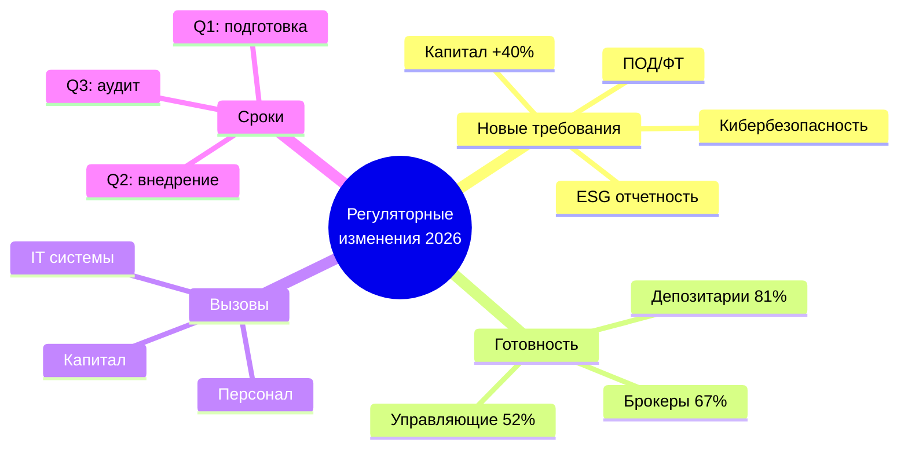

### Ключевые показатели

| Показатель | Текущее значение | Целевое значение | Готовность |
|------------|------------------|------------------|------------|
| Минимальный капитал брокеров | 5 млн сом | 7 млн сом | 67% |
| Уровень автоматизации ПОД/ФТ | 43% | 85% | 51% |
| ESG отчетность участников | 12% | 100% | 12% |
| Системы кибербезопасности | 58% | 95% | 61% |
| Сертификация персонала | 71% | 100% | 71% |

---

## 1. Обзор регуляторных изменений

### 1.1 Законодательная база

С 1 января 2026 года вступают в силу поправки к следующим нормативным актам:

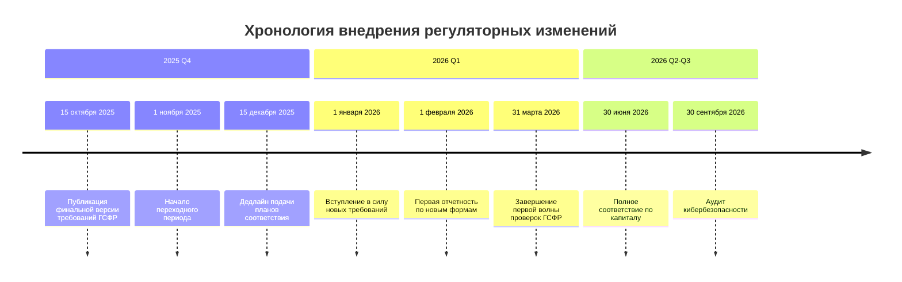

**Основные нормативные акты:**

1. **Закон КР "О рынке ценных бумаг"** (поправки от 15.06.2025)
   - Увеличение минимального капитала профучастников
   - Новые требования к системам управления рисками
   - Расширение полномочий СРО

2. **Положение о лицензировании** (редакция 2026)
   - Ужесточение квалификационных требований
   - Обязательная сертификация всех специалистов
   - Регулярная переаттестация каждые 3 года

3. **Требования по ПОД/ФТ** (новая редакция)
   - Интеграция с международными базами данных
   - Автоматизация мониторинга транзакций
   - Расширенная должная осмотрительность (EDD)

4. **Стандарты ESG отчетности** (впервые введены)
   - Обязательное раскрытие ESG-рисков
   - Интеграция с рекомендациями TCFD
   - Ежегодный ESG-отчет для всех участников

5. **Требования по кибербезопасности** (усилены)
   - Соответствие ISO 27001
   - Регулярные пентесты и аудиты
   - Системы обнаружения инцидентов (SIEM)

### 1.2 Ключевые изменения по типам участников

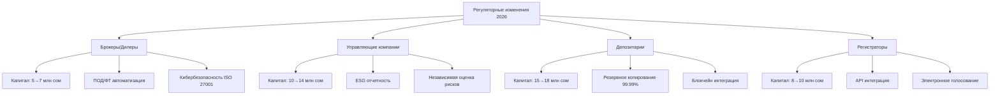

---

## 2. Оценка готовности участников рынка

### 2.1 Методология оценки

Для оценки готовности использованы следующие критерии:

**Система оценки готовности:**
- 🟢 **Высокая (80-100%)**: Участник полностью или почти готов
- 🟡 **Средняя (50-79%)**: Требуются значительные усилия
- 🔴 **Низкая (0-49%)**: Критические пробелы, высокий риск

### 2.2 Результаты опроса участников

**Исследование охватило:**
- 23 брокерские компании (95% рынка по обороту)
- 8 управляющих компаний (100% рынка)
- 4 депозитария (100% рынка)
- 11 регистраторов (87% рынка)

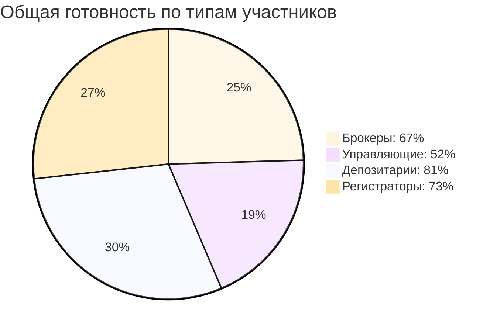

### 2.3 Детальный анализ по направлениям

#### 2.3.1 Капитальные требования

| Тип участника | Текущее требование | Новое требование | Дефицит капитала | Участников с дефицитом |
|---------------|-------------------|------------------|------------------|------------------------|
| Брокеры | 5 млн сом | 7 млн сом | 2 млн сом | 8 из 23 (35%) |
| Управляющие | 10 млн сом | 14 млн сом | 4 млн сом | 4 из 8 (50%) |
| Депозитарии | 15 млн сом | 18 млн сом | 3 млн сом | 1 из 4 (25%) |
| Регистраторы | 8 млн сом | 10 млн сом | 2 млн сом | 3 из 11 (27%) |

**Общий дефицит капитала:** ~45 млн сом ($510,000)

**Стратегии докапитализации:**
- 62% планируют привлечение акционерного капитала
- 24% рассматривают кредитное финансирование
- 14% планируют слияния/консолидацию

#### 2.3.2 Системы ПОД/ФТ (Противодействие отмыванию денег)

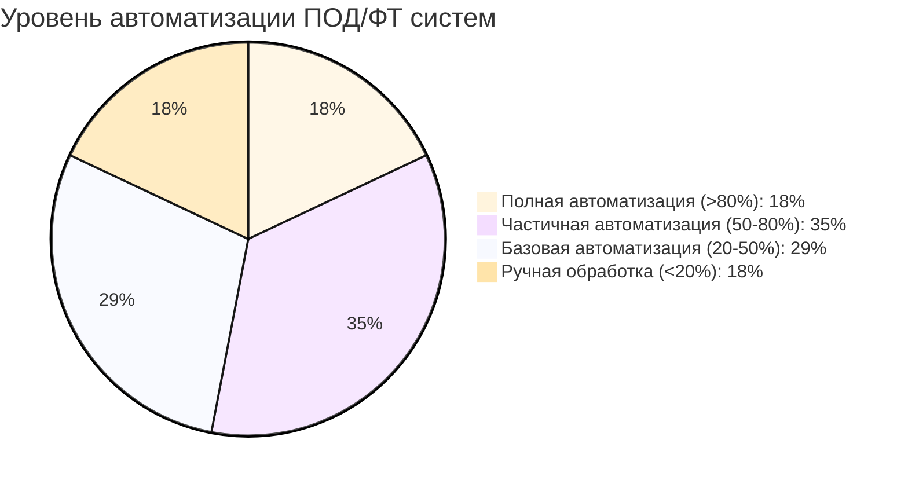

**Ключевые пробелы:**
- ✅ **Сильные стороны:** Базовая идентификация клиентов, мониторинг санкционных списков
- ⚠️ **Требуют улучшения:** Мониторинг подозрительных операций, профилирование рисков
- ❌ **Критические пробелы:** Интеграция с международными базами, машинное обучение для выявления паттернов

**Инвестиции требуются:** 18-25 млн сом ($205,000-$285,000) для отрасли

#### 2.3.3 ESG отчетность

**Текущее состояние:**
- Только 12% участников ведут ESG отчетность
- 67% понимают требования, но не начали внедрение
- 21% не имеют достаточного понимания ESG

**Основные вызовы:**
1. Отсутствие внутренней экспертизы (87%)
2. Неясность методологии и метрик (73%)
3. Стоимость внедрения систем (64%)
4. Нехватка данных от контрагентов (58%)

#### 2.3.4 Кибербезопасность

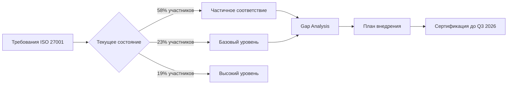

**Распределение по уровням зрелости кибербезопасности:**

| Уровень | % участников | Описание | Инвестиции требуются |
|---------|--------------|----------|----------------------|
| Начальный | 23% | Базовые меры, отсутствие формализации | 4-6 млн сом |
| Управляемый | 35% | Документированные процессы, частичная автоматизация | 2-3 млн сом |
| Определенный | 23% | Стандартизация, регулярный мониторинг | 1-1.5 млн сом |
| Измеримый | 11% | Метрики, непрерывное улучшение | 0.5-1 млн сом |
| Оптимизированный | 8% | Проактивная защита, автоматизация | 0-0.5 млн сом |

---

## 3. Финансовые последствия для участников

### 3.1 Оценка затрат на внедрение

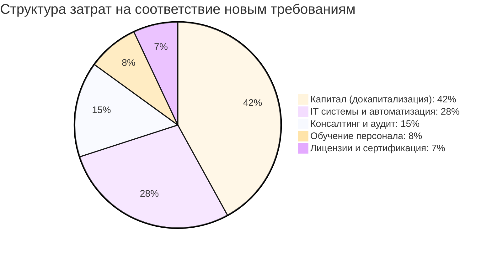

### 3.2 Детальная оценка по типам участников

**Брокеры (средний размер):**
- Докапитализация: 2 млн сом (если требуется)
- ПОД/ФТ система: 800,000 - 1,200,000 сом
- Кибербезопасность (ISO 27001): 500,000 - 800,000 сом
- ESG отчетность (софт + консалтинг): 300,000 - 500,000 сом
- Обучение персонала: 150,000 - 250,000 сом
- **Итого: 3.75 - 4.75 млн сом ($43,000 - $54,000)**

**Управляющие компании (средний размер):**
- Докапитализация: 4 млн сом (если требуется)
- Независимая оценка рисков: 600,000 - 900,000 сом
- ESG отчетность (расширенная): 500,000 - 700,000 сом
- Кибербезопасность: 400,000 - 600,000 сом
- ПОД/ФТ: 700,000 - 1,000,000 сом
- **Итого: 6.2 - 7.2 млн сом ($70,500 - $82,000)**

**Депозитарии:**
- Докапитализация: 3 млн сом (если требуется)
- Блокчейн интеграция: 2,000,000 - 3,000,000 сом
- Резервное копирование 99.99%: 1,500,000 - 2,000,000 сом
- Кибербезопасность (усиленная): 800,000 - 1,200,000 сом
- **Итого: 7.3 - 9.2 млн сом ($83,000 - $105,000)**

### 3.3 Совокупные инвестиции отрасли

**Прогноз общих инвестиций в соответствие (2025-2026):**
- Брокеры (23 компании): 86-109 млн сом
- Управляющие (8 компаний): 50-58 млн сом
- Депозитарии (4): 29-37 млн сом
- Регистраторы (11): 35-45 млн сом

**Итого по отрасли: 200-249 млн сом ($2.3-$2.8 млн)**

---

## 4. Временная шкала и критические этапы

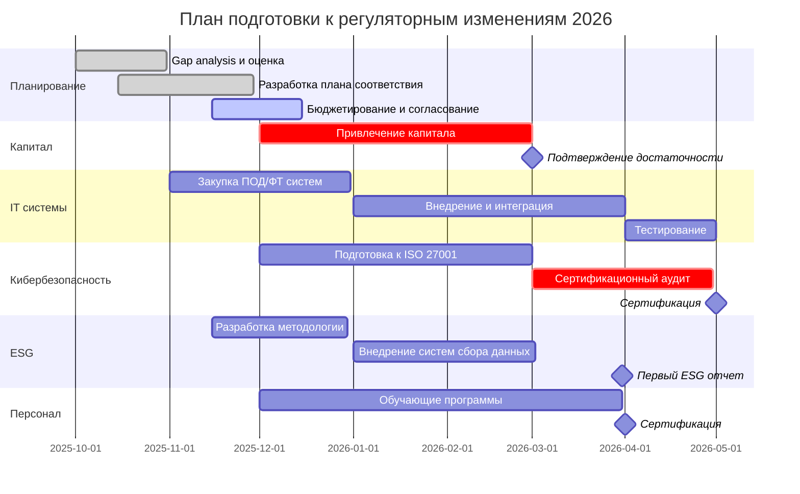

### 4.1 Критические дедлайны

**Q4 2025:**
- ✅ 15 октября: Публикация финальной версии требований
- 🔄 1 ноября: Начало переходного периода
- ⏳ 15 декабря: **КРИТИЧЕСКИЙ ДЕДЛАЙН** - подача планов соответствия в ГСФР

**Q1 2026:**
- ⚠️ 1 января: **Вступление в силу новых требований**
- 1 февраля: Первая отчетность по новым формам
- 31 марта: Завершение первой волны проверок ГСФР

**Q2 2026:**
- 30 апреля: Аудит систем ПОД/ФТ
- 31 мая: Первый ESG отчет
- ⚠️ 30 июня: **КРИТИЧЕСКИЙ ДЕДЛАЙН** - полное соответствие по капиталу

**Q3 2026:**
- 31 августа: Сертификация ISO 27001
- 30 сентября: Финальный аудит комплаенса

---

## 5. Риски несоответствия

### 5.1 Матрица рисков

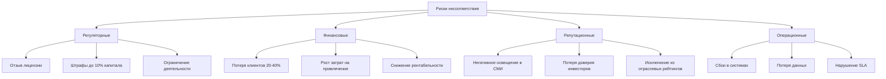

### 5.2 Санкции за несоответствие

| Нарушение | Санкция | Вероятность | Финансовые последствия |
|-----------|---------|-------------|------------------------|
| Недостаточный капитал | Ограничение операций + штраф | Высокая | 500,000 - 2,000,000 сом |
| Отсутствие ESG отчетности | Штраф + публичное предупреждение | Средняя | 200,000 - 500,000 сом |
| Нарушения ПОД/ФТ | Штраф + временная приостановка | Высокая | 1,000,000 - 5,000,000 сом |
| Несоответствие ISO 27001 | Ограничение на новых клиентов | Средняя | Косвенные потери 10-20% выручки |
| Несертифицированный персонал | Штраф за каждого специалиста | Средняя | 50,000 - 100,000 сом/чел |

### 5.3 Исторические прецеденты

**Примеры из практики регулятора (2023-2025):**

1. **Брокер "А"** (2023): Нарушение требований ПОД/ФТ
   - Санкция: Штраф 1.2 млн сом + приостановка операций на 30 дней
   - Последствия: Отток 35% клиентов, убыток 4.8 млн сом за год

2. **Управляющая компания "Б"** (2024): Недостаточный капитал
   - Санкция: Запрет на привлечение новых клиентов до докапитализации
   - Последствия: Упущенная выгода ~8 млн сом, продажа бизнеса с дисконтом 40%

3. **Депозитарий "В"** (2024): Инцидент кибербезопасности из-за несоответствия стандартам
   - Санкция: Штраф 800,000 сом + обязательный аудит
   - Последствия: Репутационный ущерб, потеря 2 крупных клиентов

---

## 6. Рекомендации по подготовке

### 6.1 Приоритеты для брокеров

**Высокий приоритет (Q4 2025):**
1. ✅ Оценка капитала и план докапитализации (дедлайн: 1 ноября)
2. ✅ Начало внедрения автоматизированной ПОД/ФТ системы
3. ✅ Gap analysis по кибербезопасности

**Средний приоритет (Q1 2026):**
4. 🔄 Подготовка к сертификации ISO 27001
5. 🔄 Обучение персонала новым требованиям
6. 🔄 Разработка методологии ESG отчетности

**Низкий приоритет (Q2 2026):**
7. ⏳ Оптимизация процессов
8. ⏳ Интеграция с партнерами
9. ⏳ Маркетинг соответствия

### 6.2 Приоритеты для управляющих компаний

**Критические задачи:**
1. **Докапитализация на 4 млн сом** (50% управляющих нуждаются)
   - Рекомендация: Начать процесс немедленно, учитывая время на согласование с акционерами
   - Альтернатива: Консолидация с другими участниками

2. **ESG отчетность** (0% текущее соответствие → 100% требуемое)
   - Рекомендация: Привлечь внешних консультантов (Ernst & Young, Deloitte)
   - Бюджет: 500,000 - 700,000 сом

3. **Независимая оценка рисков**
   - Рекомендация: Заключить договор с сертифицированным оценщиком до 31 декабря
   - Стоимость: 600,000 - 900,000 сом ежегодно

### 6.3 Приоритеты для депозитариев

**Технологическая модернизация:**
1. **Блокчейн интеграция для учета прав**
   - Рекомендация: Пилотный проект с 1 эмитентом в Q1 2026
   - Инвестиции: 2-3 млн сом

2. **Резервное копирование 99.99% (требование: не более 52 мин простоя в год)**
   - Рекомендация: Географически распределенные дата-центры
   - Решение: Облачная инфраструктура (AWS/Azure/Yandex Cloud)

3. **Усиленная кибербезопасность**
   - Рекомендация: Внешний пентест каждые 6 месяцев
   - Внедрение SIEM (Security Information and Event Management)

### 6.4 Универсальные рекомендации

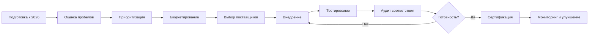

**Критические факторы успеха:**

1. **Лидерство руководства**
   - Назначить ответственного на уровне правления/CEO
   - Регулярная отчетность совету директоров

2. **Кросс-функциональная команда**
   - Представители: комплаенс, IT, риски, финансы, HR
   - Еженедельные статус-митинги

3. **Внешние партнеры**
   - Консультанты по регуляторике
   - IT интеграторы (ПОД/ФТ, кибербезопасность)
   - Аудиторы и сертификаторы

4. **Управление изменениями**
   - Коммуникация с персоналом
   - Обучающие программы
   - Мотивация команды проекта

---

## 7. Возможности и преимущества

### 7.1 Конкурентные преимущества раннего соответствия

**Участники, достигшие соответствия к 1 января 2026, получат:**

1. **Маркетинговые преимущества**
   - Знак "Соответствует требованиям 2026" на сайте и в материалах
   - Включение в "белый список" ГСФР и КФА
   - Приоритет в государственных тендерах

2. **Операционные преимущества**
   - Упрощенная процедура отчетности
   - Снижение частоты проверок регулятором
   - Доступ к расширенным лицензионным возможностям

3. **Финансовые преимущества**
   - Привлечение институциональных инвесторов
   - Снижение стоимости привлечения капитала
   - Рост клиентской базы за счет переток из несоответствующих компаний

### 7.2 Долгосрочные выгоды

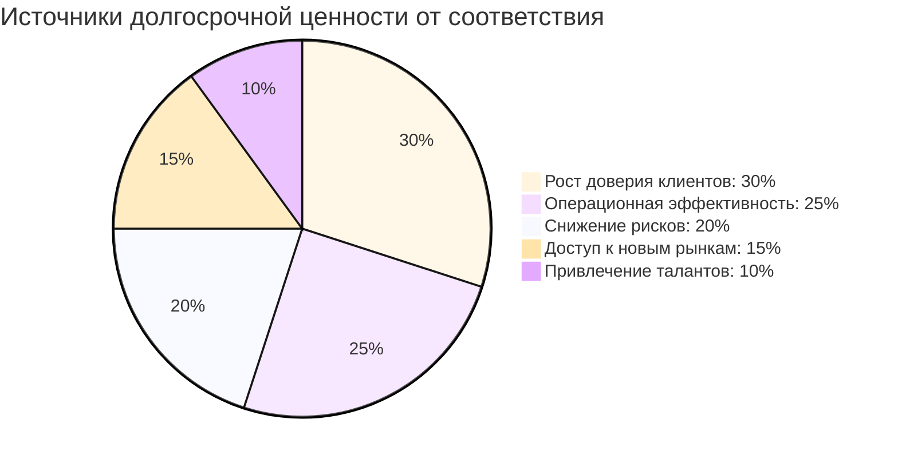

**Количественные оценки (горизонт 3 года):**
- Рост клиентской базы: +15-25%
- Снижение операционных убытков: -30-40%
- Улучшение Net Promoter Score: +20-30 пунктов
- Сокращение затрат на комплаенс: -15-20% (за счет автоматизации)

---

## 8. Международный контекст

### 8.1 Сравнение с региональными рынками

| Требование | Кыргызстан 2026 | Казахстан | Узбекистан | Грузия |
|------------|-----------------|-----------|------------|--------|
| Минимальный капитал брокера | $80,000 | $140,000 | $100,000 | $120,000 |
| ПОД/ФТ автоматизация | 85% | 90% | 80% | 95% |
| ESG отчетность | Обязательно | Обязательно для крупных | Добровольно | Обязательно |
| ISO 27001 | Обязательно | Обязательно | Рекомендовано | Обязательно |
| Частота аудита | Ежегодно | Ежегодно | Раз в 2 года | Ежегодно |

**Выводы:**
- Требования КР соответствуют международным стандартам
- Капитальные требования ниже, чем у региональных лидеров
- Акцент на ESG и кибербезопасность соответствует глобальным трендам

### 8.2 Лучшие практики из зарубежного опыта

**Казахстан (KASE):** Поэтапное внедрение с 2-летним переходным периодом
- Результат: 95% участников достигли соответствия без отзыва лицензий
- Ключевой фактор: Активная поддержка регулятора, обучающие программы

**Грузия:** Использование sandbox-подхода для тестирования новых технологий
- Результат: Ускоренное внедрение блокчейн-решений
- Ключевой фактор: Гибкость регулятора, инновационный подход

**Эстония (Nasdaq Tallinn):** Полная цифровизация комплаенса
- Результат: Снижение затрат на соответствие на 40%
- Ключевой фактор: Государственная цифровая инфраструктура (e-Residency)

---

## 9. Роль КФА в поддержке участников

### 9.1 Инициативы Ассоциации

**Запущенные программы:**

1. **"Готовность 2026"** - комплексная программа поддержки
   - Бесплатные консультации для членов КФА
   - Ежемесячные вебинары с экспертами
   - Доступ к шаблонам и чек-листам

2. **Групповые закупки** - снижение затрат
   - ПОД/ФТ системы: скидка 20-30% при групповой покупке
   - Консалтинговые услуги: скидка 15% для членов КФА
   - Обучение персонала: корпоративные тарифы

3. **Диалог с регулятором**
   - Представление интересов участников в ГСФР
   - Разъяснение неоднозначных требований
   - Лоббирование разумных переходных периодов

### 9.2 Образовательные ресурсы

**Доступно для членов КФА:**
- 📚 База знаний с 50+ статьями и гайдами
- 🎓 Онлайн-курсы по новым требованиям (12 модулей)
- 🤝 Peer-to-peer сессии для обмена опытом
- 📊 Benchmark-исследования готовности

---

## 10. Заключение

### 10.1 Ключевые выводы

1. **Готовность рынка неоднородна**: От 52% (управляющие) до 81% (депозитарии)
2. **Критический период**: Q4 2025 - Q2 2026
3. **Общие инвестиции отрасли**: 200-249 млн сом ($2.3-$2.8 млн)
4. **Основные вызовы**: Капитал (35% участников), ПОД/ФТ автоматизация (82%), ESG (88%)
5. **Возможности**: Конкурентные преимущества для лидеров, консолидация рынка

### 10.2 Призыв к действию

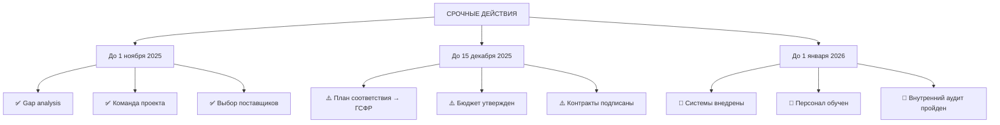

**Рекомендации КФА:**

🎯 **Для всех участников:**
- Провести внутренний gap analysis до 1 ноября 2025
- Назначить ответственного за проект соответствия
- Подать план соответствия в ГСФР до 15 декабря 2025
- Присоединиться к программе КФА "Готовность 2026"

💼 **Для руководителей:**
- Рассматривать соответствие как стратегическую инициативу, не только комплаенс
- Выделить достаточный бюджет (см. оценки в разделе 3)
- Обеспечить вовлеченность всех подразделений

🤝 **Для регулятора:**
- Продолжать конструктивный диалог с участниками
- Рассмотреть пилотные программы для сложных требований
- Обеспечить ясность в интерпретации требований

---

## Контакты

**Аналитический отдел КФА**
📧 research@kfa.kg
📞 +996 (312) 90-XX-XX
🌐 https://kfa.kg

**Программа "Готовность 2026"**
📧 readiness2026@kfa.kg
📅 Регистрация на вебинары: https://kfa.kg/events

---

## Приложения

### Приложение A: Чек-лист самооценки готовности

**Капитал:**
- [ ] Рассчитан текущий собственный капитал
- [ ] Определен дефицит (если есть)
- [ ] Разработан план докапитализации
- [ ] Получено одобрение акционеров

**ПОД/ФТ:**
- [ ] Оценен уровень текущей автоматизации
- [ ] Выбран поставщик системы
- [ ] Разработан план интеграции
- [ ] Назначен ответственный за ПОД/ФТ

**ESG:**
- [ ] Изучены требования к отчетности
- [ ] Определены релевантные метрики
- [ ] Внедрены системы сбора данных
- [ ] Назначен ESG-координатор

**Кибербезопасность:**
- [ ] Проведен gap analysis по ISO 27001
- [ ] Выбран сертификационный орган
- [ ] Внедрены недостающие контроли
- [ ] Запланирован сертификационный аудит

**Персонал:**
- [ ] Идентифицированы сотрудники, требующие сертификации
- [ ] Выбраны обучающие программы
- [ ] Запланированы экзамены
- [ ] Выделен бюджет на обучение

### Приложение B: Рекомендованные поставщики решений

*(Список не исчерпывающий, не является рекламой)*

**ПОД/ФТ системы:**
- EGAR Technology (Россия/КНР) - от $25,000
- ComplyAdvantage (Великобритания) - от $30,000
- NICE Actimize (США) - от $50,000

**Кибербезопасность:**
- BI.ZONE (Россия) - консалтинг и сертификация ISO 27001
- Positive Technologies (Россия) - SIEM, пентесты
- Лаборатория Касперского (Россия) - защитные решения

**ESG отчетность:**
- Ernst & Young (КР) - консалтинг и аудит
- Deloitte (КР) - методология и внедрение
- PwC (КР) - ESG стратегия

### Приложение C: Нормативные документы

1. Закон КР "О рынке ценных бумаг" (редакция от 15.06.2025)
2. Положение ГСФР №XX/2025 "О лицензировании деятельности на рынке ценных бумаг"
3. Стандарт КФА "Требования к системам управления рисками" (2025)
4. Методические рекомендации ГСФР по ESG отчетности (2025)
5. ISO/IEC 27001:2022 "Информационная безопасность"

---

**Дата следующего обновления:** 1 декабря 2025
**Версия:** 1.0
**Статус:** Утверждено правлением КФА 22.10.2025
