# ESG-тренды на развивающихся рынках: опыт Кыргызстана

**Дата публикации:** 22 октября 2025
**Автор:** Центр устойчивого развития КФА
**Категория:** ESG и устойчивое развитие

---

## Резюме

Анализ интеграции принципов ESG (Environmental, Social, Governance) на развивающихся рынках с фокусом на опыт Кыргызской Республики. Исследование охватывает глобальные тренды, локальную адаптацию, барьеры внедрения и возможности для участников рынка ценных бумаг. Особое внимание уделено практическим рекомендациям для компаний, работающих в условиях формирующихся рынков.

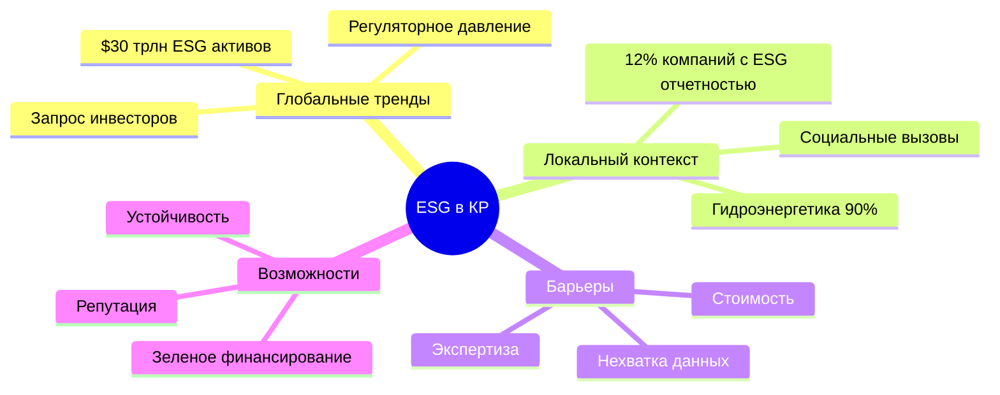

### Ключевые показатели ESG-интеграции

| Метрика                                     | Глобально | Развивающиеся рынки | Кыргызстан | Целевое значение (2030) |
| ------------------------------------------- | --------- | ------------------- | ---------- | ----------------------- |
| ESG отчетность крупных компаний             | 78%       | 43%                 | 12%        | 60%                     |
| Доля зеленых облигаций                      | 12%       | 5%                  | <1%        | 8%                      |
| ESG-интеграция институциональных инвесторов | 89%       | 54%                 | 18%        | 70%                     |
| Женщины в советах директоров                | 33%       | 19%                 | 11%        | 30%                     |
| Раскрытие углеродного следа                 | 65%       | 28%                 | 7%         | 50%                     |

---

## 1. Глобальный контекст ESG

### 1.1 Эволюция ESG-движения

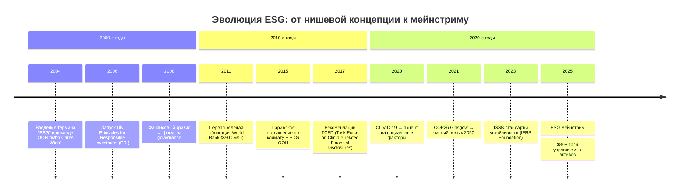

### 1.2 Драйверы ESG-интеграции

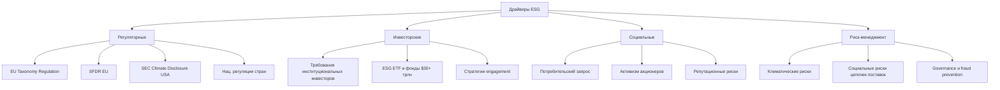

**Статистика глобального рынка ESG:**

- **$30+ трлн** — активы под управлением с учетом ESG (2025)
- **89%** — институциональные инвесторы интегрируют ESG в процесс инвестирования
- **33%** — среднегодовой рост рынка зеленых облигаций (2020-2025)
- **200+** — регуляторных инициатив по ESG раскрытию по всему миру

### 1.3 Три столпа ESG

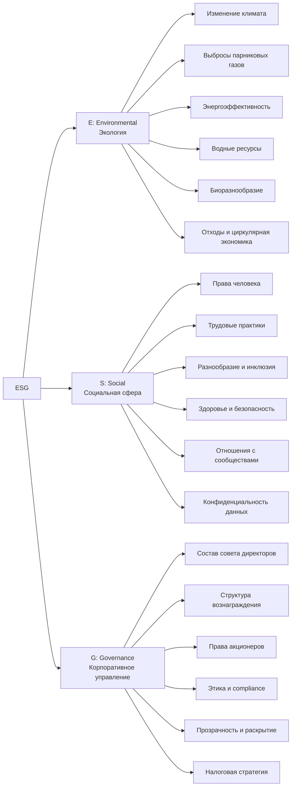

---

## 2. ESG на развивающихся рынках

### 2.1 Особенности emerging markets

**Контрастный профиль: вызовы vs возможности**

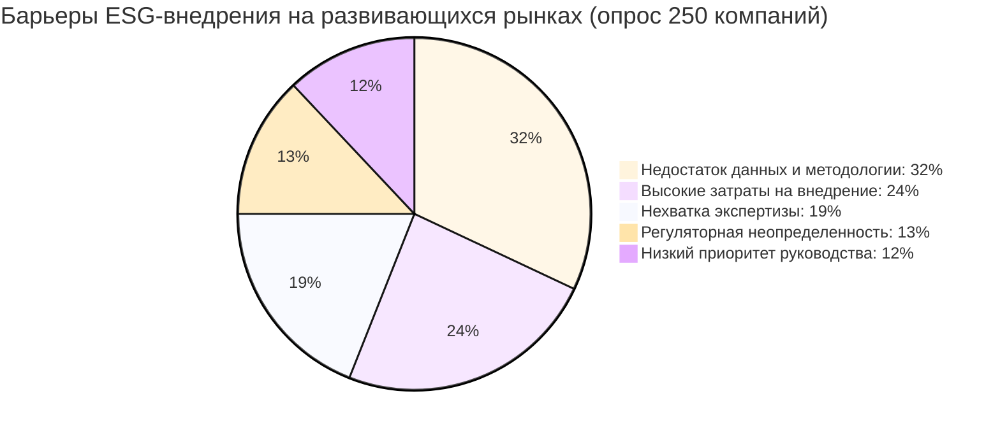

#### 2.1.1 Вызовы

| Вызов                       | Описание                                                       | Распространенность |
| --------------------------- | -------------------------------------------------------------- | ------------------ |
| **Качество данных**         | Отсутствие систем сбора ESG-данных, ручной процесс             | 78% компаний       |
| **Финансовые ограничения**  | Ограниченный бюджет на ESG-инициативы и отчетность             | 65%                |
| **Недостаток экспертизы**   | Нехватка ESG-специалистов, особенно в регионах                 | 71%                |
| **Фрагментация стандартов** | Множество конкурирующих ESG-фреймворков, неясность выбора      | 58%                |
| **Краткосрочный фокус**     | Приоритет краткосрочной прибыли над долгосрочной устойчивостью | 54%                |

#### 2.1.2 Возможности

| Возможность                   | Описание                                                            | Потенциальная выгода                    |
| ----------------------------- | ------------------------------------------------------------------- | --------------------------------------- |
| **Leapfrogging**              | Внедрение передовых ESG-практик, минуя промежуточные этапы          | Конкурентное преимущество               |
| **Первопроходцы**             | Лидерство в регионе привлекает ESG-инвесторов                       | Доступ к капиталу со скидкой 50-100 bps |
| **Ниша устойчивого развития** | Неудовлетворенный спрос на ESG-активы в регионе                     | Захват быстрорастущего сегмента         |
| **Поддержка DFI**             | Финансирование от Development Finance Institutions (IFC, ADB, EBRD) | Льготное финансирование + TA            |
| **Репутационная премия**      | ESG-лидеры получают медийное внимание и доверие                     | Рост стоимости бренда 15-25%            |

### 2.2 Региональные тренды (Центральная Азия)

**Сравнительный анализ стран ЦА:**

| Страна           | ESG отчетность топ-50 компаний | Зеленые облигации выпущено | ESG рейтинг (MSCI ESG Indexes) | Ключевые фокусы                    |
| ---------------- | ------------------------------ | -------------------------- | ------------------------------ | ---------------------------------- |
| **Казахстан**    | 38%                            | $2.5 млрд (2020-2025)      | BB                             | Декарбонизация, governance реформы |
| **Узбекистан**   | 21%                            | $1.2 млрд                  | B                              | Социальные реформы, водные ресурсы |
| **Кыргызстан**   | 12%                            | <$100 млн                  | CCC+                           | Гидроэнергетика, права человека    |
| **Таджикистан**  | 8%                             | $0                         | CCC                            | Алюминий и энергия                 |
| **Туркменистан** | 5%                             | $0                         | Нет данных                     | Природный газ                      |

**Лидеры ESG в ЦА:**

1. 🥇 **Казахстан**: Активное регуляторное продвижение, крупнейший рынок
2. 🥈 **Узбекистан**: Быстрая трансформация, амбициозные цели
3. 🥉 **Кыргызстан**: Потенциал в зеленой энергетике, но низкая база

---

## 3. ESG в Кыргызстане: текущее состояние

### 3.1 Макро-контекст

**Сильные стороны Кыргызстана:**

- ✅ **Чистая энергетика**: 90%+ электроэнергии из ГЭС (гидроэлектростанций)
- ✅ **Природный капитал**: Богатые водные ресурсы, биоразнообразие
- ✅ **Демократические традиции**: Относительно открытое гражданское общество в регионе

**Слабые стороны:**

- ❌ **Экономическая база**: Низкий ВВП на душу населения ($1,500)
- ❌ **Зависимость от переводов**: 30%+ ВВП — денежные переводы мигрантов
- ❌ **Governance вызовы**: Коррупция, политическая нестабильность

### 3.2 Оценка ESG-зрелости компаний КР

**Исследование КФА (октябрь 2025): 85 крупнейших компаний КР**

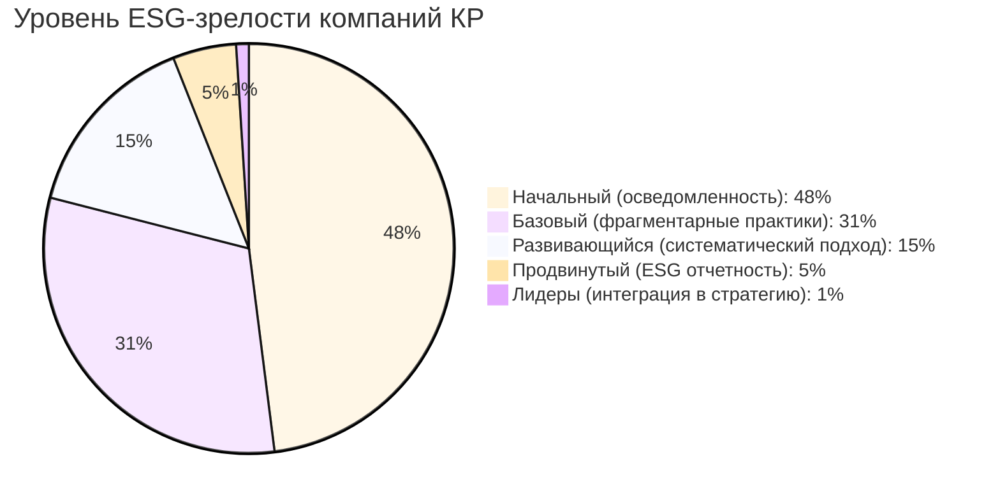

**Детальная оценка по столпам:**

| Столп                 | Средний балл (из 10) | Описание                                                                                      |
| --------------------- | -------------------- | --------------------------------------------------------------------------------------------- |
| **E (Environmental)** | 3.2                  | Низкая осведомленность об углеродном следе, отсутствие систем мониторинга                     |
| **S (Social)**        | 5.1                  | Базовые трудовые практики, но слабое раскрытие; разнообразие низкое                           |
| **G (Governance)**    | 4.7                  | Улучшения в прозрачности, но концентрация собственности и независимость директоров — проблемы |
| **Раскрытие**         | 2.8                  | Критически низкое: только 12% публикуют ESG-отчеты или sustainability reports                 |

### 3.3 Секторальный анализ

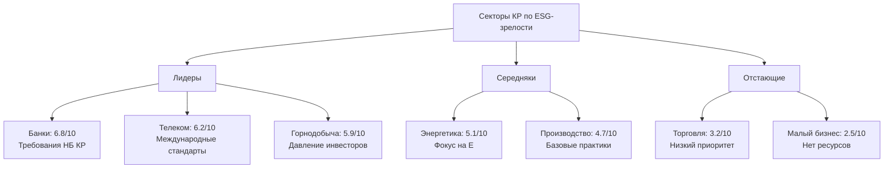

**Примеры ESG-практик в КР:**

**🏆 Лучшие практики:**

1. **"Кумтор Голд Компани"** (горнодобыча):
   - Ежегодный sustainability report по GRI стандартам
   - Программы поддержки местных сообществ ($5+ млн/год)
   - Мониторинг экологического воздействия

2. **"Банк Азия"**:
   - ESG-политика кредитования (исключает вредные отрасли)
   - Раскрытие гендерного разнообразия (32% женщин в менеджменте)
   - Зеленые кредиты для МСБ (энергоэффективность)

3. **"O!" (мобильный оператор)**:
   - Carbon footprint измерение и цели снижения
   - Программы digital inclusion для удаленных регионов
   - Прозрачная структура управления

---

## 4. Регуляторные рамки ESG в КР

### 4.1 Текущая регуляторная среда

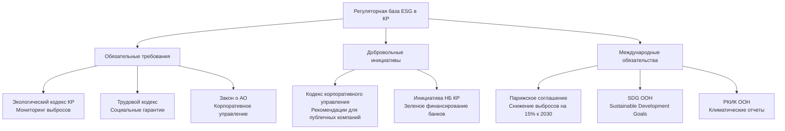

### 4.2 Новые требования (2026)

**С 1 января 2026 года для участников рынка ЦБ:**

1. **Обязательное ESG раскрытие** (для публичных компаний с капитализацией >100 млн сом):
   - Годовой отчет должен включать ESG-секцию
   - Минимальные метрики: выбросы CO₂, гендерное разнообразие совета, случаи коррупции
   - Формат: по аналогии с EU NFRD (Non-Financial Reporting Directive), адаптированный

2. **"Зеленая таксономия КР"** (в разработке):
   - Классификация экономических активностей по степени экологической устойчивости
   - Первоначальный фокус: возобновляемая энергия, энергоэффективность, устойчивое сельское хозяйство
   - Цель: направление капитала в зеленые проекты

3. **ESG Due Diligence для институциональных инвесторов**:
   - Управляющие компании должны интегрировать ESG в инвестиционный процесс
   - Раскрытие ESG-рисков в клиентских отчетах
   - Голосование на собраниях акционеров с учетом ESG

**Переходный период:** 12 месяцев для крупных компаний, 24 месяца для средних.

### 4.3 Международное сотрудничество

**Программы поддержки ESG в КР:**

| Организация                       | Программа                        | Бюджет  | Фокус                                         |
| --------------------------------- | -------------------------------- | ------- | --------------------------------------------- |
| **IFC (Всемирный банк)**          | Green Buildings Program          | $10 млн | Энергоэффективность в строительстве           |
| **ADB (Азиатский банк развития)** | Climate Resilience Project       | $25 млн | Адаптация к изменению климата                 |
| **EBRD**                          | Green Economy Financing Facility | $50 млн | Зеленые кредиты для МСБ через локальные банки |
| **GIZ (Германия)**                | Sustainable Business Advisory    | $3 млн  | Консалтинг и capacity building для компаний   |
| **USAID**                         | Corporate Governance Program     | $5 млн  | Улучшение governance практик                  |

---

## 5. Практическая имплементация ESG

### 5.1 Roadmap ESG-трансформации

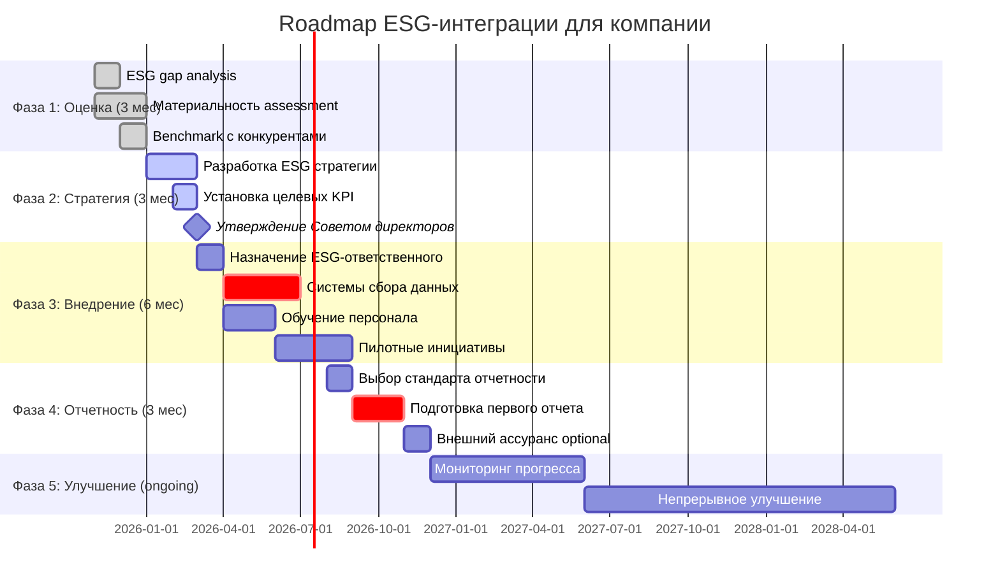

### 5.2 Материальность (Materiality Assessment)

**Определение материальных ESG-тем для компании:**

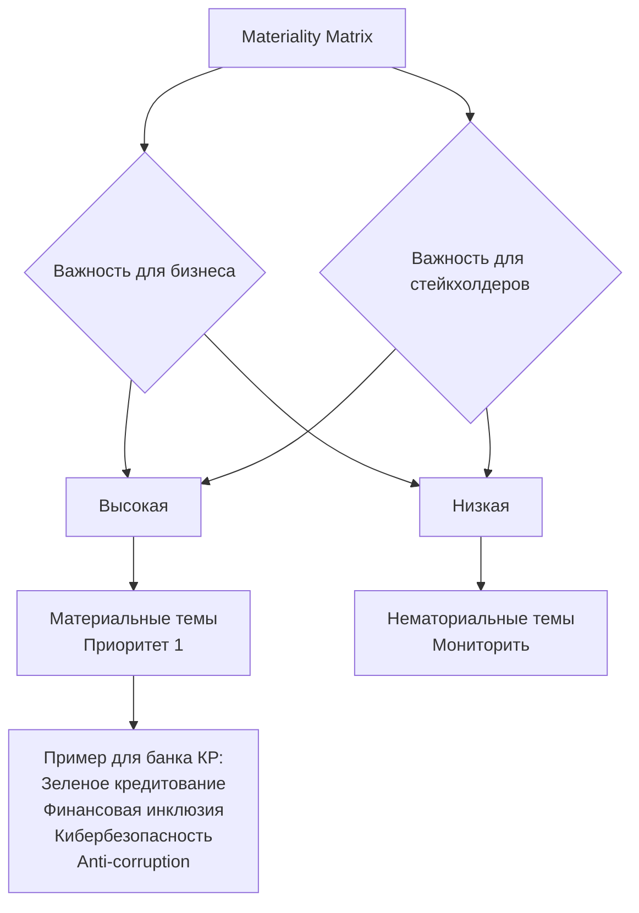

**Процесс материальности:**

1. **Идентификация стейкхолдеров**: Акционеры, клиенты, сотрудники, регулятор, сообщества, НКО
2. **Сбор мнений**: Опросы, интервью, фокус-группы
3. **Оценка воздействия**: Какие ESG-темы критичны для бизнеса и общества
4. **Приоритизация**: Матрица материальности (важность для бизнеса vs для стейкхолдеров)
5. **Валидация**: Утверждение руководством и Советом директоров

### 5.3 Выбор стандарта отчетности

**Основные ESG-фреймворки:**

| Стандарт                                                       | Описание                                                               | Подходит для                              | Стоимость               |
| -------------------------------------------------------------- | ---------------------------------------------------------------------- | ----------------------------------------- | ----------------------- |
| **GRI (Global Reporting Initiative)**                          | Самый популярный (75% компаний глобально), фокус на impact на общество | Все отрасли и размеры                     | $0 (публичный стандарт) |
| **SASB (Sustainability Accounting Standards Board)**           | Финансово-материальные ESG-темы по отраслям                            | Публичные компании, инвесторы             | $0                      |
| **TCFD (Task Force on Climate-related Financial Disclosures)** | Фокус на климатические риски и возможности                             | Все, особенно углеродоемкие               | $0                      |
| **CDP (Carbon Disclosure Project)**                            | Углеродный след, водные ресурсы, леса                                  | Крупные компании, supply chains           | $0-5,000                |
| **ISSB (International Sustainability Standards Board)**        | Новый глобальный стандарт (с 2024), объединяет SASB и TCFD             | Станет обязательным во многих юрисдикциях | $0                      |

**Рекомендации для компаний КР:**

- **Крупные публичные компании**: GRI + TCFD (климат) + готовиться к ISSB
- **Средние компании**: GRI Essentials (упрощенная версия)
- **Малые компании / МСБ**: Внутренний dashboard с ключевыми метриками, без формального отчета

### 5.4 Ключевые ESG-метрики для участников рынка ЦБ КР

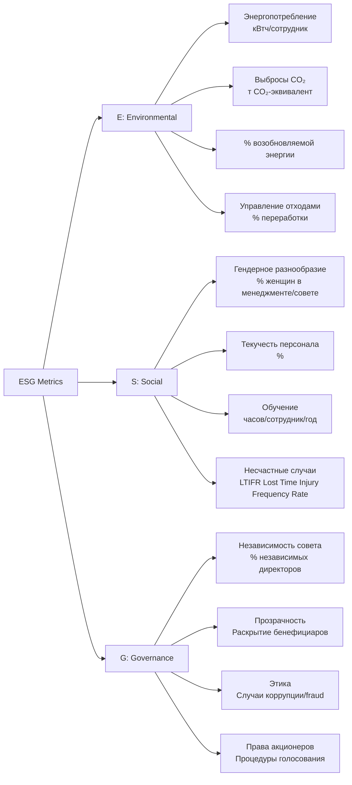

**Минимальный набор метрик для участников рынка ЦБ (требование с 2026):**

| Столп | Метрика                                   | Единица измерения     | Частота  |
| ----- | ----------------------------------------- | --------------------- | -------- |
| **E** | Выбросы CO₂ (Scope 1+2)                   | т CO₂-эквивалент      | Ежегодно |
| **E** | Энергопотребление                         | МВтч                  | Ежегодно |
| **S** | Гендерное разнообразие (совет директоров) | % женщин              | Ежегодно |
| **S** | Гендерное разнообразие (топ-менеджмент)   | % женщин              | Ежегодно |
| **S** | Обучение персонала                        | Часов на сотрудника   | Ежегодно |
| **G** | Независимость совета директоров           | % независимых         | Ежегодно |
| **G** | Раскрытие бенефициарной собственности     | Да/Нет, % владения    | Ежегодно |
| **G** | Случаи коррупции и нарушений этики        | Количество + описание | Ежегодно |

---

## 6. Зеленое финансирование

### 6.1 Инструменты зеленого финансирования

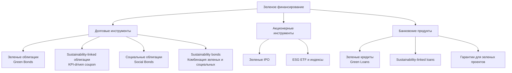

### 6.2 Зеленые облигации (Green Bonds)

**Принципы зеленых облигаций (Green Bond Principles, GBP):**

1. **Use of Proceeds**: Средства направляются исключительно на зеленые проекты
2. **Process for Project Evaluation and Selection**: Прозрачный процесс отбора проектов
3. **Management of Proceeds**: Раздельный учет средств
4. **Reporting**: Ежегодная отчетность об использовании средств и воздействии

**Eligible green projects (примеры):**

- ♻️ Возобновляемая энергия (солнечная, ветровая, гидро)
- 🏢 Энергоэффективные здания (green buildings)
- 🚊 Чистый транспорт (электромобили, общественный транспорт)
- 💧 Управление водными ресурсами
- 🌳 Лесовосстановление, защита биоразнообразия
- ♻️ Циркулярная экономика, переработка отходов

**Потенциал в КР:**

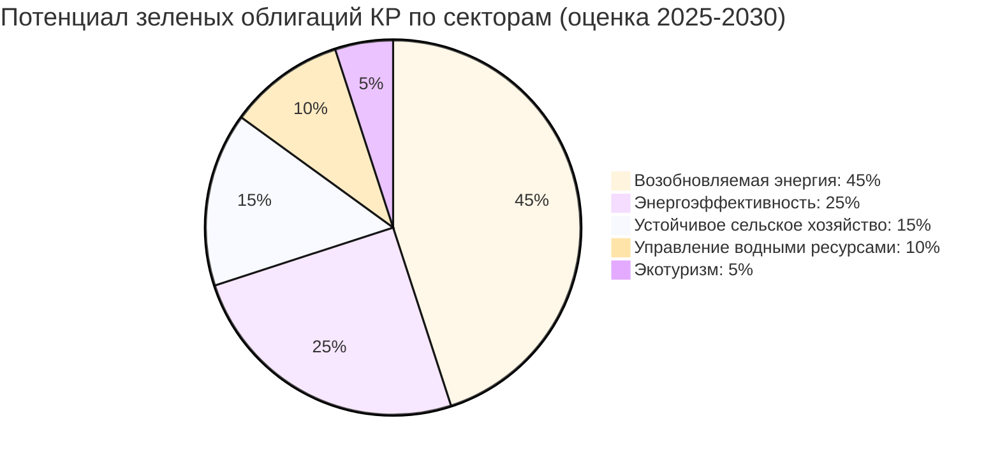

**Кейс: Первая зеленая облигация в КР (гипотетический)**

**Эмитент**: "ГЭС Токтогул" (гидроэлектростанция)
**Объем**: 500 млн сом ($5.7 млн)
**Срок**: 5 лет
**Ставка**: 9% (vs 10% для обычных облигаций компании) → "greenium" -100 bps
**Use of Proceeds**: Модернизация турбин для повышения эффективности на 12%
**Ожидаемое воздействие**:

- Снижение выбросов CO₂: 50,000 т/год (за счет замещения угольной генерации в регионе)
- Увеличение генерации: +80 ГВтч/год
  **Сертификация**: Climate Bonds Initiative certified
  **Спрос**: Международные DFI инвесторы + локальные пенсионные фонды с ESG-мандатом

**Барьеры для зеленых облигаций в КР:**

- ❌ Малый размер проектов (<$10 млн) → высокие транзакционные издержки
- ❌ Нехватка локальных ESG-инвесторов
- ❌ Отсутствие независимых верификаторов (Second Party Opinion providers)
- ❌ Регуляторная неопределенность (нет официальной "зеленой таксономии")

### 6.3 Sustainability-Linked Loans (SLL)

**Концепция:** Процентная ставка привязана к достижению ESG KPI эмитента.

**Пример структуры:**

**Заемщик**: Производственная компания "X"
**Кредитор**: Банк с ESG-политикой
**Сумма**: 100 млн сом
**Базовая ставка**: 12%
**KPI:**

1. Снижение выбросов CO₂ на 20% к 2028 (vs 2025 baseline)
2. Увеличение доли женщин в менеджменте с 15% до 30% к 2028
3. Получение ISO 14001 (экологический менеджмент) к 2027

**Pricing adjustment:**

- Все 3 KPI достигнуты: ставка снижается на 50 bps → 11.5%
- 2 из 3 достигнуты: ставка снижается на 25 bps → 11.75%
- <2 достигнуты: ставка остается 12% (или повышается на 25 bps как штраф)

**Преимущества SLL:**

- ✅ Гибкость: средства можно использовать на любые цели (не только зеленые проекты)
- ✅ Инцентив для компаний улучшать ESG-показатели
- ✅ Проще структурировать, чем зеленые облигации

**Рост рынка SLL:** $800 млрд глобально в 2024 (+40% CAGR), развивающиеся рынки активно перенимают.

---

## 7. Вызовы и риски ESG

### 7.1 Greenwashing — главная угроза доверию

**Определение:** **Greenwashing** — создание ложного впечатления об экологичности или социальной ответственности компании/продукта.

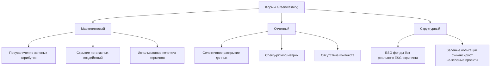

**Примеры greenwashing (международная практика):**

- 🏭 Нефтегазовая компания рекламирует инвестиции в возобновляемую энергию (5% бюджета), скрывая 95% в ископаемое топливо
- 🌳 "Углеродно-нейтральная" авиакомпания, покупающая непроверенные carbon offsets
- 💚 Фонд с названием "ESG", но портфель включает табачные и оружейные компании

**Последствия greenwashing:**

- Регуляторные штрафы (EU уже налагает)
- Потеря доверия инвесторов и клиентов
- Обратный эффект: скептицизм к ESG в целом

**Как избежать greenwashing:**

1. ✅ **Прозрачность**: Раскрывать и позитивное, и негативное воздействие
2. ✅ **Верификация**: Внешний аудит ESG-данных (limited или reasonable assurance)
3. ✅ **Стандарты**: Следовать признанным фреймворкам (GRI, TCFD)
4. ✅ **Конкретность**: Избегать нечетких заявлений ("eco-friendly", "sustainable" без определения)

### 7.2 Балансирование приоритетов: ESG vs финансовая производительность

**Дилемма:** Инвестиции в ESG могут снижать краткосрочную прибыль.

**Аргументы "против" ESG:**

- 💸 Высокие затраты на внедрение (системы, консалтинг, отчетность): 0.5-2% выручки
- 📉 Ограничение инвестиционной вселенной (исключение высокодоходных, но "грязных" активов)
- ⏳ Долгий срок окупаемости зеленых инвестиций (5-10+ лет)
- 🎯 Отвлечение менеджмента от core business

**Аргументы "за" ESG:**

- 📈 **Долгосрочная ценность**: Компании с высокими ESG-рейтингами показывают на 3-6% более высокую доходность на капитал (исследование MSCI, 2023)
- 🛡️ **Снижение рисков**: Меньше регуляторных штрафов, экологических инцидентов, репутационных кризисов
- 💰 **Доступ к капиталу**: ESG-лидеры привлекают капитал под более низкие ставки (50-100 bps дисконт)
- 🧲 **Привлечение талантов**: 70% миллениалов предпочитают работать в социально ответственных компаниях
- 🔮 **Будущее регулирование**: Проактивная подготовка к неизбежному ужесточению требований

**Эмпирические данные:**

- **Harvard Business School (2020)**: Компании с высокими ESG-рейтингами на 50% менее волатильны в кризисы
- **McKinsey (2022)**: ESG-программы увеличивают EBITDA на 10-60% через повышение эффективности
- **Morningstar (2024)**: 70% ESG-фондов превзошли традиционные фонды за 10-летний период

**Вывод:** ESG — не благотворительность, а разумное долгосрочное инвестирование в устойчивость бизнеса.

---

## 8. Рекомендации для участников рынка КР

### 8.1 Для эмитентов ценных бумаг

**Краткосрочные действия (2025-2026):**

1. **Провести ESG gap analysis** (самостоятельно или с консультантом)
   - Оценить текущие практики по фреймворку (напр., GRI)
   - Идентифицировать пробелы относительно лучших практик и новых требований 2026

2. **Назначить ESG-ответственного** (может быть на 0.5 ставки для малых компаний)
   - Координация сбора данных
   - Взаимодействие с стейкхолдерами
   - Мониторинг регуляторных изменений

3. **Начать измерение базовых метрик**
   - Углеродный след (можно использовать бесплатные калькуляторы: EPA, carbonfootprint.com)
   - Гендерное разнообразие (просто подсчитать!)
   - Структура governance

4. **Раскрыть ESG в годовом отчете** (даже если не обязательно пока)
   - Продемонстрирует проактивность
   - Подготовит к обязательным требованиям 2026

**Среднесрочные действия (2026-2028):**

5. **Разработать ESG стратегию и цели**
   - Материальные темы
   - Измеримые KPI и таргеты
   - Утверждение Советом директоров

6. **Публиковать standalone ESG/sustainability report**
   - По GRI или другому стандарту
   - Рассмотреть внешний ассуранс

7. **Рассмотреть зеленое финансирование**
   - Если есть подходящие проекты → зеленые облигации
   - Sustainability-linked кредиты для общего финансирования с ESG-инцентивами

8. **Engagement со стейкхолдерами**
   - Регулярный диалог с инвесторами, НКО, сообществами
   - Учитывать обратную связь в стратегии

**Долгосрочные действия (2028+):**

9. **Интеграция ESG в корпоративную ДНК**
   - ESG KPI в вознаграждении менеджмента
   - ESG как часть риск-менеджмента
   - Цели по углеродной нейтральности (net zero)

10. **Лидерство и адвокация**
    - Участие в отраслевых инициативах (напр., программы КФА)
    - Обмен лучшими практиками
    - Влияние на развитие ESG-регулирования в КР

### 8.2 Для инвесторов (управляющие компании, пенсионные фонды)

**ESG-интеграция в инвестиционный процесс:**

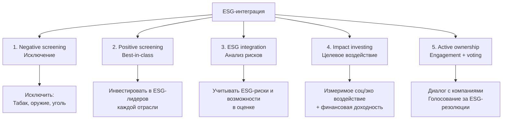

**Рекомендуемая стратегия для управляющих в КР:**

1. **Начать с negative screening** (самое простое)
   - Исключить высокорисковые с точки зрения ESG отрасли
   - Документировать политику исключений

2. **Постепенно внедрять ESG-анализ**
   - Использовать публичные ESG-рейтинги (MSCI ESG, Sustainalytics — если доступны для КР компаний)
   - Собственная оценка по чек-листу для локальных компаний

3. **Раскрывать ESG-подход клиентам**
   - ESG-политика в инвестиционном меморандуме
   - Отчеты об ESG-рисках портфеля

4. **Active ownership** (для крупных инвесторов)
   - Участие в собраниях акционеров
   - Engagement с компаниями по ESG-темам
   - Совместные инициативы с другими инвесторами

### 8.3 Для регулятора (ГСФР)

**Рекомендации КФА по развитию ESG-регулирования:**

1. **Зеленая таксономия КР**
   - Разработать совместно с индустрией
   - Гармонизировать с международными стандартами (EU Taxonomy как reference)
   - Начать с узкого набора секторов, постепенно расширять

2. **Стимулирование зеленого финансирования**
   - Упрощенные требования к листингу зеленых облигаций
   - Налоговые льготы для зеленых инвестиций
   - Гарантии для первых выпусков (risk-sharing с государством)

3. **Capacity building**
   - Обучающие программы для компаний по ESG-отчетности
   - Сертификация локальных ESG-консультантов
   - Партнерство с международными организациями (GRI, SASB)

4. **Данные и инфраструктура**
   - Создать публичную базу ESG-данных компаний КР
   - Стандартизированные формы отчетности
   - Интеграция с биржей (ESG indices, зеленые облигации секция)

---

## 9. Будущее ESG в Кыргызстане

### 9.1 Сценарии развития (2025-2035)

```mermaid
%%{init: {'theme':'base'}}%%
quadrantChart
    title Сценарии ESG-развития КР (вероятность vs желательность)
    x-axis Низкая желательность --> Высокая желательность
    y-axis Низкая вероятность --> Высокая вероятность
    quadrant-1 Оптимистичный (стремиться)
    quadrant-2 Реалистичный (базовый)
    quadrant-3 Пессимистичный (избегать)
    quadrant-4 Амбициозный (возможен с поддержкой)

    Статус-кво (минимальные изменения): [0.3, 0.4]
    Следование за регионом (Казахстан, Узбекистан): [0.6, 0.6]
    ESG-лидерство в ЦА: [0.8, 0.3]
    Зеленая ниша (экотуризм, чистая энергия): [0.7, 0.5]
```

**Базовый сценарий (60% вероятность):**

- ESG-отчетность публичных компаний: 60% к 2030 (vs 12% в 2025)
- Первые зеленые облигации: 2027, объем $20-50 млн
- Регуляторные требования гармонизированы с Казахстаном
- Международное финансирование поддерживает зеленые проекты
- **Результат:** КР в середине пелетона развивающихся рынков по ESG

**Оптимистичный сценарий (20% вероятность):**

- Политическая стабильность + реформы → ускорение
- КР позиционируется как "зеленая страна ЦА" (90%+ чистая энергия)
- Зеленый туризм и органическое сельское хозяйство — драйверы экономики
- Активное участие DFI и impact инвесторов
- **Результат:** Нишевое ESG-лидерство, привлечение ESG-капитала

**Пессимистичный сценарий (20% вероятность):**

- Политическая нестабильность, экономические шоки
- ESG воспринимается как "роскошь", фокус на выживание
- Регуляторные требования не внедряются
- Отставание от региона углубляется
- **Результат:** Упущенные возможности, отток ESG-инвесторов

### 9.2 Целевая картина 2035

**Видение КФА: "Кыргызстан — устойчивая финансовая система ЦА"**

**Ключевые индикаторы успеха к 2035:**

| Индикатор                                              | 2025 (базовая линия) | 2035 (цель) |
| ------------------------------------------------------ | -------------------- | ----------- |
| ESG отчетность (топ-50 компаний)                       | 12%                  | 80%         |
| Зеленые облигации (выпущено накопительно)              | <$100 млн            | $500 млн    |
| ESG-фонды (AUM)                                        | 0                    | $50 млн     |
| Женщины в советах директоров (публичные компании)      | 11%                  | 35%         |
| Углеродный след финансового сектора (снижение vs 2025) | Baseline             | -30%        |
| Компании с Science-Based Targets (климатические цели)  | 0                    | 20 компаний |

**Необходимые условия:**

1. ✅ Политическая стабильность и продолжение реформ
2. ✅ Развитие локальной ESG-экспертизы и инфраструктуры
3. ✅ Международное сотрудничество и финансирование
4. ✅ Партнерство государства, бизнеса и гражданского общества
5. ✅ Адаптация к климатическим изменениям (водные ресурсы критичны для КР)

---

## 10. Заключение

### 10.1 Ключевые выводы

1. **ESG — не мода, а новая реальность**
   - $30+ трлн активов под управлением с ESG
   - Регуляторные требования усиливаются глобально и в регионе

2. **Развивающиеся рынки имеют уникальные вызовы и возможности**
   - Вызовы: данные, экспертиза, финансовые ресурсы
   - Возможности: leapfrogging, первопроходцы, DFI финансирование

3. **Кыргызстан имеет потенциал в "зеленой" нише**
   - 90%+ чистая энергетика — конкурентное преимущество
   - Но низкая база: всего 12% компаний с ESG-отчетностью

4. **Новые регуляторные требования 2026 — катализатор**
   - Обязательное ESG раскрытие для участников рынка ЦБ
   - Зеленая таксономия и стимулы для зеленого финансирования

5. **Практический подход критически важен**
   - Начать с малого: базовые метрики, gap analysis
   - Постепенная интеграция в стратегию
   - Избегать greenwashing через прозрачность и верификацию

### 10.2 Призыв к действию

**Для компаний:**

> "Начните ESG-путь сегодня. К 2030 это будет не конкурентное преимущество, а необходимость для выживания."

**Первые шаги:**

1. 📊 Измерить углеродный след компании (бесплатные калькуляторы доступны)
2. 👥 Назначить ESG-ответственного (даже на 0.5 ставки)
3. 📈 Установить 1-2 измеримые ESG-цели на 2026
4. 🤝 Присоединиться к программам КФА по ESG

**Для инвесторов:**

> "Интегрируйте ESG в инвестиционный процесс. Это не только этично, но и финансово разумно."

**Для регулятора:**

> "Создайте enabling environment для ESG — стандарты, стимулы, инфраструктура. КР может стать зеленым лидером ЦА."

**Для всех:**

> "ESG — не про perfect, это про progress. Каждый шаг к устойчивости имеет значение."

---

## Контакты и ресурсы

**Центр устойчивого развития КФА**
📧 esg@kfa.kg
📞 +996 (312) 90-XX-XX

**Полезные ресурсы:**

- 📚 База знаний по ESG: https://kfa.kg/esg
- 🎓 Онлайн-курс "ESG для начинающих": https://kfa.kg/education/esg
- 🤝 Сообщество ESG-практиков КР: https://kfa.kg/community/esg
- 📊 ESG dashboard компаний КР (в разработке): https://kfa.kg/esg-data

**Международные ресурсы:**

- GRI Standards: https://www.globalreporting.org
- TCFD Recommendations: https://www.fsb-tcfd.org
- SASB Standards: https://www.sasb.org
- UN PRI: https://www.unpri.org
- Climate Bonds Initiative: https://www.climatebonds.net

**Рекомендуемая литература:**

1. "ESG and Responsible Institutional Investing Around the World" — Monk, Sharma, Sinclair
2. "Sustainable Investing: Revolutions in Theory and Practice" — Boffo, Patalano (OECD)
3. "Green Finance and Investment" series — OECD
4. "Emerging Markets ESG Investing" — Migliorelli, Dessertine

---

## Приложения

### Приложение A: ESG Self-Assessment Tool

_(Упрощенный чек-лист для компаний КР)_

**Environmental (E):**

- [ ] Знаете ли вы свой углеродный след (выбросы CO₂)?
- [ ] Измеряете ли энергопотребление?
- [ ] Есть ли цели по снижению воздействия на окружающую среду?
- [ ] Используете ли возобновляемую энергию?
- [ ] Есть ли программа управления отходами?

**Social (S):**

- [ ] Знаете ли процент женщин в менеджменте и совете директоров?
- [ ] Есть ли политика разнообразия и инклюзии?
- [ ] Измеряете ли удовлетворенность сотрудников?
- [ ] Есть ли программы обучения персонала?
- [ ] Соблюдаются ли трудовые права (нет детского труда, принудительного труда)?
- [ ] Есть ли программы поддержки местных сообществ?

**Governance (G):**

- [ ] Есть ли независимые директора в совете (>25%)?
- [ ] Раскрыта ли бенефициарная собственность?
- [ ] Есть ли Кодекс этики?
- [ ] Есть ли канал для сообщения о нарушениях (whistleblowing)?
- [ ] Публикуется ли годовой отчет с финансовой информацией?
- [ ] Проводится ли внешний аудит финансовой отчетности?

**Интерпретация:**

- **12-18 "да"**: 🌟 Высокая ESG-зрелость, продолжайте!
- **7-11 "да"**: 🟡 Средний уровень, есть над чем работать
- **<7 "да"**: 🔴 Начальный уровень, срочно начинайте ESG-программу

### Приложение B: Глоссарий ESG-терминов

- **Carbon footprint**: Углеродный след, общий объем выбросов парниковых газов компании/продукта
- **Greenwashing**: Создание ложного впечатления об экологичности
- **Impact investing**: Инвестиции с целью измеримого социального/экологического воздействия + финансовая доходность
- **Materiality**: Материальность, существенность ESG-тем для бизнеса и стейкхолдеров
- **Net Zero**: Углеродная нейтральность, баланс между выбросами и их удалением
- **Science-Based Targets (SBT)**: Климатические цели, соответствующие науке (ограничение потепления 1.5°C)
- **Scope 1, 2, 3**: Категории выбросов (прямые, от энергии, в цепочке поставок)
- **TCFD**: Task Force on Climate-related Financial Disclosures, рекомендации по раскрытию климатических рисков

---

**Версия:** 1.0
**Дата утверждения:** 22 октября 2025
**Следующий пересмотр:** Апрель 2026
**Статус:** Утверждено Правлением КФА
