# Лучшие практики корпоративного управления для участников рынка ценных бумаг

**Дата публикации:** 22 октября 2025
**Автор:** Комитет по корпоративному управлению КФА
**Категория:** Корпоративное управление

---

## Резюме

Руководство по лучшим практикам корпоративного управления (corporate governance) для профессиональных участников рынка ценных бумаг и публичных компаний Кыргызской Республики. Основано на принципах OECD, рекомендациях IOSCO и успешном опыте развивающихся рынков. Содержит практические рекомендации, адаптированные к реалиям КР, с учетом размера и специфики компаний.

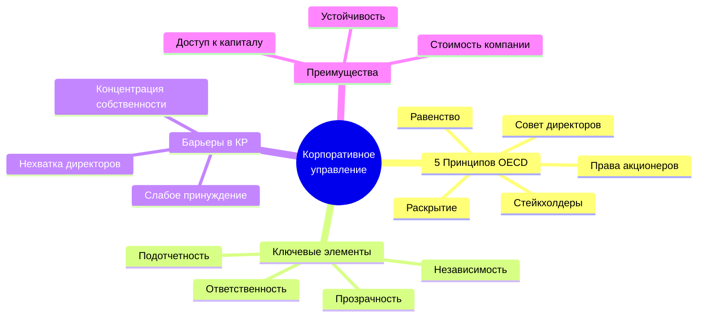

### Ключевые показатели корпоративного управления

| Метрика                                                         | Среднее КР (2025) | Лучшие практики  | Целевое значение (2028) |
| --------------------------------------------------------------- | ----------------- | ---------------- | ----------------------- |
| Доля независимых директоров в совете                            | 18%               | ≥33%             | 30%                     |
| Женщины в советах директоров                                    | 11%               | ≥30%             | 25%                     |
| Частота заседаний совета директоров                             | 4.2 раза/год      | ≥6 раз/год       | 6 раз/год               |
| Раскрытие бенефициаров (публичные компании)                     | 45%               | 100%             | 90%                     |
| Наличие комитетов при совете (аудит, вознаграждение, номинации) | 23%               | 100% для крупных | 60%                     |
| Внешний аудит Big4/региональные лидеры                          | 12%               | Рекомендовано    | 30%                     |

---

## 1. Основы корпоративного управления

### 1.1 Определение и значение

> **Корпоративное управление** — система отношений между менеджментом компании, ее советом директоров, акционерами и другими стейкхолдерами. Определяет структуру, через которую устанавливаются цели компании, определяются средства их достижения и мониторится исполнение.
>
> — _OECD Principles of Corporate Governance (2023 revision)_

**Зачем нужно хорошее корпоративное управление?**

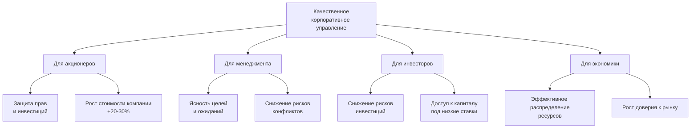

**Эмпирические данные о ценности governance:**

- **McKinsey (2022)**: Инвесторы готовы платить премию 20-30% за акции компаний с высоким governance
- **IFC (2021)**: Компании с независимым советом директоров демонстрируют на 18% более высокую рентабельность
- **Harvard Law School (2020)**: Хорошее governance снижает стоимость капитала на 50-100 bps

### 1.2 Пять принципов OECD

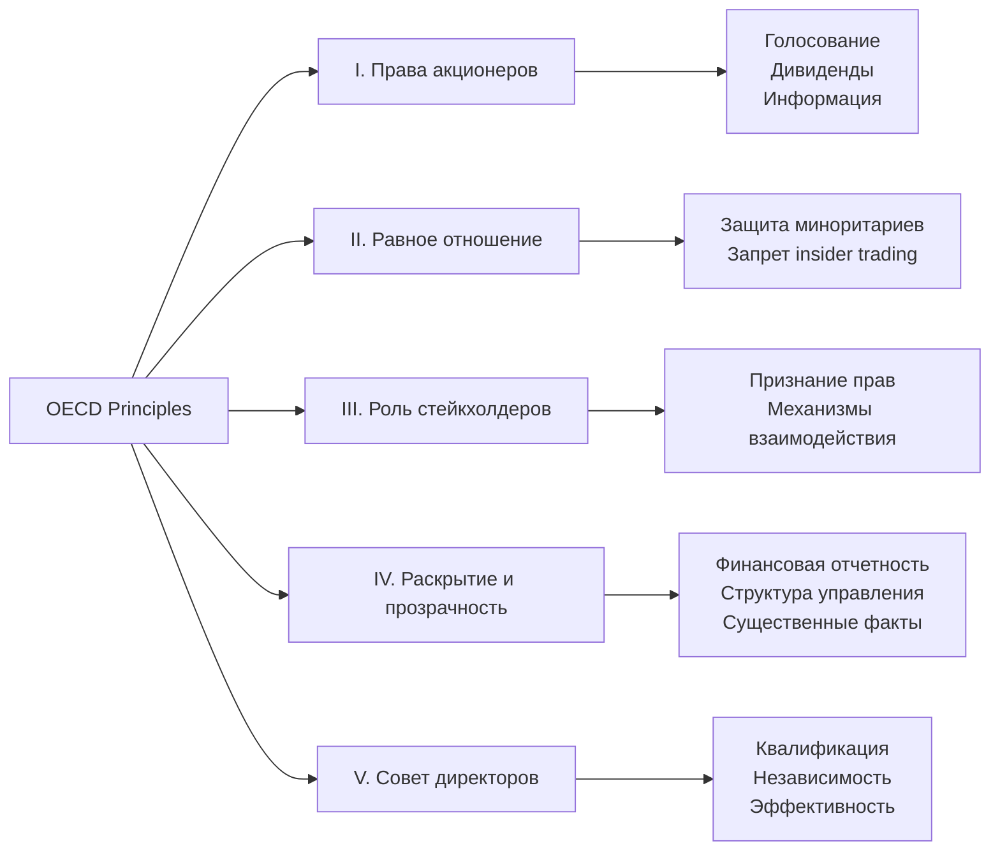

**Адаптация принципов OECD к реалиям КР** (рекомендации КФА):

- ✅ Принципы применимы ко всем акционерным обществам, но уровень внедрения зависит от размера
- ✅ Публичные компании должны стремиться к полному соответствию
- ✅ Непубличные АО могут применять избирательно ("comply or explain")
- ✅ Регулятор и СРО (КФА) должны способствовать внедрению через guidance и стимулы

---

## 2. Структура корпоративного управления

### 2.1 Трехзвенная модель

**Классическая модель governance в акционерном обществе:**

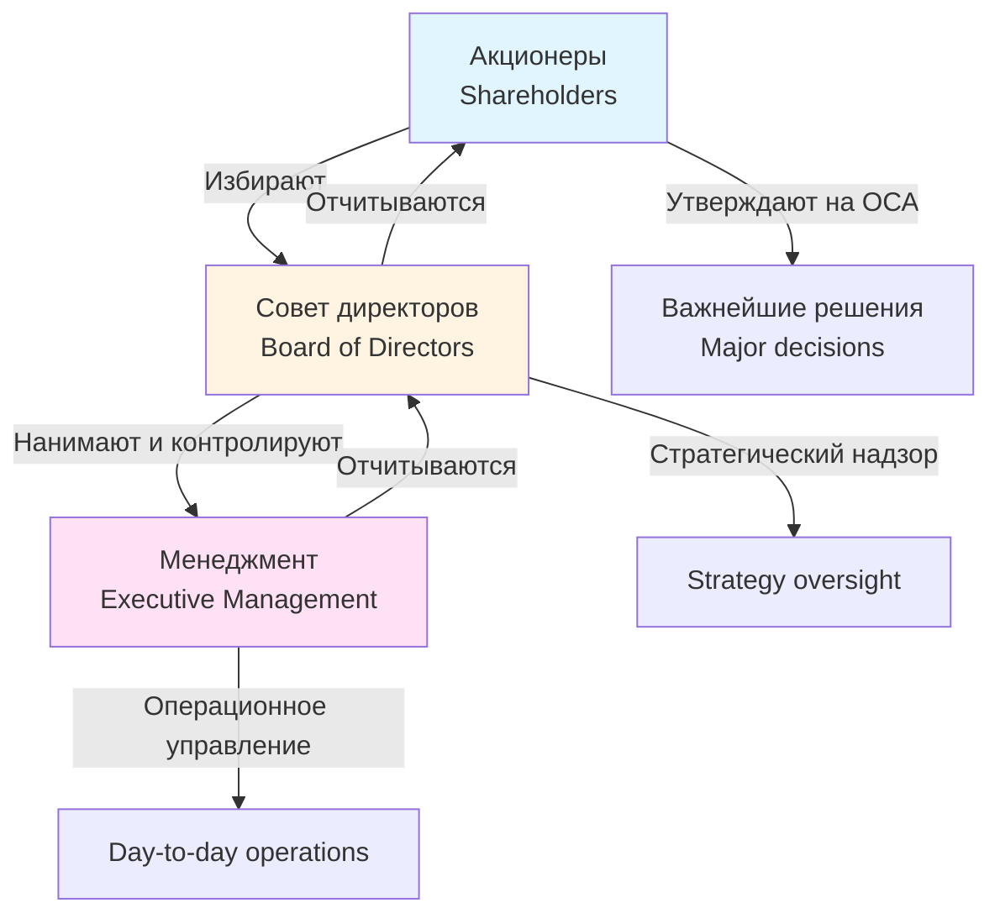

**Разделение функций:**

| Орган                                     | Роль                                          | Частота        | Ключевые полномочия                                                                      |
| ----------------------------------------- | --------------------------------------------- | -------------- | ---------------------------------------------------------------------------------------- |
| **Общее собрание акционеров (ОСА)**       | Высший орган, принятие стратегических решений | 1+ раз в год   | Избрание совета, утверждение отчетности, изменение устава, реорганизация, крупные сделки |
| **Совет директоров**                      | Надзор, стратегия, контроль менеджмента       | 4-12 раз в год | Назначение CEO, утверждение стратегии, мониторинг рисков, комплаенс                      |
| **Исполнительный орган (CEO, правление)** | Операционное управление                       | Постоянно      | Реализация стратегии, найм персонала, текущие операции                                   |

### 2.2 Роль совета директоров

**Ключевые функции совета:**

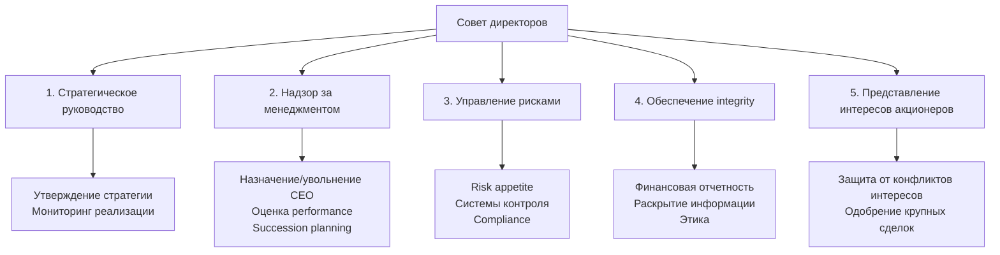

**Обязанности директора (fiduciary duties):**

1. **Duty of Care (обязанность заботы):**
   - Принимать решения информированно и добросовестно
   - Посвящать достаточно времени и внимания делам компании
   - Основываться на полной и достоверной информации

2. **Duty of Loyalty (обязанность лояльности):**
   - Действовать в интересах компании, а не личных
   - Избегать конфликтов интересов
   - Не использовать корпоративные возможности для личной выгоды

3. **Duty of Disclosure (обязанность раскрытия):**
   - Раскрывать материальную информацию акционерам
   - Раскрывать конфликты интересов
   - Обеспечивать точность и полноту отчетности

**Ответственность директора:**

- Гражданско-правовая (иски о возмещении ущерба компании)
- Административная (штрафы регулятора за нарушения)
- Уголовная (в случаях мошенничества, инсайдерской торговли)
- Репутационная (дисквалификация, потеря доверия рынка)

### 2.3 Размер и состав совета

**Оптимальный размер:**

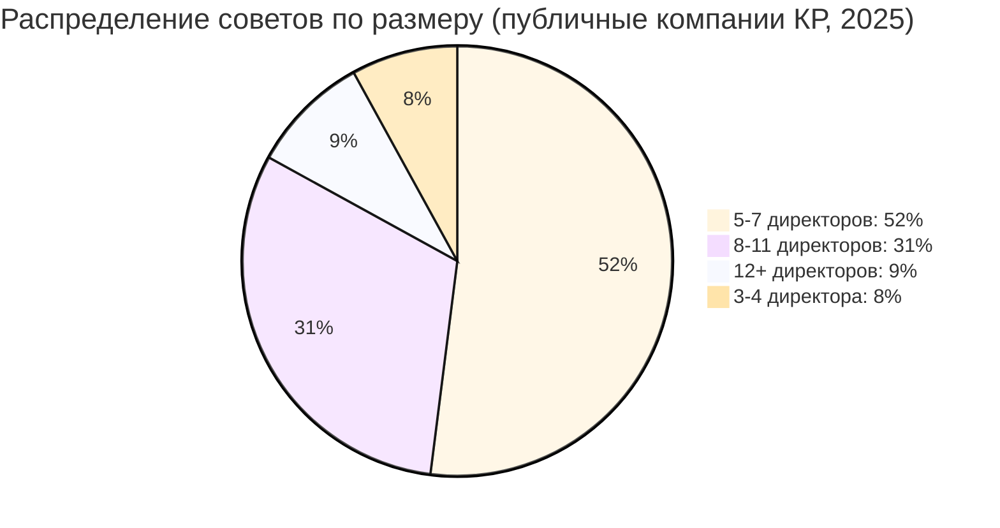

**Рекомендации по размеру:**

- **Малые компании** (капитализация <50 млн сом): 5 директоров (минимум по закону 3)
- **Средние компании** (50-300 млн сом): 7 директоров
- **Крупные компании** (>300 млн сом): 9-11 директоров

**Обоснование:**

- ✅ **Не слишком большой**: Эффективность обсуждений, оперативность решений
- ✅ **Не слишком малый**: Разнообразие компетенций, возможность формирования комитетов
- ✅ **Нечетное число**: Избежание патовых ситуаций при голосовании

**Компетенционная матрица совета:**

| Компетенция             | Критическая для         | % советов, имеющих эксперта (КР) |
| ----------------------- | ----------------------- | -------------------------------- |
| Финансы и бухучет       | Все                     | 78%                              |
| Отраслевая экспертиза   | Все                     | 65%                              |
| Стратегия и M&A         | Крупные                 | 42%                              |
| Риск-менеджмент         | Финансовые компании     | 51%                              |
| IT и кибербезопасность  | Все (растущая важность) | 18%                              |
| HR и компенсации        | Крупные                 | 34%                              |
| Маркетинг и продажи     | B2C компании            | 29%                              |
| Юридическая и комплаенс | Все                     | 56%                              |
| ESG и устойчивость      | Публичные               | 12%                              |
| Международный опыт      | Экспортеры              | 22%                              |

**Рекомендация:** Совет должен покрывать минимум 5-6 ключевых компетенций, релевантных для бизнеса компании.

---

## 3. Независимые директора

### 3.1 Концепция независимости

> **Независимый директор** — член совета директоров, который не имеет материальных отношений с компанией, ее менеджментом или крупными акционерами, способных повлиять на его беспристрастное суждение.

**Критерии независимости (по Кодексу корпоративного управления КФА 2024):**

❌ **НЕ является независимым**, если:

1. Работал в компании или ее дочерних обществах последние 3 года
2. Является крупным акционером (>5%) или представляет такого акционера
3. Имеет близкие родственные связи с менеджментом или крупными акционерами
4. Получает от компании вознаграждение, кроме вознаграждения директора
5. Является/был в последние 3 года партнером внешнего аудитора компании
6. Является директором/менеджером компании, где CEO данной компании является директором
7. Работает в компании-конкуренте или имеет иной существенный конфликт интересов
8. Является директором более 9 лет (зависимость от менеджмента)

✅ **Дополнительные признаки независимости:**

- Отсутствие значительных деловых отношений с компанией
- Отсутствие займов от компании или компании от него
- Независимое мышление и готовность challenge менеджмент

### 3.2 Зачем нужны независимые директора?

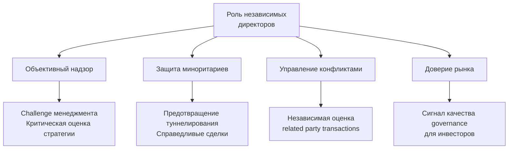

**Эмпирические данные:**

- **IFC (2021)**: Наличие ≥33% независимых директоров коррелирует с +15% ROE
- **S&P (2020)**: Компании с независимым советом имеют кредитный рейтинг на 1-2 ступени выше
- **OECD (2023)**: Независимые директора снижают вероятность fraud на 40%

### 3.3 Рекомендуемая доля независимых директоров

**Международные стандарты:**

- **UK Corporate Governance Code**: ≥50% для крупных публичных компаний
- **NYSE (США)**: Majority (>50%) должны быть независимыми
- **OECD**: Рекомендует significant number, минимум 33%
- **Asian Corporate Governance Association**: 33-50% в зависимости от размера

**Рекомендации КФА для КР:**

| Тип компании                                   | Минимум   | Рекомендовано | Обоснование                                        |
| ---------------------------------------------- | --------- | ------------- | -------------------------------------------------- |
| **Крупные публичные компании**                 | 33% (1/3) | 40-50%        | Баланс интересов, защита миноритариев              |
| **Средние публичные**                          | 25%       | 33%           | Учет сложности поиска квалифицированных кандидатов |
| **Малые публичные / Крупные непубличные**      | 20%       | 25%           | Хотя бы один независимый для ключевых комитетов    |
| **Финансовые компании (брокеры, управляющие)** | 33%       | 50%           | Регуляторные требования, фидуциарная роль          |

**Переходный период:** Для компаний, не соответствующих рекомендациям сегодня:

- К 2026: Минимум 1 независимый директор
- К 2028: Минимум 25% (для публичных)
- К 2030: Соответствие полным рекомендациям

### 3.4 Поиск и отбор независимых директоров

**Вызов в КР:** Ограниченный пул квалифицированных кандидатов.

**Решения:**

1. **База данных независимых директоров КФА** (запущена 2025):
   - 150+ сертифицированных директоров
   - Поиск по компетенциям, опыту, отрасли
   - Бесплатная для членов КФА

2. **Программа сертификации директоров КФА**:
   - 5-дневный курс + экзамен
   - Топики: governance, финансы, стратегия, риски, комплаенс
   - 200+ выпускников с 2022 года

3. **Международные кандидаты**:
   - Диаспора (кыргызстанцы, работающие за рубежом)
   - Эксперты из соседних стран (Казахстан, Узбекистан, Россия)
   - Удаленное участие (онлайн-заседания) возможно

**Процесс отбора (best practice):**

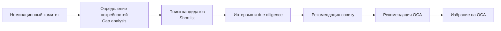

**Критерии оценки кандидата:**

- ✅ Компетенция (заполняет ли пробел в матрице совета?)
- ✅ Независимость (соответствие критериям)
- ✅ Доступность времени (минимум 15-20 дней в год для среднего совета)
- ✅ Репутация (проверка через референсы, публичные источники)
- ✅ Культурный fit (совместимость с ценностями компании)

---

## 4. Комитеты совета директоров

### 4.1 Типы комитетов

**Три обязательных комитета для крупных публичных компаний:**

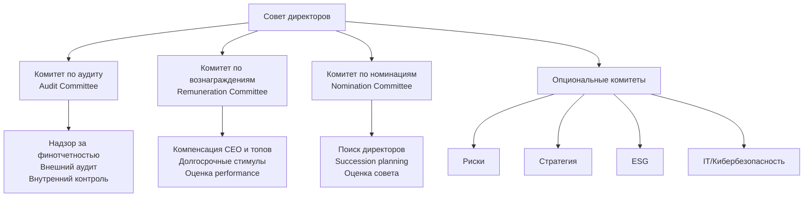

### 4.2 Комитет по аудиту (Audit Committee)

**Состав:**

- **Минимум 3 члена** (для крупных компаний 5)
- **100% независимые директора** (best practice; минимум председатель)
- **Минимум 1 финансовый эксперт** (опыт CFO, аудитор, финансовый аналитик)

**Ключевые функции:**

1. **Надзор за финансовой отчетностью:**
   - Проверка годовой и квартальной отчетности перед публикацией
   - Обсуждение значительных оценочных суждений (assumptions, estimates)
   - Мониторинг изменений учетной политики

2. **Управление внешним аудитом:**
   - Рекомендация назначения/смены аудитора (ОСА утверждает)
   - Согласование плана аудита и вознаграждения
   - Оценка качества и независимости аудитора
   - Коммуникация с аудитором (без присутствия менеджмента минимум 1 раз в год)

3. **Внутренний контроль и риски:**
   - Оценка эффективности систем внутреннего контроля
   - Надзор за внутренним аудитом (если есть)
   - Мониторинг ключевых рисков и системы управления рисками

4. **Комплаенс и этика:**
   - Мониторинг соблюдения законов и регуляций
   - Надзор за каналом сообщений о нарушениях (whistleblowing)
   - Расследование финансовых нарушений

**Частота заседаний:** Минимум 4 раза в год (перед публикацией каждого квартального отчета).

**Red flags для комитета:**

- 🚩 Частая смена аудиторов (может указывать на разногласия)
- 🚩 Задержки в публикации отчетности
- 🚩 Существенные корректировки прошлых периодов
- 🚩 Растущий gap между прибылью и денежным потоком
- 🚩 Связанные стороны (related parties) в необычных сделках

### 4.3 Комитет по вознаграждениям (Remuneration / Compensation Committee)

**Состав:**

- **Минимум 3 члена**
- **Большинство независимые** (best practice: 100%)
- **Председатель обязательно независимый**

**Ключевые функции:**

1. **Политика вознаграждения:**
   - Разработка принципов компенсации CEO и топ-менеджмента
   - Баланс между фиксированной и переменной частью
   - Долгосрочные стимулы (акции, опционы, LTI plans)
   - Benchmarking с рынком

2. **Индивидуальные компенсации:**
   - Установление вознаграждения CEO (совет утверждает)
   - Согласование компенсаций других топ-менеджеров
   - Bonuses на основе performance

3. **Оценка performance:**
   - Ежегодная оценка CEO (количественные и качественные KPI)
   - Обратная связь для CEO
   - Связь компенсации с достижением целей

4. **Succession planning:**
   - Планирование преемственности CEO и ключевых позиций
   - Развитие внутренних кандидатов
   - External bench для критических ролей

**Принципы вознаграждения (best practice):**

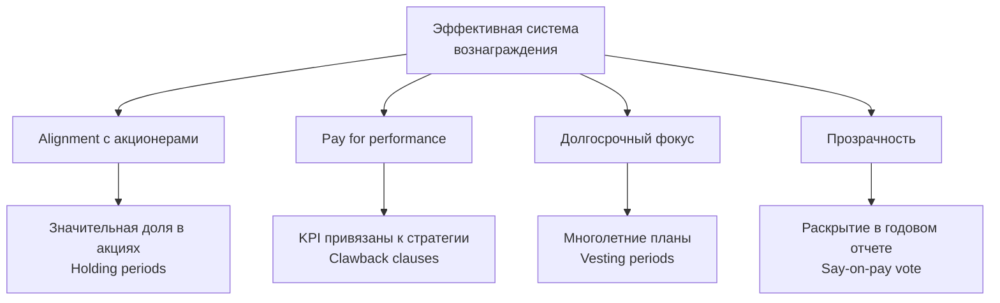

**Структура вознаграждения CEO (рекомендуемое соотношение):**

| Компонент                      | % от общей компенсации | Привязка                                                  | Период            |
| ------------------------------ | ---------------------- | --------------------------------------------------------- | ----------------- |
| **Базовый оклад**              | 40-50%                 | Фиксированный, рыночная ставка                            | Ежемесячно        |
| **Годовой бонус**              | 20-30%                 | Финансовые KPI (EBITDA, выручка), стратегические цели     | Ежегодно          |
| **Долгосрочные стимулы (LTI)** | 25-35%                 | Рост стоимости акций, TSR (Total Shareholder Return), ROE | 3-5 лет (vesting) |

**Пример KPI для бонуса CEO брокерской компании:**

| KPI                                      | Вес | Целевое значение (2026)  | Формула бонуса                                         |
| ---------------------------------------- | --- | ------------------------ | ------------------------------------------------------ |
| EBITDA                                   | 40% | 15 млн сом               | 0-200% бонуса в зависимости от достижения 80-120% цели |
| Рост клиентской базы                     | 20% | +15%                     | Линейная шкала                                         |
| NPS (Net Promoter Score)                 | 15% | 50+                      | Пороговое значение                                     |
| Комплаенс (0 значительных нарушений)     | 15% | 0                        | Gate: если нарушения → весь бонус 0                    |
| ESG цели (напр., гендерное разнообразие) | 10% | 25% женщин в менеджменте | Да/Нет                                                 |

### 4.4 Комитет по номинациям (Nomination / Governance Committee)

**Состав:**

- **Минимум 3 члена**
- **Большинство независимые**

**Ключевые функции:**

1. **Подбор директоров:**
   - Оценка потребностей совета (компетенционный gap analysis)
   - Поиск и отбор кандидатов в директора
   - Due diligence кандидатов
   - Рекомендация ОСА

2. **Оценка совета:**
   - Ежегодная оценка эффективности совета в целом
   - Оценка индивидуальных директоров
   - Оценка комитетов
   - Plan улучшений

3. **Succession planning:**
   - План преемственности CEO (совместно с комитетом по вознаграждениям)
   - План обновления совета (rotation policy)

4. **Governance:**
   - Мониторинг соблюдения Кодекса корпоративного управления
   - Обновление внутренних документов (Устав, Положения)
   - Обучение директоров

---

## 5. Права акционеров

### 5.1 Базовые права

**Фундаментальные права акционеров (по Закону КР "Об акционерных обществах"):**

1. ✅ **Участие в управлении:**
   - Участие в общих собраниях акционеров
   - Голосование (пропорционально доле владения)
   - Выдвижение кандидатов в совет директоров

2. ✅ **Экономические права:**
   - Получение дивидендов
   - Доля в ликвидационной стоимости при ликвидации
   - Преимущественное право приобретения акций при доп. эмиссии (для обыкновенных акций)

3. ✅ **Информационные права:**
   - Доступ к финансовой отчетности
   - Информация о существенных фактах
   - Ознакомление с документами компании (перечень ограничен)

4. ✅ **Право на судебную защиту:**
   - Обжалование решений ОСА
   - Иски о возмещении убытков к директорам и менеджменту
   - Derivative suits (от имени компании против нарушителей)

### 5.2 Общее собрание акционеров (ОСА)

**Годовое ОСА — ключевой механизм accountability:**

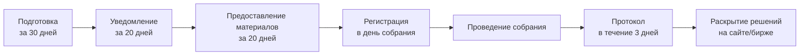

**Обязательная повестка годового ОСА:**

1. Утверждение годового отчета, финансовой отчетности
2. Распределение прибыли, объявление дивидендов
3. Избрание совета директоров (если истекают полномочия)
4. Избрание внешнего аудитора
5. Другие вопросы (по инициативе совета или акционеров)

**Кворум:**

- Для годового ОСА: 50%+ голосующих акций (первый созыв)
- Для внеочередного: может быть ниже (30-40% по уставу)
- Если кворума нет → повторное собрание (кворум по уставу, часто без минимума)

**Большинство для принятия решений:**

- **Простое большинство (>50%)**: Обычные вопросы (дивиденды, избрание директоров)
- **Квалифицированное (75%)**: Реорганизация, ликвидация, изменение устава, крупные сделки

### 5.3 Защита миноритарных акционеров

**Проблема:** Контролирующие акционеры могут ущемлять права миноритариев.

**Механизмы защиты:**

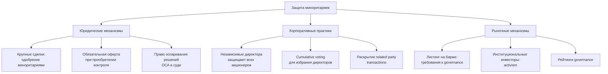

**Сделки с заинтересованностью (related party transactions):**

**Процедура одобрения (по Закону КР):**

1. Идентификация конфликта интересов (директор/менеджер/крупный акционер имеет интерес в сделке)
2. Раскрытие конфликта
3. Одобрение незаинтересованными членами совета (или ОСА, если сумма >2% активов)
4. Справедливые условия сделки (arm's length)

**Best practice:**

- Независимый комитет по аудиту оценивает fairness сделки
- Независимая оценка для крупных сделок
- Раскрытие в годовом отчете: природа, стороны, условия, сумма

**Обязательная оферта (mandatory bid rule):**

- Если инвестор приобретает 30%+ акций → обязан сделать оферту остальным акционерам по цене не ниже максимальной, заплаченной им за последние 12 месяцев
- Цель: Дать миноритариям возможность выйти на справедливых условиях при смене контроля

**Cumulative voting (кумулятивное голосование):**

- Метод избрания совета директоров, дающий миноритариям больше шансов избрать своего представителя
- Каждый акционер имеет количество голосов = число акций × число избираемых директоров
- Может распределить все голоса между кандидатами по своему усмотрению (включая все голоса одному кандидату)
- Пример: Миноритарий с 15% акций может избрать 1 директора в совет из 7, сосредоточив все голоса на одном кандидате

---

## 6. Раскрытие информации и прозрачность

### 6.1 Принципы раскрытия

> "Прозрачность — краеугольный камень доверия инвесторов к компании."

**Ключевые принципы (IOSCO Disclosure Principles):**

1. **Полнота**: Раскрывать всю материальную информацию, необходимую для принятия инвестиционных решений
2. **Точность**: Информация должна быть правдивой и не вводить в заблуждение
3. **Своевременность**: Раскрытие в установленные сроки, существенные факты — незамедлительно
4. **Доступность**: Информация должна быть легко доступна всем заинтересованным лицам одновременно

### 6.2 Что раскрывать?

**Обязательное раскрытие для публичных компаний КР:**

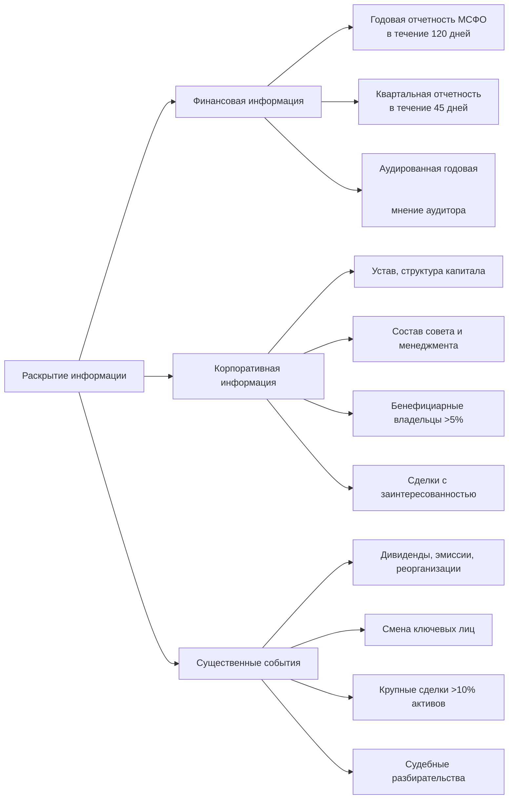

**Годовой отчет — ключевой документ раскрытия:**

**Минимальное содержание (по Закону КР + рекомендации КФА):**

1. **Обращение председателя совета и CEO**
2. **Описание бизнеса:**
   - Основные виды деятельности
   - Продукты и услуги
   - Конкурентные преимущества
   - Рынки присутствия

3. **Финансовые показатели:**
   - Консолидированная отчетность по МСФО
   - Анализ руководства (MD&A): тренды, факторы, риски
   - Ключевые коэффициенты (рентабельность, ликвидность, задолженность)

4. **Корпоративное управление:**
   - Структура управления
   - Состав совета директоров (биографии, независимость, посещаемость заседаний)
   - Комитеты совета
   - Вознаграждение директоров и топ-менеджмента (агрегированно или индивидуально)
   - Сделки с заинтересованностью

5. **Акционеры:**
   - Структура акционерного капитала
   - Крупные акционеры (>5%)
   - Бенефициарные владельцы

6. **Риски:**
   - Основные категории рисков
   - Система управления рисками

7. **Устойчивое развитие (рекомендовано, обязательно с 2026):**
   - ESG-практики и показатели
   - Социальная ответственность

8. **Перспективы:**
   - Стратегия и цели
   - Планы развития

### 6.3 Где раскрывать?

**Каналы раскрытия:**

1. **Официальный сайт компании** (обязательно для публичных):
   - Раздел "Инвесторам" / "Акционерам"
   - Годовые отчеты за последние 5 лет
   - Устав, положения
   - Существенные факты

2. **Сайт фондовой биржи** (для листингованных):
   - Система раскрытия информации биржи
   - Все существенные факты публикуются здесь

3. **СМИ** (для наиболее крупных событий):
   - Пресс-релизы
   - Конференции для аналитиков и инвесторов

**Best practice: Investor Relations функция**

- Выделенное лицо/отдел для взаимодействия с инвесторами
- Контакты на сайте (email, телефон)
- Регулярные телеконференции после публикации результатов
- Investor days, roadshows для крупных компаний

---

## 7. Управление конфликтами интересов

### 7.1 Типы конфликтов

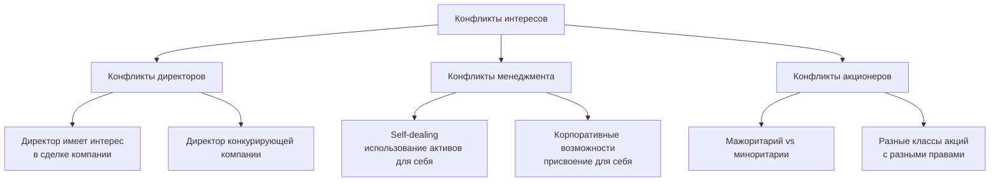

### 7.2 Управление конфликтами: процедуры

**Идентификация:**

- Ежегодная декларация интересов от всех директоров и топ-менеджмента
- Раскрытие перед каждым заседанием совета

**Процедура при возникновении конфликта:**

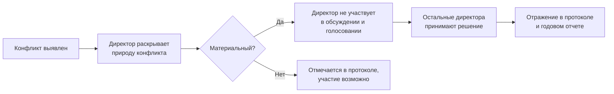

**Пример конфликта и его разрешения:**

**Ситуация:**

- Брокерская компания "Альфа" рассматривает аренду нового офиса
- Один из директоров владеет зданием, которое рассматривается как вариант
- Потенциальная арендная плата: 1.5 млн сом/год

**Процедура:**

1. Директор раскрывает свой интерес на заседании совета
2. Директор покидает заседание при обсуждении этого вопроса
3. Комитет по аудиту (независимые директора) получает независимую оценку рыночной арендной платы
4. Сравнение с альтернативными предложениями
5. Если условия справедливы (arm's length) и лучше альтернатив → одобрение остальными директорами
6. Полное раскрытие сделки в годовом отчете

### 7.3 Запреты и ограничения

**Абсолютные запреты:**

- ❌ **Инсайдерская торговля**: Использование инсайдерской информации для покупки/продажи акций
- ❌ **Корпоративные возможности**: Присвоение бизнес-возможностей, принадлежащих компании
- ❌ **Конкурирующая деятельность**: Директор/менеджер не может работать в конкурирующей компании без согласия

**Ограничения:**

- ⚠️ **Займы**: Компания не может предоставлять займы директорам и менеджменту (или только на рыночных условиях с одобрением ОСА)
- ⚠️ **Поручительство**: Ограничения на поручительства компании за обязательства директоров/менеджмента
- ⚠️ **Blackout periods**: Директора и менеджмент не могут торговать акциями компании в периоды перед публикацией финансовых результатов (обычно 30 дней до + 2 дня после)

---

## 8. Практическая имплементация

### 8.1 Roadmap улучшения корпоративного управления

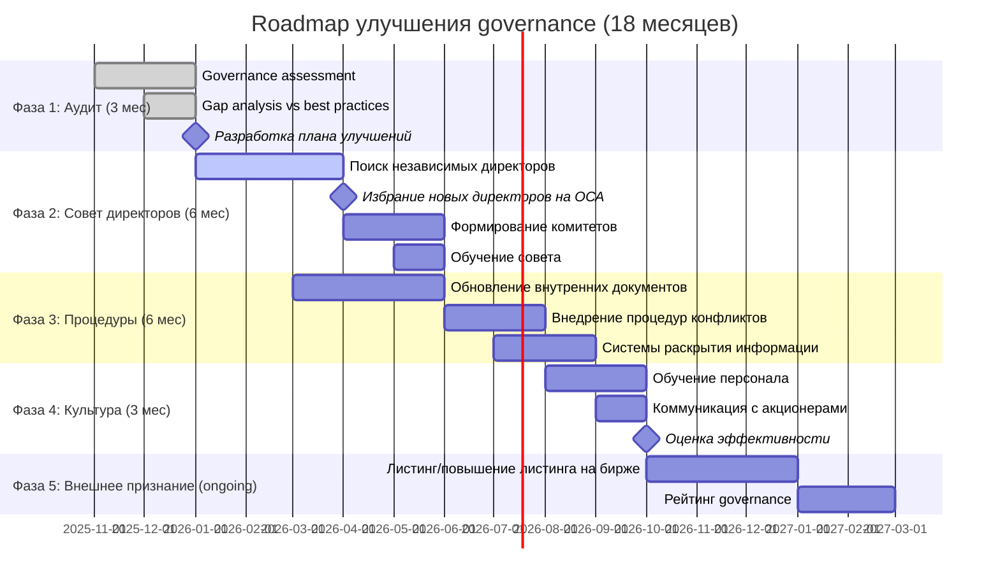

### 8.2 Оценка качества корпоративного управления

**Scorecard корпоративного управления КФА (2025):**

_(Self-assessment для компаний, 100 баллов максимум)_

**I. Совет директоров (30 баллов)**

- [ ] Размер совета 5-11 (3 балла)
- [ ] ≥25% независимые директора (5 баллов; +2 если ≥33%)
- [ ] Компетенционная матрица покрывает ≥5 областей (4 балла)
- [ ] Заседания ≥6 раз в год (3 балла)
- [ ] Посещаемость директоров ≥80% (3 балла)
- [ ] Ежегодная оценка эффективности совета (5 баллов)
- [ ] Программа вводного обучения новых директоров (3 балла)
- [ ] Женщины ≥20% в совете (2 балла; +1 если ≥30%)

**II. Комитеты (15 баллов)**

- [ ] Комитет по аудиту существует (5 баллов)
- [ ] Комитет по вознаграждениям существует (4 балла)
- [ ] Комитет по номинациям существует (3 балла)
- [ ] Комитеты состоят преимущественно из независимых (3 балла)

**III. Права акционеров (20 баллов)**

- [ ] Cumulative voting для избрания директоров (4 балла)
- [ ] Все акционеры получают материалы ОСА за ≥20 дней (3 балла)
- [ ] Возможность удаленного участия/голосования (2 балла)
- [ ] Раскрытие бенефициарных владельцев >5% (5 баллов)
- [ ] Процедура разрешения споров с акционерами (3 балла)
- [ ] Дивидендная политика утверждена и раскрыта (3 балла)

**IV. Раскрытие и прозрачность (20 баллов)**

- [ ] Годовой отчет публикуется на сайте (5 баллов)
- [ ] Квартальная отчетность публикуется (3 балла)
- [ ] Раскрытие вознаграждения директоров и топ-менеджмента (4 балла)
- [ ] Раскрытие сделок с заинтересованностью (4 балла)
- [ ] Контакты IR на сайте (2 балла)
- [ ] Годовой отчет на английском языке (2 балла)

**V. Управление рисками и комплаенс (15 баллов)**

- [ ] Политика управления рисками утверждена советом (5 баллов)
- [ ] Кодекс этики принят (3 балла)
- [ ] Канал сообщений о нарушениях (whistleblowing) (4 балла)
- [ ] Внутренний аудит или аутсорс (3 балла)

**Интерпретация:**

- **80-100 баллов**: 🌟 Отличное governance, соответствует международным стандартам
- **60-79 баллов**: ✅ Хорошее governance, есть области для улучшения
- **40-59 баллов**: ⚠️ Удовлетворительное governance, требуются значительные улучшения
- **<40 баллов**: ❌ Слабое governance, критические пробелы

### 8.3 Затраты на улучшение governance

**Оценка затрат для средней публичной компании в КР:**

| Статья расходов               | Описание                                         | Стоимость (сом/год)                   |
| ----------------------------- | ------------------------------------------------ | ------------------------------------- |
| **Вознаграждение директоров** | 7 директоров × 300,000 сом (включая независимых) | 2,100,000                             |
| **Комитеты**                  | Доп. вознаграждение за участие (опционально)     | 0-500,000                             |
| **Обучение совета**           | Курсы, конференции                               | 200,000                               |
| **Внешний аудит (Big4)**      | Годовой аудит МСФО                               | 1,500,000-3,000,000                   |
| **IR функция**                | 1-2 сотрудника                                   | 1,000,000-1,500,000                   |
| **Governance консультант**    | Разовый проект улучшения                         | 800,000 (разово)                      |
| **Раскрытие информации**      | Веб-сайт, публикации, переводы                   | 300,000                               |
| **D&O страхование**           | Страхование ответственности директоров           | 500,000-1,000,000                     |
| **ИТОГО (ежегодно)**          |                                                  | **5.6-8.6 млн сом** ($64,000-$98,000) |

**Это ~1-2% выручки для средней компании с выручкой 300-500 млн сом.**

**ROI (возврат инвестиций):**

- Снижение стоимости капитала на 50-100 bps → экономия миллионов на финансировании
- Рост оценки компании на 20-30% (McKinsey)
- Снижение регуляторных рисков и штрафов
- **Окупаемость: 2-3 года**

---

## 9. Кейсы и примеры

### 9.1 Кейс 1: Успешная трансформация governance (анонимизировано)

**Компания:** Средняя производственная компания, КР
**Исходная ситуация (2020):**

- Семейный бизнес, 100% владение основателем
- Совет директоров 3 человека (основатель + 2 родственника)
- Никаких независимых директоров
- Комитеты отсутствуют
- Годовой отчет — формальный, 15 страниц
- Governance score: 28/100

**Триггер для изменений:**

- Желание привлечь IFC (International Finance Corporation) как акционера для финансирования расширения
- IFC требует соответствия governance стандартам

**Трансформация (2020-2022):**

1. **Расширение совета:** 3 → 7 директоров, добавлены 3 независимых (включая 1 иностранного)
2. **Комитеты:** Созданы комитет по аудиту (3 независимых) и комитет по вознаграждениям
3. **Внешний аудит:** Переход на Big4 аудитора
4. **Раскрытие:** Детальный годовой отчет (80+ страниц), сайт для инвесторов
5. **Policies:** Приняты Кодекс этики, политика конфликтов интересов, дивидендная политика
6. **Обучение:** Все директора прошли сертификацию IFC

**Результаты (2023):**

- IFC вошел в капитал (15% за $3 млн) → оценка компании $20 млн
- EBRD предоставил кредит $5 млн под 8% (vs 12% до трансформации)
- Governance score: 78/100
- Выручка +40% (2020-2023) благодаря финансированию расширения
- **Основатель:** "Сначала сопротивлялся — казалось, теряю контроль. Сейчас вижу: независимые директора улучшают решения, а капитал стал дешевле. 15%, которые отдал IFC, стоили того — моя доля в большей компании ценнее 100% в маленькой."

### 9.2 Кейс 2: Провал governance — дорогой урок (анонимизировано)

**Компания:** Брокерская компания, КР
**Ситуация (2021):**

- Совет директоров: 5 человек, все связаны с основным акционером (80% владения)
- Независимых директоров нет
- Комитет по аудиту отсутствует

**Инцидент (2022):**

- CEO (племянник основного акционера) заключил крупные кредитные сделки с аффилированными компаниями под заниженный процент
- Фактически — туннелирование активов
- Потери: ~15 млн сом (30% капитала компании)

**Обнаружение:**

- Внешний аудитор обнаружил в ходе годового аудита
- Регулятор (ГСФР) провел проверку

**Последствия:**

- Штраф регулятора: 2 млн сом
- Репутационный ущерб → отток клиентов
- Основной акционер вынужден докапитализировать компанию
- Смена CEO
- **Совокупный ущерб: ~25 млн сом + репутация**

**Что не сработало:**

- ❌ Отсутствие независимых директоров → некому было challenge решения CEO
- ❌ Нет комитета по аудиту → сделки с заинтересованностью не проверялись
- ❌ Слабый внутренний контроль

**Урок:**

> "Хорошее governance — не про бюрократию и затраты. Это страховка от катастрофических ошибок. Независимые директора могли бы предотвратить этот инцидент, сэкономив компании десятки миллионов."

### 9.3 Кейс 3: Листинг на бирже — catalyst для governance (реальный пример: КФБ)

**Компания:** Кыргызская фондовая биржа (КФБ)
**Ситуация:**

- Акции биржи торгуются на самой бирже (self-listing)
- Высокие требования к governance для подачи примера участникам

**Governance практики КФБ:**

- Совет директоров: 7 человек, 4 независимых (57%)
- Комитеты: аудит, риски, номинации
- Раскрытие: детальные квартальные и годовые отчеты на сайте
- Кодекс корпоративного управления: полное соответствие
- Внешний аудит: Big4

**Эффект:**

- Доверие участников рынка к бирже как институту
- Пример для листингующихся компаний
- "Walk the talk" — биржа требует governance от листингуемых, и сама демонстрирует

---

## 10. Заключение

### 10.1 Ключевые выводы

1. **Качественное корпоративное управление — not optional, а необходимость**
   - Защита инвесторов, доступ к капиталу, рост стоимости компании
   - Окупаемость инвестиций в governance: 2-3 года

2. **Независимые директора — критический элемент**
   - Минимум 25-33% совета для публичных компаний
   - Объективный надзор, защита миноритариев, снижение рисков конфликтов

3. **Комитеты — эффективный механизм специализации**
   - Аудит, вознаграждения, номинации — обязательны для крупных
   - Состав: преимущественно независимые

4. **Прозрачность и раскрытие — основа доверия**
   - Детальный годовой отчет, своевременные существенные факты
   - Investor Relations функция для постоянной коммуникации

5. **Governance — это процесс, не разовая акция**
   - Постепенное внедрение, адаптация к размеру и специфике компании
   - Ежегодная оценка и непрерывное улучшение

### 10.2 Рекомендации

**Для компаний:**

**Краткосрочные шаги (2025-2026):**

1. Провести self-assessment по Scorecard КФА
2. Добавить минимум 1 независимого директора
3. Создать комитет по аудиту
4. Улучшить раскрытие в годовом отчете

**Среднесрочные (2026-2028):** 5. Достичь 25-33% независимых в совете 6. Сформировать все ключевые комитеты 7. Внедрить формализованные процедуры конфликтов интересов 8. Ежегодная оценка эффективности совета

**Долгосрочные (2028+):** 9. Стремиться к governance score >80/100 10. Рассмотреть листинг на бирже (для крупных) 11. Получить признание: рейтинги, награды за governance

**Для регулятора:**

- Продолжить развитие Кодекса корпоративного управления ("comply or explain" approach)
- Стимулы для companies с хорошим governance (упрощенные процедуры, публичное признание)
- Capacity building: обучение директоров, база данных независимых директоров (КФА)

**Для инвесторов:**

- Учитывать governance в инвестиционных решениях
- Active ownership: engagement с компаниями, голосование на ОСА
- Поддерживать инициативы за улучшение governance (напр., программы КФА)

### 10.3 Будущее governance в КР

**Тренды:**

- 📈 **Регуляторное давление растет**: Новые требования 2026, гармонизация с международными стандартами
- 🌍 **Глобализация**: Приток ESG-инвесторов требует international-grade governance
- 🤖 **Цифровизация**: Технологии меняют governance (e-voting, blockchain для прозрачности владения)
- 👥 **Разнообразие**: Запрос на гендерное и этническое разнообразие в советах

**Целевая картина 2030:**

- 80%+ публичных компаний имеют ≥25% независимых директоров
- 60%+ имеют комитеты при совете
- Governance score средний по рынку: 70/100 (vs 45 в 2025)
- КР — признанный лидер governance в Центральной Азии

**Призыв к действию:**

> "Корпоративное управление — это не затраты, а инвестиции. Не бюрократия, а страховка. Не ограничение свободы, а защита капитала. Начните сегодня — ваша компания и акционеры скажут спасибо завтра."

---

## Контакты и ресурсы

**Комитет по корпоративному управлению КФА**
📧 governance@kfa.kg
📞 +996 (312) 90-XX-XX

**Полезные ресурсы:**

- 📚 Кодекс корпоративного управления КФА (2024): https://kfa.kg/governance/code
- 🎓 Программа сертификации директоров: https://kfa.kg/education/directors
- 👥 База независимых директоров: https://kfa.kg/governance/directors-database
- 📊 Governance Scorecard (self-assessment): https://kfa.kg/governance/scorecard
- 🤝 Сообщество директоров КР: https://kfa.kg/community/directors

**Международные ресурсы:**

- OECD Principles of Corporate Governance (2023): https://www.oecd.org/corporate/principles-corporate-governance/
- IFC Corporate Governance Toolkit: https://www.ifc.org/corporategovernance
- ICGN Global Governance Principles: https://www.icgn.org
- Asian Corporate Governance Association: https://www.acga-asia.org

**Рекомендуемая литература:**

1. "Corporate Governance" — Bob Tricker (учебник, 4-е издание)
2. "Corporate Governance Matters" — Larcker, Tayan
3. "Boards That Lead" — Ram Charan, Dennis Carey, Michael Useem
4. "The Board Book" — William Klepper (практическое руководство для директоров)

---

## Приложения

### Приложение A: Шаблон Положения о Совете директоров

_(Доступно для членов КФА на https://kfa.kg/templates/board-charter)_

**Содержание:**

1. Состав и срок полномочий
2. Роли и ответственность
3. Председатель совета
4. Заседания совета (частота, кворум, голосование)
5. Комитеты
6. Оценка эффективности
7. Вознаграждение
8. Обучение и развитие
9. Конфликты интересов

### Приложение B: Чек-лист для собрания совета директоров

**До заседания (за 7 дней):**

- [ ] Повестка утверждена председателем
- [ ] Материалы подготовлены и разосланы директорам
- [ ] Приглашения отправлены (с указанием даты, времени, места/ссылки)
- [ ] Подтверждено участие (кворум будет)

**Во время заседания:**

- [ ] Регистрация участников
- [ ] Проверка кворума
- [ ] Раскрытие конфликтов интересов (если есть)
- [ ] Обсуждение вопросов повестки
- [ ] Голосование и фиксация решений
- [ ] Any other business

**После заседания (в течение 3 дней):**

- [ ] Протокол подготовлен
- [ ] Протокол подписан председателем и секретарем
- [ ] Решения доведены до исполнителей
- [ ] Материалы заархивированы

### Приложение C: Глоссарий

- **Board of Directors**: Совет директоров
- **Independent Director**: Независимый директор
- **Executive Director**: Исполнительный директор (член совета и менеджмента)
- **Non-Executive Director**: Неисполнительный директор (член совета, но не менеджмента)
- **Fiduciary Duty**: Фидуциарная обязанность (обязанность лояльности и заботы)
- **Cumulative Voting**: Кумулятивное голосование
- **Related Party Transaction**: Сделка с заинтересованностью
- **Tunneling**: Туннелирование (вывод активов контролирующими акционерами)
- **Dual-class shares**: Акции с разными правами голоса
- **Say-on-pay**: Консультативное голосование акционеров по вознаграждению менеджмента
- **Poison pill**: "Ядовитая пилюля" (мера защиты от враждебного поглощения)

---

**Версия:** 1.0
**Дата утверждения:** 22 октября 2025
**Следующий пересмотр:** Октябрь 2026
**Статус:** Утверждено Правлением КФА
