# Анализ рынка ценных бумаг Кыргызской Республики за III квартал 2025 года

> **Тип публикации:** Квартальный аналитический отчет
> **Автор:** Аналитический департамент КФА
> **Дата публикации:** 15 октября 2025
> **Период анализа:** Июль - Сентябрь 2025
> **Статус:** Утверждено

---

## 📋 Оглавление

1. [Исполнительное резюме](#исполнительное-резюме)
2. [Макроэкономический контекст](#макроэкономический-контекст)
3. [Динамика основных показателей](#динамика-основных-показателей)
4. [Структура рынка](#структура-рынка)
5. [Анализ по сегментам](#анализ-по-сегментам)
6. [Профиль инвесторов](#профиль-инвесторов)
7. [Крупнейшие сделки](#крупнейшие-сделки)
8. [Регуляторные события](#регуляторные-события)
9. [Прогноз на IV квартал](#прогноз-на-iv-квартал)
10. [Выводы и рекомендации](#выводы-и-рекомендации)

---

## Исполнительное резюме

### Ключевые тенденции III квартала 2025

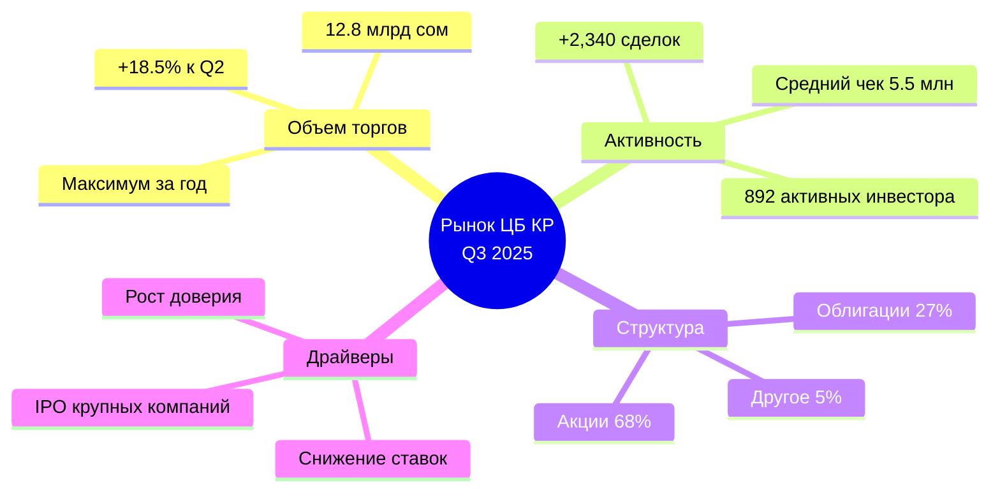

### Основные выводы

| Показатель                | Значение Q3 2025 | Изменение к Q2 | Изменение г/г |
| ------------------------- | ---------------- | -------------- | ------------- |
| **Объем торгов**          | 12.8 млрд сом    | +18.5%         | +34.2%        |
| **Количество сделок**     | 2,340            | +12.3%         | +28.7%        |
| **Активные инвесторы**    | 892              | +8.9%          | +41.3%        |
| **Средний размер сделки** | 5.47 млн сом     | +5.5%          | +4.3%         |
| **Капитализация**         | 87.3 млрд сом    | +6.7%          | +22.1%        |

**Главный тренд:** Устойчивый рост активности на фоне улучшения макроэкономических условий и повышения интереса институциональных инвесторов к кыргызским активам.

---

## Макроэкономический контекст

### Экономическая ситуация в КР

#### Ключевые макропоказатели

| Показатель                  | Q3 2025   | Q2 2025   | Прогноз 2025 |
| --------------------------- | --------- | --------- | ------------ |
| **ВВП (рост г/г)**          | +6.8%     | +6.2%     | +6.5%        |
| **Инфляция (г/г)**          | 7.2%      | 7.8%      | 7-8%         |
| **Курс USD/KGS**            | 87.3      | 88.1      | 86-89        |
| **Ставка НБКР**             | 11.5%     | 12.0%     | 11.0%        |
| **Золото-валютные резервы** | $3.8 млрд | $3.6 млрд | $4.0 млрд    |

#### Факторы, влияющие на рынок ЦБ

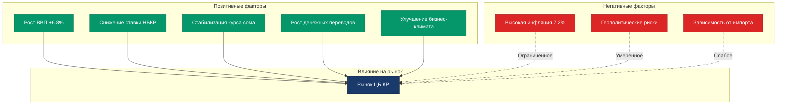

### Сравнение с регионом (Центральная Азия)

| Страна         | Рост ВВП Q3 | Инфляция | Рост рынка ЦБ |
| -------------- | ----------- | -------- | ------------- |
| **Кыргызстан** | +6.8%       | 7.2%     | +34.2% г/г    |
| Казахстан      | +5.1%       | 9.1%     | +12.3% г/г    |
| Узбекистан     | +6.0%       | 8.5%     | +45.6% г/г    |
| Таджикистан    | +7.2%       | 6.8%     | +28.1% г/г    |

**Позиция КР:** 2-е место по росту рынка ЦБ в регионе после Узбекистана.

---

## Динамика основных показателей

### Объем торгов (млрд сом)

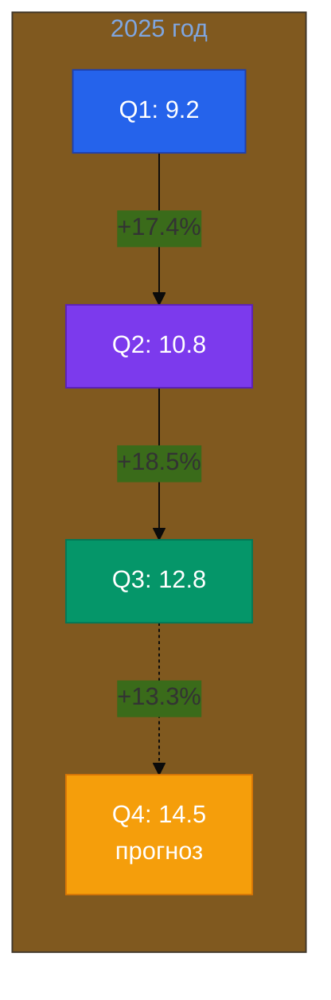

### Динамика количества сделок

| Месяц             | Количество сделок | Изменение м/м | Объем (млн сом) |
| ----------------- | ----------------- | ------------- | --------------- |
| **Июль 2025**     | 742               | +8.2%         | 3,920           |
| **Август 2025**   | 801               | +8.0%         | 4,350           |
| **Сентябрь 2025** | 797               | -0.5%         | 4,530           |
| **Итого Q3**      | **2,340**         | +12.3% кв/кв  | **12,800**      |

### Распределение объемов по месяцам (%)

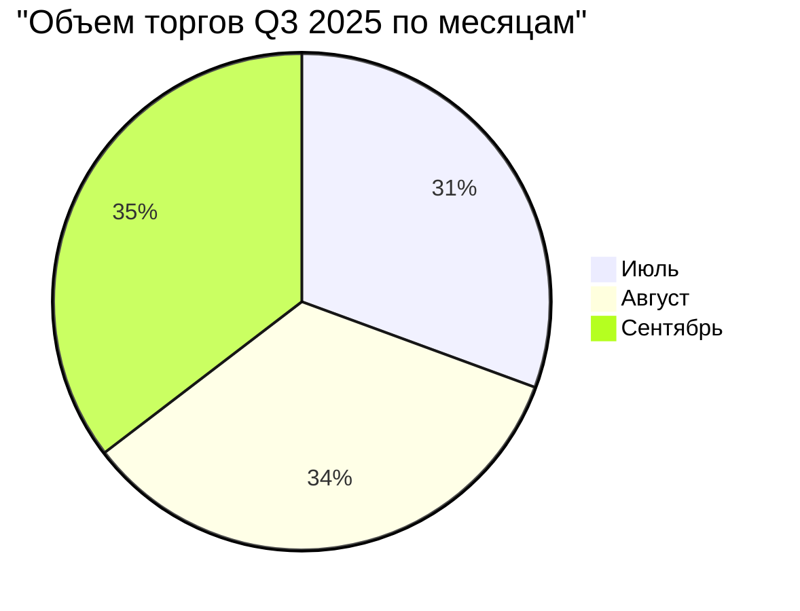

**Ключевой тренд:** Сентябрь показал максимальный месячный объем торгов за всю историю наблюдений (4.53 млрд сом), что связано с размещением облигаций двух крупных компаний.

---

## Структура рынка

### Распределение по типам ценных бумаг

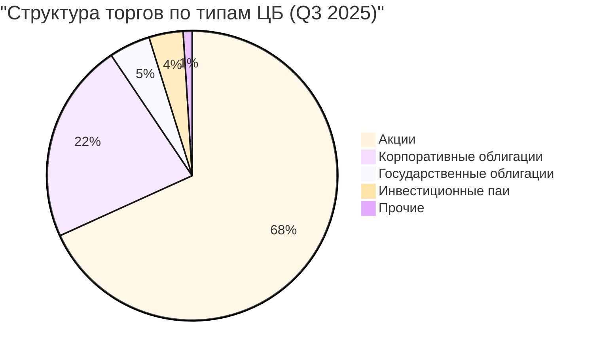

### Детализация по секторам экономики

| Сектор           | Доля в обороте | Объем (млн сом) | ТОП-3 компании                        |
| ---------------- | -------------- | --------------- | ------------------------------------- |
| **Финансовый**   | 42.3%          | 5,414           | БТА Банк, Optima Bank, Bakai Bank     |
| **Энергетика**   | 18.7%          | 2,394           | Нацэнергохолдинг, КЕГК, Северэлектро  |
| **Телеком**      | 15.2%          | 1,946           | Beeline, MegaCom, O!                  |
| **Производство** | 10.8%          | 1,382           | Кыргызалтын, Кумтор, АО "Кант Цемент" |
| **Торговля**     | 6.4%           | 819             | Народный Универмаг, Asia Mall         |
| **Прочие**       | 6.6%           | 845             | Разные компании                       |

### Динамика структуры (сравнение с Q2)

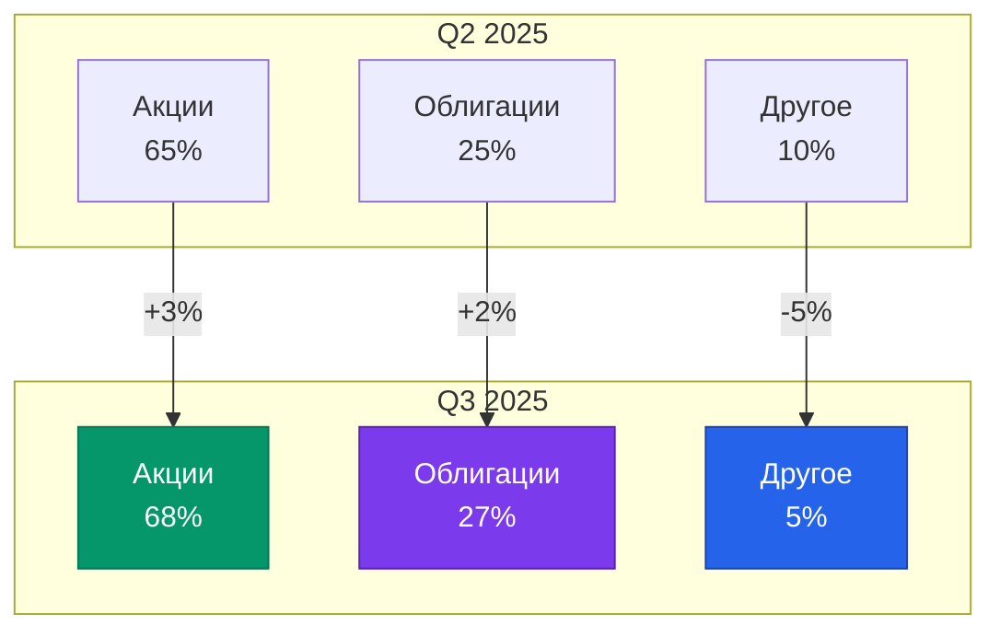

---

## Анализ по сегментам

### Рынок акций

#### Топ-10 наиболее торгуемых акций Q3 2025

| №   | Тикер   | Компания         | Объем (млн сом) | Сделок | Δ цены кв/кв |
| --- | ------- | ---------------- | --------------- | ------ | ------------ |
| 1   | BTAB    | БТА Банк         | 1,245           | 187    | +12.4%       |
| 2   | OPTB    | Optima Bank      | 892             | 156    | +8.7%        |
| 3   | BEELINE | Beeline KG       | 743             | 134    | +15.2%       |
| 4   | MEGA    | MegaCom          | 678             | 121    | +6.3%        |
| 5   | NEH     | Нацэнергохолдинг | 534             | 89     | +22.1%       |
| 6   | KYZALT  | Кыргызалтын      | 487             | 76     | +34.6%       |
| 7   | BAKAI   | Bakai Bank       | 423             | 93     | +4.2%        |
| 8   | O!      | O! KG            | 389             | 82     | -2.1%        |
| 9   | KEGK    | КЕГК             | 312             | 54     | +18.7%       |
| 10  | KUMTOR  | Kumtor Gold      | 298             | 47     | +45.3%       |

#### Лидеры роста Q3 2025

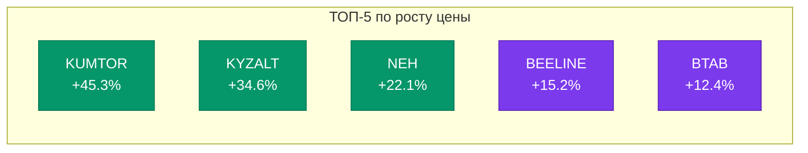

**Драйверы роста:**

- **KUMTOR**: Рост цен на золото на мировом рынке (+12% за квартал)
- **KYZALT**: Открытие нового месторождения + увеличение добычи
- **NEH**: Повышение тарифов на электроэнергию + модернизация ГЭС
- **BEELINE**: Расширение 5G покрытия + рост абонентской базы
- **BTAB**: Рекордная прибыль за полугодие + дивиденды 15%

### Рынок облигаций

#### Новые размещения Q3 2025

| Эмитент              | Объем (млн сом) | Срок   | Ставка | Рейтинг | Спрос/предложение |
| -------------------- | --------------- | ------ | ------ | ------- | ----------------- |
| **БТА Банк**         | 800             | 3 года | 13.5%  | A-      | 2.3x              |
| **MegaCom**          | 600             | 5 лет  | 14.0%  | BBB+    | 1.8x              |
| **Нацэнергохолдинг** | 500             | 7 лет  | 12.8%  | A       | 3.1x              |
| **Beeline**          | 350             | 3 года | 13.2%  | BBB+    | 2.0x              |
| **Asia Mall**        | 200             | 2 года | 15.5%  | BB      | 1.2x              |

**Общий объем новых размещений:** 2.45 млрд сом (+67% к Q2 2025)

#### Доходность облигаций (средняя по рынку)

| Срок       | Корп. облигации | Гос. облигации | Спред    |
| ---------- | --------------- | -------------- | -------- |
| **1 год**  | 14.2%           | 11.8%          | 2.4 п.п. |
| **3 года** | 13.8%           | 11.5%          | 2.3 п.п. |
| **5 лет**  | 13.5%           | 11.2%          | 2.3 п.п. |
| **7+ лет** | 13.2%           | 10.8%          | 2.4 п.п. |

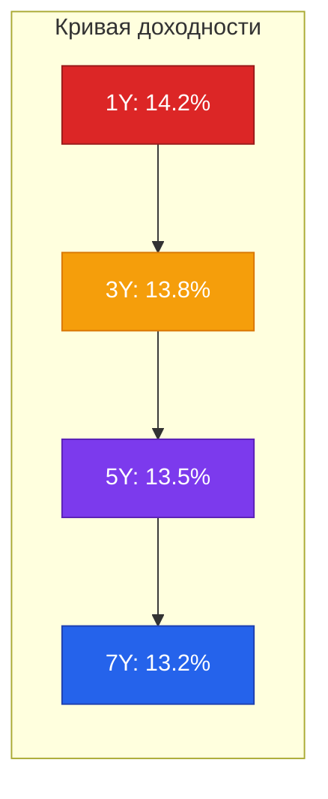

**Тренд:** Нормальная кривая доходности с небольшим наклоном вниз, что свидетельствует о позитивных ожиданиях рынка.

---

## Профиль инвесторов

### Структура инвесторов по типам

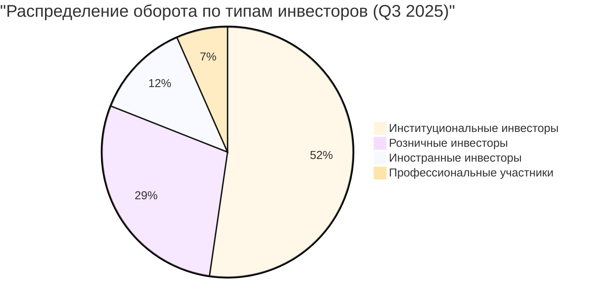

### Динамика активных инвесторов

| Тип инвестора             | Q3 2025 | Q2 2025 | Изменение |
| ------------------------- | ------- | ------- | --------- |
| **Физические лица**       | 687     | 641     | +7.2%     |
| **Юридические лица (КР)** | 142     | 131     | +8.4%     |
| **Иностранные**           | 63      | 47      | +34.0%    |
| **Всего**                 | **892** | **819** | **+8.9%** |

### География инвесторов (по регионам КР)

| Регион                   | Кол-во инвесторов | Доля в обороте |
| ------------------------ | ----------------- | -------------- |
| **Бишкек**               | 534 (60%)         | 78.2%          |
| **Ош**                   | 127 (14%)         | 9.8%           |
| **Чуйская область**      | 89 (10%)          | 5.3%           |
| **Джалал-Абадская обл.** | 54 (6%)           | 3.1%           |
| **Другие регионы**       | 88 (10%)          | 3.6%           |

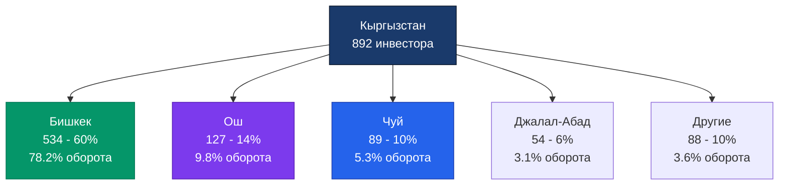

### Портрет типичного инвестора Q3 2025

| Характеристика          | Розничный инвестор           | Институциональный            |
| ----------------------- | ---------------------------- | ---------------------------- |
| **Средний возраст**     | 38 лет                       | -                            |
| **Средний портфель**    | 2.3 млн сом                  | 47.8 млн сом                 |
| **Горизонт инвестиций** | 2-3 года                     | 5-7 лет                      |
| **Предпочтения**        | Акции (65%), Облигации (35%) | Облигации (58%), Акции (42%) |
| **Активность**          | 3.4 сделки/квартал           | 18.7 сделок/квартал          |

---

## Крупнейшие сделки

### ТОП-10 сделок III квартала 2025

| №   | Дата  | Компания         | Тип              | Объем (млн сом) | Покупатель              | Цель                          |
| --- | ----- | ---------------- | ---------------- | --------------- | ----------------------- | ----------------------------- |
| 1   | 15.09 | БТА Банк         | Облигации        | 800             | Институциональные       | Рефинансирование              |
| 2   | 22.08 | MegaCom          | Облигации        | 600             | Смешанные               | Расширение сети 5G            |
| 3   | 05.09 | Нацэнергохолдинг | Облигации        | 500             | Государство + институц. | Модернизация ГЭС              |
| 4   | 12.07 | Кыргызалтын      | Акции (блок 12%) | 487             | Стратегический инвестор | Участие в управлении          |
| 5   | 28.08 | Beeline          | Облигации        | 350             | Розничные + институц.   | Развитие инфраструктуры       |
| 6   | 19.09 | Kumtor Gold      | Акции (блок 8%)  | 298             | Иностранный инвестор    | Портфельные инвестиции        |
| 7   | 03.08 | Optima Bank      | Акции            | 267             | Местные институц.       | Укрепление капитала           |
| 8   | 14.09 | КЕГК             | Акции            | 234             | Частные инвесторы       | IPO дополнительная эмиссия    |
| 9   | 07.08 | Asia Mall        | Облигации        | 200             | Розничные               | Строительство 2-й очереди     |
| 10  | 29.07 | Bakai Bank       | Акции            | 178             | Акционеры               | Увеличение уставного капитала |

### Анализ M&A активности

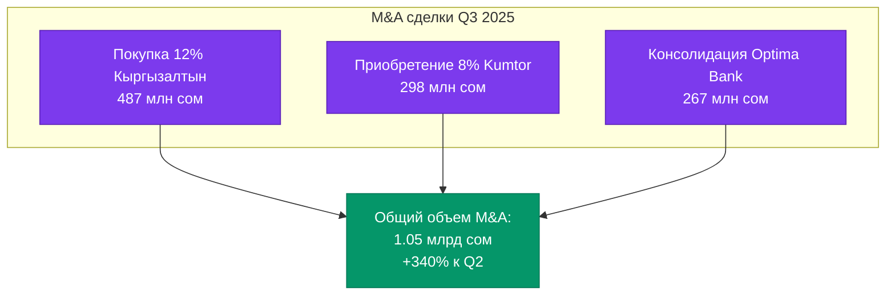

**Тренд:** Значительный рост M&A активности, связанный с укрупнением бизнесов и приходом стратегических инвесторов.

---

## Регуляторные события

### Ключевые изменения Q3 2025

#### 1. Новые требования ГСРФР

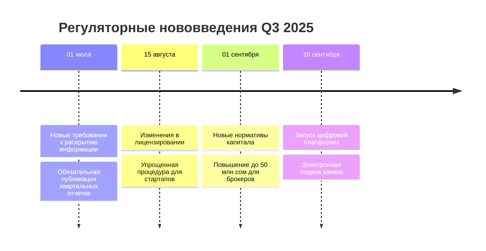

#### 2. Влияние на участников рынка

| Изменение                    | Влияние      | Затронуто компаний |
| ---------------------------- | ------------ | ------------------ |
| **Требования к раскрытию**   | Умеренное    | 87 эмитентов       |
| **Лицензирование стартапов** | Позитивное   | 12 новых заявок    |
| **Нормативы капитала**       | Значительное | 34 брокера         |
| **Цифровая платформа**       | Позитивное   | Все участники      |

#### 3. Статистика соответствия

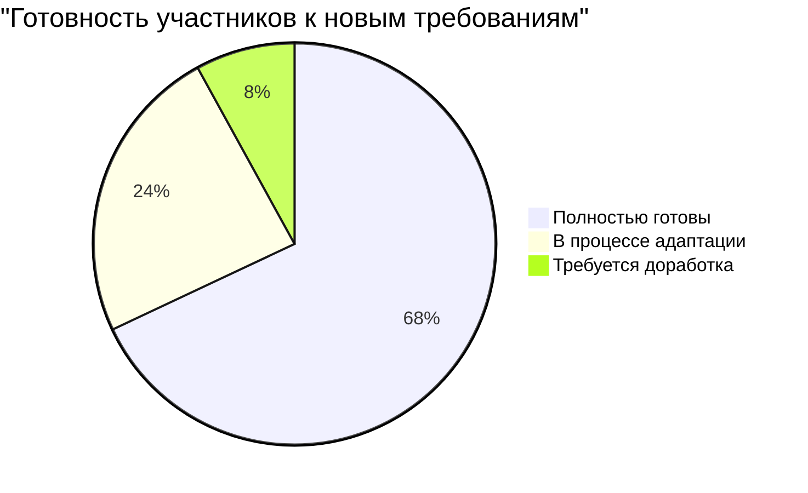

---

## Прогноз на IV квартал 2025

### Базовый сценарий (вероятность 60%)

#### Ключевые предпосылки:

- Сохранение макроэкономической стабильности
- Продолжение снижения ставки НБКР до 11.0%
- Отсутствие крупных внешних шоков
- Реализация запланированных IPO

#### Прогнозные показатели Q4 2025

| Показатель             | Q4 2025 (прогноз) | Q3 2025 (факт) | Изменение |
| ---------------------- | ----------------- | -------------- | --------- |
| **Объем торгов**       | 14.5 млрд сом     | 12.8 млрд сом  | +13.3%    |
| **Количество сделок**  | 2,650             | 2,340          | +13.2%    |
| **Активные инвесторы** | 980               | 892            | +9.9%     |
| **Новые IPO**          | 3-4 компании      | 2 компании     | +50-100%  |
| **Капитализация**      | 93.5 млрд сом     | 87.3 млрд сом  | +7.1%     |

### Сценарный анализ

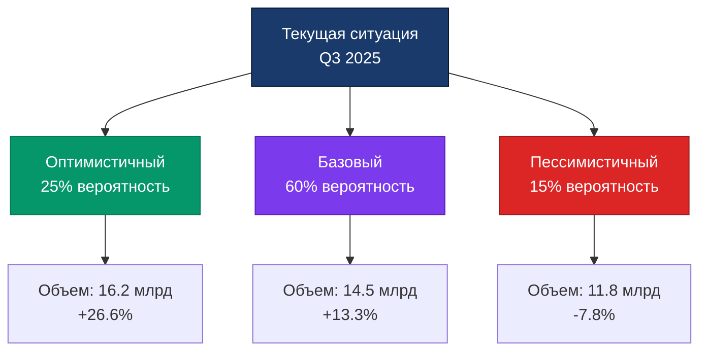

#### Оптимистичный сценарий (25%)

**Драйверы:**

- Резкое снижение ставки НБКР до 10.5%
- Успешное размещение 5-6 крупных IPO
- Приход крупного стратегического инвестора
- Значительный приток иностранного капитала

**Результат:** Объем торгов 16.2 млрд сом (+26.6% к Q3)

#### Пессимистичный сценарий (15%)

**Риски:**

- Замедление экономического роста
- Геополитическая нестабильность в регионе
- Отмена запланированных IPO
- Отток капитала

**Результат:** Объем торгов 11.8 млрд сом (-7.8% к Q3)

### Ожидаемые события Q4 2025

| Месяц       | Событие                              | Потенциальное влияние |
| ----------- | ------------------------------------ | --------------------- |
| **Октябрь** | IPO Кыргызтелеком                    | Высокое (+)           |
| **Октябрь** | Снижение ставки НБКР до 11.0%        | Среднее (+)           |
| **Ноябрь**  | Размещение еврооблигаций МФ КР       | Высокое (+)           |
| **Ноябрь**  | Конференция инвесторов КФА           | Среднее (+)           |
| **Декабрь** | Дивидендные выплаты крупных компаний | Высокое (+)           |
| **Декабрь** | Закрытие года - фиксация прибыли     | Среднее (-/+)         |

---

## Выводы и рекомендации

### Ключевые выводы

#### 1. Устойчивый рост рынка ✅

- Объем торгов Q3 вырос на **18.5%** квартал к кварталу
- Годовой рост составил **34.2%** - максимальный за 5 лет
- Все сегменты показали положительную динамику

#### 2. Улучшение структуры рынка ✅

- Доля акций выросла до **68.2%** (было 65%)
- Активность в облигациях +2 п.п. до **27%**
- Диверсификация по секторам экономики

#### 3. Рост активности инвесторов ✅

- Количество активных инвесторов: **892** (+8.9%)
- Особенно сильный рост иностранных инвесторов: **+34%**
- Увеличение среднего размера сделки до **5.47 млн сом**

#### 4. Успешные IPO и размещения ✅

- Объем новых размещений облигаций: **2.45 млрд сом** (+67%)
- Высокий спрос на качественные бумаги (до 3.1x)
- Доходности остаются привлекательными (13-14%)

#### 5. Регуляторные улучшения ✅

- Цифровизация процессов регулирования
- Упрощение входа для новых участников
- Повышение прозрачности рынка

### Риски

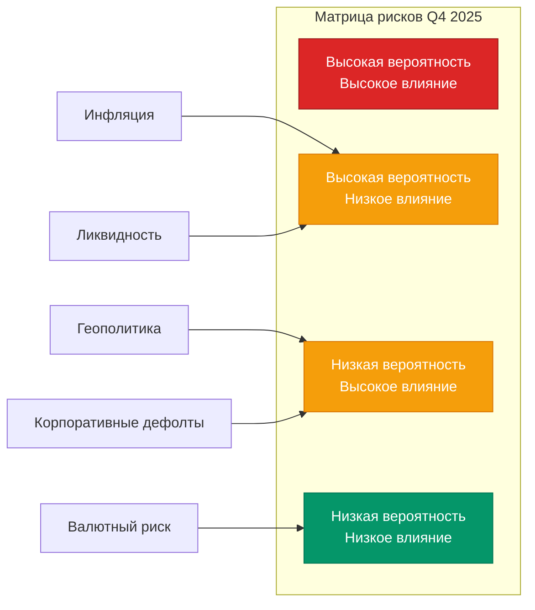

| Риск                               | Вероятность | Влияние | Митигация                       |
| ---------------------------------- | ----------- | ------- | ------------------------------- |
| **Инфляционное давление**          | Высокая     | Среднее | Диверсификация, защитные активы |
| **Геополитическая нестабильность** | Низкая      | Высокое | Мониторинг, стоп-лоссы          |
| **Недостаток ликвидности**         | Средняя     | Среднее | Резервы, маркет-мейкеры         |
| **Валютные колебания**             | Средняя     | Низкое  | Хеджирование                    |
| **Корпоративные дефолты**          | Низкая      | Высокое | Кредитный анализ, рейтинги      |

### Рекомендации для участников рынка

#### Для эмитентов:

1. **Использовать благоприятное окно** для размещений в Q4
2. **Улучшать корпоративное управление** для привлечения инвесторов
3. **Активнее раскрывать информацию** для повышения доверия
4. **Рассмотреть IPO** в условиях высокого спроса

#### Для инвесторов:

1. **Институциональным:**
   - Увеличивать экспозицию на кыргызские активы
   - Фокус на облигации надежных эмитентов (доходность 13-14%)
   - Диверсифицировать по секторам

2. **Розничным:**
   - Постепенно входить в рынок (усреднение)
   - Приоритет - ликвидные акции ТОП-10
   - Облигации для консервативной части портфеля

3. **Иностранным:**
   - КР предлагает высокую доходность vs риск
   - Валютный риск ограничен стабилизацией сома
   - Рассмотреть долгосрочные инвестиции (3-5 лет)

#### Для регулятора:

1. Продолжать цифровизацию процессов
2. Развивать институт маркет-мейкеров
3. Стимулировать выход на IPO крупных компаний
4. Усиливать защиту прав миноритарных акционеров

### Целевые ориентиры 2025

| Показатель             | Факт 9М 2025 | Цель 2025 | Выполнение |
| ---------------------- | ------------ | --------- | ---------- |
| **Объем торгов**       | 32.8 млрд    | 47.0 млрд | 69.8%      |
| **Капитализация**      | 87.3 млрд    | 95.0 млрд | 91.9%      |
| **Активные инвесторы** | 892          | 1,000     | 89.2%      |
| **Новые IPO**          | 4            | 8         | 50.0%      |

**Вероятность достижения целей:** 75-80%

---

## Методология

### Источники данных

- Бишкекская фондовая биржа (BSE)
- Государственная служба регулирования финансового рынка (ГСРФР)
- Национальный банк Кыргызской Республики (НБКР)
- Национальный статистический комитет КР
- Отчетность профессиональных участников - членов КФА
- Данные Bloomberg и Reuters (для международных сравнений)

### Период анализа

- **Основной период:** 01 июля 2025 - 30 сентября 2025
- **Сравнительный период:** Q2 2025, Q3 2024
- **Дата среза данных:** 10 октября 2025

### Валюта

Все данные представлены в кыргызских сомах (KGS), если не указано иное.

---

## Контакты

**Аналитический департамент КФА**

- 📧 Email: analytics@kfa.kg
- 📞 Телефон: +996 (312) 66-00-00 (доб. 123)
- 🌐 Сайт: www.kfa.kg/research

**Для СМИ:**

- 📧 Email: press@kfa.kg
- 📞 Телефон: +996 (312) 66-00-00 (доб. 101)

---

## Disclaimer

Данный отчет подготовлен исключительно в информационных целях и не является инвестиционной рекомендацией или предложением о покупке/продаже ценных бумаг. Все прогнозы и оценки носят вероятностный характер и могут не реализоваться. Инвесторы должны провести собственный анализ и консультироваться с профессиональными советниками перед принятием инвестиционных решений.

КФА не несет ответственности за убытки, возникшие в результате использования информации из данного отчета.

---

**© 2025 Кыргызский Финансовый Альянс. Все права защищены.**

_При использовании материалов отчета ссылка на КФА обязательна._
