# Методология оценки рисков для профессиональных участников рынка ценных бумаг

**Дата публикации:** 22 октября 2025
**Автор:** Департамент управления рисками КФА
**Категория:** Риск-менеджмент

---

## Резюме

Комплексная методология оценки рисков для профессиональных участников рынка ценных бумаг Кыргызской Республики, разработанная с учетом рекомендаций Basel III, IOSCO и международных стандартов ERM (Enterprise Risk Management). Методология охватывает 8 категорий рисков и предлагает практические инструменты для идентификации, оценки, мониторинга и управления рисками.

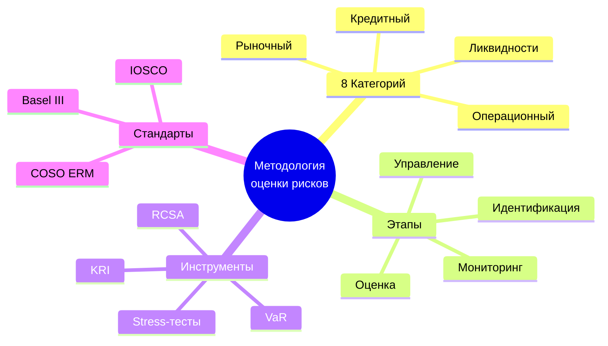

### Ключевые показатели рискового профиля (средние по отрасли)

| Метрика                                | Брокеры      | Управляющие | Депозитарии  | Целевое значение |
| -------------------------------------- | ------------ | ----------- | ------------ | ---------------- |
| VaR (95%, 1 день)                      | 2.3% активов | 1.8% AUM    | 0.4% активов | <3%              |
| Коэффициент покрытия ликвидности (LCR) | 168%         | 142%        | 215%         | >100%            |
| Операционные убытки / Выручка          | 1.7%         | 2.1%        | 1.2%         | <2%              |
| Risk Appetite Index                    | 6.2/10       | 5.8/10      | 4.1/10       | Индивидуально    |
| Стресс-тест успешность                 | 73%          | 81%         | 89%          | >80%             |

---

## 1. Концептуальная основа

### 1.1 Риск-философия и риск-аппетит

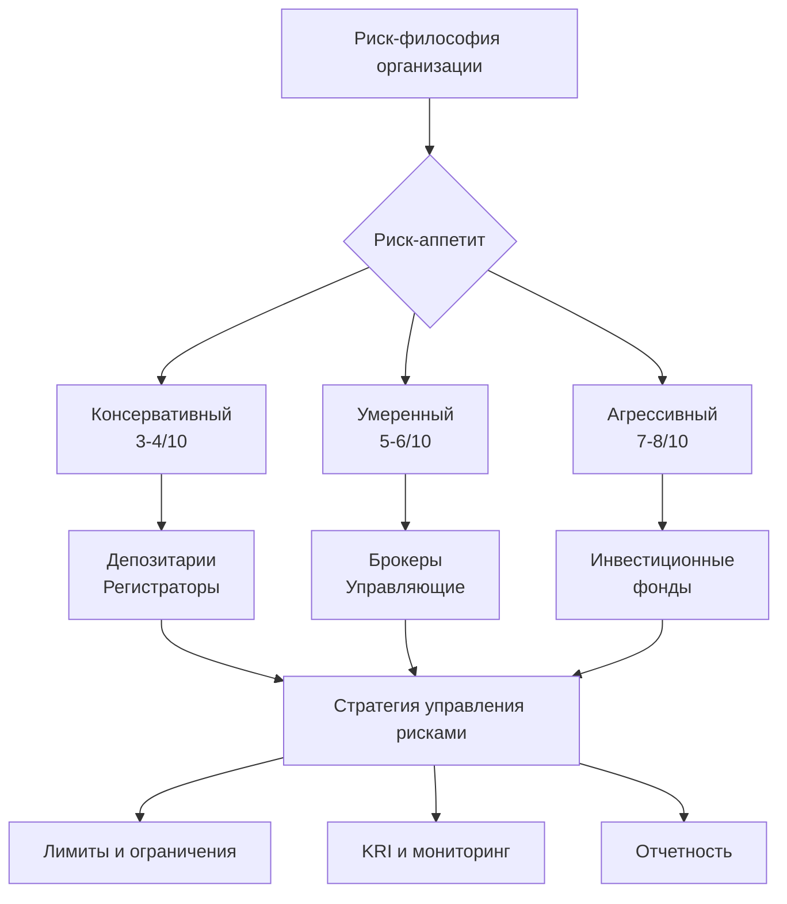

**Определение риск-аппетита:**

> **Риск-аппетит** — максимальный уровень риска, который организация готова принять для достижения своих стратегических целей.

**Шкала риск-аппетита (1-10):**

- **1-2 (Минимальный)**: Избегание риска, фокус на сохранение капитала
- **3-4 (Консервативный)**: Низкая толерантность, строгие лимиты
- **5-6 (Умеренный)**: Балансированный подход, риск = возможности
- **7-8 (Агрессивный)**: Высокая толерантность, активное принятие риска
- **9-10 (Максимальный)**: Спекулятивная стратегия, высокие риски

### 1.2 Интегрированная модель управления рисками (ERM)

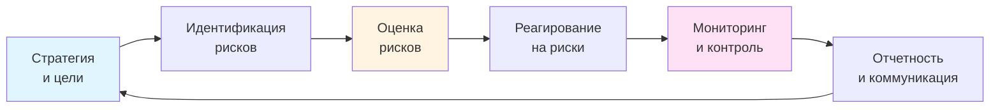

**Принципы ERM согласно COSO:**

1. **Стратегическая интеграция**: Риск-менеджмент встроен в стратегическое планирование
2. **Культура риска**: Осознание рисков на всех уровнях организации
3. **Динамичность**: Постоянная адаптация к изменяющейся среде
4. **Ценностная ориентация**: Фокус на защите и создании ценности
5. **Информационная открытость**: Прозрачная коммуникация о рисках

---

## 2. Таксономия рисков

### 2.1 Классификация рисков для участников рынка ЦБ

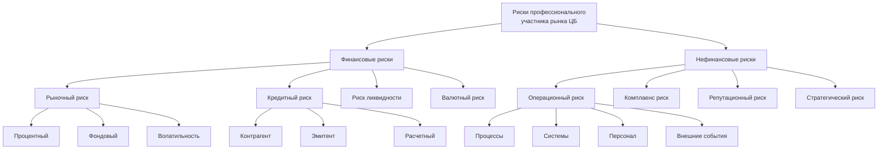

### 2.2 Детальное описание категорий

#### 2.2.1 Рыночный риск

**Определение:** Риск убытков вследствие неблагоприятного изменения рыночных цен финансовых инструментов, процентных ставок, валютных курсов.

**Подкатегории:**

- **Процентный риск**: Изменение процентных ставок влияет на стоимость портфеля облигаций
- **Фондовый риск**: Колебания цен акций
- **Риск базиса**: Несовершенная корреляция между хеджем и базовым активом
- **Риск волатильности**: Изменения в ожидаемой волатильности активов

**Типичные источники для участников КР:**

- Волатильность КФБ: σ акций = 18-25% годовых
- Процентные ставки: диапазон 10-16% для корпоративных облигаций
- Валютный курс USD/KGS: историческая волатильность 4-7% годовых

#### 2.2.2 Кредитный риск

**Определение:** Риск убытков вследствие неисполнения контрагентом/эмитентом своих обязательств.

**Подкатегории:**

- **Риск дефолта**: Полное неисполнение обязательств
- **Миграционный риск**: Ухудшение кредитного качества (downgrade)
- **Риск концентрации**: Чрезмерная экспозиция на одного контрагента/эмитента
- **Расчетный риск**: Риск неисполнения при расчетах по сделкам

**Статистика по КР (2020-2025):**

- Средняя вероятность дефолта корпоративных облигаций: 1.2%
- Recovery rate при дефолте: 45-60%
- Максимальная концентрация на топ-5 эмитентов: 35% для брокеров

#### 2.2.3 Риск ликвидности

**Определение:** Риск невозможности своевременно исполнить обязательства из-за недостатка ликвидных активов или невозможности реализовать активы без существенной потери стоимости.

**Два измерения:**

1. **Funding liquidity**: Риск дефицита денежных средств для расчетов
2. **Market liquidity**: Риск невозможности продать актив по справедливой цене

**Метрики:**

- LCR (Liquidity Coverage Ratio) = ликвидные активы / чистый отток за 30 дней
- NSFR (Net Stable Funding Ratio) = стабильное фундирование / требуемое фундирование
- Bid-ask spread как индикатор рыночной ликвидности

#### 2.2.4 Операционный риск

**Определение (Basel III):** Риск убытков вследствие неадекватности или сбоев внутренних процессов, людей, систем или внешних событий.

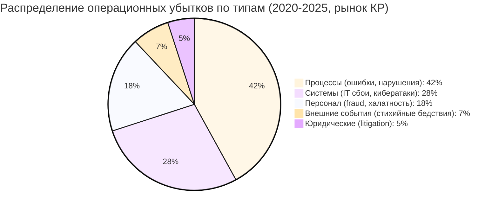

**Примеры операционных рисков:**

- Ошибки в обработке сделок (trade errors)
- Сбои торговых систем
- Мошенничество персонала или клиентов
- Кибератаки и утечки данных
- Нарушения комплаенса (штрафы регулятора)

---

## 3. Методология идентификации рисков

### 3.1 Инструменты идентификации

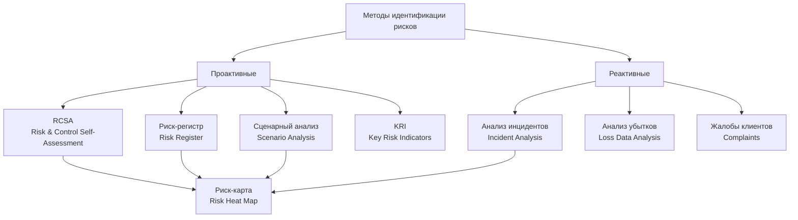

### 3.2 RCSA (Risk & Control Self-Assessment)

**Процесс RCSA:**

**Шаг 1: Идентификация рисков по бизнес-процессу**

- Привлечение владельцев процессов
- Мозговой штурм по потенциальным рискам
- Использование таксономии рисков (раздел 2)

**Шаг 2: Оценка встроенных контролей**

- Идентификация существующих контролей для каждого риска
- Оценка эффективности контролей (эффективный / частично / неэффективный)

**Шаг 3: Определение остаточного риска**

- Inherent Risk (без учета контролей)
- Residual Risk (с учетом контролей)
- Gap analysis: где контроли недостаточны

**Шаг 4: План действий**

- Для рисков с высоким остаточным риском разработать план улучшения контролей
- Назначить ответственных и дедлайны

**Пример RCSA для брокерской компании:**

| Бизнес-процесс               | Риск                                      | Inherent Risk | Контроль                | Эффективность | Residual Risk | Действия                     |
| ---------------------------- | ----------------------------------------- | ------------- | ----------------------- | ------------- | ------------- | ---------------------------- |
| Исполнение клиентских заявок | Ошибка ввода заявки (wrong price/volume)  | Высокий       | 4-eyes check            | Частично      | Средний       | Автоматизировать валидацию   |
| Хранение активов клиентов    | Несанкционированное использование активов | Критический   | Раздельный учет + аудит | Эффективный   | Низкий        | Поддерживать                 |
| Клиентская онбординг         | Недостаточная KYC/AML проверка            | Высокий       | ПОД/ФТ система          | Частично      | Средний       | Интеграция с внешними базами |

### 3.3 Риск-регистр (Risk Register)

**Структура риск-регистра:**

```markdown
**Риск ID:** R-MKT-001
**Категория:** Рыночный риск
**Описание:** Падение индекса КФБ более чем на 20% в течение квартала
**Владелец риска:** CRO (Chief Risk Officer)
**Вероятность:** Средняя (20-40% в год)
**Воздействие:** Высокое (>5% собственного капитала)
**Риск-рейтинг:** Высокий (12/25)
**Контроли:**

- VaR лимит на портфель
- Ежедневный мониторинг экспозиций
- Стоп-лосс на уровне 15%
  **KRI:** VaR (95%, 1 день) / Капитал
  **Пороговое значение KRI:** >3%
  **Частота пересмотра:** Ежемесячно
```

---

## 4. Методология количественной оценки

### 4.1 Value at Risk (VaR)

**Определение:** VaR — максимальный убыток портфеля с заданной вероятностью за определенный период.

**Интерпретация:** "VaR (95%, 1 день) = 500,000 сом" означает:

- С вероятностью 95% убыток за 1 день не превысит 500,000 сом
- С вероятностью 5% убыток может быть больше 500,000 сом

**Методы расчета VaR:**

#### 4.1.1 Параметрический VaR (Variance-Covariance)

**Формула:**

```
VaR = Z_α × σ_p × √t × V
```

Где:

- Z_α — квантиль нормального распределения (например, 1.65 для 95%)
- σ_p — волатильность портфеля
- t — временной горизонт (в днях)
- V — стоимость портфеля

**Пример расчета:**

```
Портфель: 10 млн сом
σ_p = 2% в день (годовая волатильность ~30%)
Доверительный уровень: 95% (Z_α = 1.65)
Горизонт: 1 день

VaR = 1.65 × 0.02 × √1 × 10,000,000 = 330,000 сом
```

**Преимущества:** Простота, быстрота расчета
**Недостатки:** Предполагает нормальное распределение (не учитывает "толстые хвосты")

#### 4.1.2 Исторический VaR

**Методология:**

1. Собрать исторические данные доходностей портфеля за N дней (обычно 250-500)
2. Ранжировать доходности от худшей к лучшей
3. Найти (1-α) квантиль распределения

**Пример:**

- Исторические данные: 250 дней
- Доверительный уровень: 95%
- Позиция в ранжированном списке: 250 × (1-0.95) = 12.5 → 13-я худшая доходность
- Если 13-я худшая доходность = -3.2%, то VaR = 3.2% × стоимость портфеля

**Преимущества:** Не предполагает распределение, учитывает реальные исторические события
**Недостатки:** Зависимость от выбранного периода, предполагает повторяемость истории

#### 4.1.3 Монте-Карло VaR

**Методология:**

1. Смоделировать стохастические процессы для всех факторов риска (цены акций, процентные ставки и т.д.)
2. Сгенерировать 10,000+ сценариев будущих доходностей портфеля
3. Вычислить (1-α) квантиль распределения доходностей

**Преимущества:** Гибкость, учет нелинейностей и сложных зависимостей
**Недостатки:** Вычислительная сложность, зависимость от модельных предположений

### 4.2 Expected Shortfall (ES) / Conditional VaR (CVaR)

**Определение:** ES — средний убыток в худших (1-α)% случаев.

**Формула:**

```
ES_α = E[Loss | Loss > VaR_α]
```

**Пример:**

- VaR(95%) = 500,000 сом
- ES(95%) = 750,000 сом

**Интерпретация:** В худших 5% случаев средний убыток составит 750,000 сом.

**Преимущество над VaR:** ES является "coherent risk measure" (удовлетворяет аксиомам субаддитивности), что делает его более предпочтительным в Basel III и новых регуляторных стандартах.

### 4.3 Stress-тестирование

**Определение:** Оценка устойчивости портфеля к экстремальным, но правдоподобным сценариям.

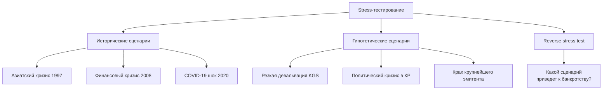

**Пример стресс-сценария для брокера в КР:**

**Сценарий:** "Финансовый кризис в КР"

- Индекс КФБ: -35%
- USD/KGS: +25% (80 → 100 сом/$)
- Доходность облигаций: +500 bps (цены -15%)
- Дефолт 2 из топ-10 корпоративных эмитентов
- Отток клиентских средств: 40%

**Оценка воздействия:**

| Позиция                          | Текущая стоимость (млн сом) | Изменение стоимости | Убыток/Прибыль (млн сом) |
| -------------------------------- | --------------------------- | ------------------- | ------------------------ |
| Акции (собственный портфель)     | 8.0                         | -35%                | -2.8                     |
| Облигации                        | 12.0                        | -15%                | -1.8                     |
| Валютная позиция (long $200K)    | 16.0                        | +25%                | +4.0                     |
| Маржинальное кредитование        | 5.0                         | Дефолт 30% клиентов | -1.5                     |
| **Итого воздействие на капитал** |                             |                     | **-2.1 млн сом**         |

**Анализ:**

- Текущий капитал: 9 млн сом
- После стресса: 6.9 млн сом
- Регуляторный минимум: 7 млн сом (с 2026)
- **Вывод:** Недостаточная капитализация, требуются меры

**План действий:**

1. Сократить экспозицию на акции на 30%
2. Увеличить hedging валютного риска
3. Ужесточить требования к маржинальному кредитованию
4. Докапитализация на 2 млн сом

### 4.4 Кредитный риск: вероятность дефолта (PD) и Loss Given Default (LGD)

**Expected Loss (EL):**

```
EL = PD × LGD × EAD
```

Где:

- **PD (Probability of Default)** — вероятность дефолта контрагента/эмитента
- **LGD (Loss Given Default)** — доля экспозиции, которая будет потеряна при дефолте (1 - Recovery Rate)
- **EAD (Exposure at Default)** — размер экспозиции на момент дефолта

**Пример:**

```
Облигация эмитента "X": номинал 10 млн сом
PD (на основе кредитного рейтинга BB): 2.5% в год
LGD (исторический показатель для КР): 50%
EAD: 10 млн сом

EL = 0.025 × 0.50 × 10,000,000 = 125,000 сом

→ Ожидаемый убыток за год = 125,000 сом
→ Резерв под кредитный риск ≥ 125,000 сом
```

**Методы оценки PD:**

1. **Рейтинговые агентства:**
   - Использовать матрицы PD от S&P, Moody's, Fitch
   - Пример: BB рейтинг → PD ~2-3% в год

2. **Внутренняя модель (для крупных участников):**
   - Скоринговая модель на основе финансовых показателей
   - Факторы: EBITDA/Interest, Debt/Equity, рентабельность, размер

3. **Рыночные индикаторы:**
   - CDS спреды (если доступны)
   - Кредитные спреды облигаций

---

## 5. Качественные методы оценки

### 5.1 Риск-матрица (Risk Heat Map)

```mermaid
%%{init: {'theme':'base'}}%%
quadrantChart
    title Риск-карта профессионального участника
    x-axis Низкое воздействие --> Высокое воздействие
    y-axis Низкая вероятность --> Высокая вероятность
    quadrant-1 Критические риски (Управлять активно)
    quadrant-2 Высокие риски (Мониторить)
    quadrant-3 Низкие риски (Мониторить периодически)
    quadrant-4 Средние риски (Управлять)

    Рыночный риск: [0.7, 0.6]
    Кредитный риск: [0.5, 0.4]
    Операционный риск: [0.6, 0.7]
    Риск ликвидности: [0.4, 0.3]
    Комплаенс риск: [0.5, 0.6]
    Кибер-риск: [0.8, 0.5]
    Репутационный риск: [0.7, 0.3]
    Стратегический риск: [0.6, 0.4]
```

**Шкала оценки:**

**Вероятность:**

- **Редкая (1)**: <5% в год, событие маловероятно
- **Низкая (2)**: 5-20%, может произойти
- **Средняя (3)**: 20-50%, вероятно произойдет
- **Высокая (4)**: 50-80%, скорее всего произойдет
- **Почти наверняка (5)**: >80%, произойдет с высокой вероятностью

**Воздействие:**

- **Незначительное (1)**: <0.5% капитала, <1 млн сом
- **Малое (2)**: 0.5-2% капитала, 1-3 млн сом
- **Среднее (3)**: 2-5% капитала, 3-8 млн сом
- **Высокое (4)**: 5-10% капитала, 8-15 млн сом
- **Критическое (5)**: >10% капитала, >15 млн сом или угроза банкротства

**Риск-рейтинг = Вероятность × Воздействие**

- 1-4: Низкий риск (зеленый)
- 5-12: Средний риск (желтый)
- 15-25: Высокий риск (красный)

### 5.2 Bow-Tie анализ

**Визуализация причинно-следственных связей риска:**

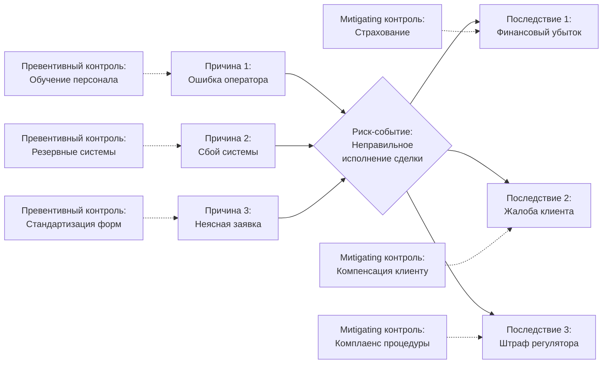

---

## 6. Ключевые индикаторы риска (KRI)

### 6.1 Концепция KRI

**KRI (Key Risk Indicators)** — метрики, которые дают раннее предупреждение о возрастающей экспозиции на риск.

**Отличие от KPI:**

- **KPI** (Key Performance Indicators) — как хорошо мы делаем работу
- **KRI** — насколько рискованна наша деятельность

### 6.2 Библиотека KRI для участников рынка ЦБ

#### Рыночный риск

| KRI                    | Формула                                 | Пороговое значение                       | Частота     |
| ---------------------- | --------------------------------------- | ---------------------------------------- | ----------- | ------- | ---------- |
| VaR / Капитал          | (VaR 95%, 1 день) / Собственный капитал | <3%                                      | Ежедневно   |
| Концентрация портфеля  | Топ-5 позиций / Общая стоимость         | <40%                                     | Еженедельно |
| Duration mismatch      |                                         | Duration активов - Duration обязательств |             | <2 года | Ежемесячно |
| Волатильность портфеля | σ портфеля (30 дней)                    | <25% годовых                             | Еженедельно |

#### Кредитный риск

| KRI                       | Формула                                            | Пороговое значение | Частота       |
| ------------------------- | -------------------------------------------------- | ------------------ | ------------- |
| NPL ratio                 | Просроченные кредиты / Общая ссудная задолженность | <5%                | Ежемесячно    |
| Крупные экспозиции        | Количество контрагентов >10% капитала              | ≤3                 | Ежемесячно    |
| Средний кредитный рейтинг | Weighted avg rating портфеля                       | ≥BB                | Ежеквартально |
| Watch list                | Контрагенты с ухудшением кредитного качества       | Тренд              | Ежемесячно    |

#### Риск ликвидности

| KRI                      | Формула                                      | Пороговое значение | Частота     |
| ------------------------ | -------------------------------------------- | ------------------ | ----------- |
| LCR                      | Ликвидные активы / Чистый отток (30 дней)    | >100%              | Ежедневно   |
| Quick ratio              | (Кэш + маркетные ЦБ) / Текущие обязательства | >80%               | Еженедельно |
| Funding gap              | Assets maturity - Liabilities maturity       | По bucket          | Еженедельно |
| Доля неликвидных активов | Неликвидные активы / Всего активов           | <30%               | Ежемесячно  |

#### Операционный риск

| KRI                                 | Формула                                      | Пороговое значение   | Частота       |
| ----------------------------------- | -------------------------------------------- | -------------------- | ------------- |
| Операционные убытки / Выручка       | Сумма операционных убытков / Годовая выручка | <2%                  | Ежеквартально |
| IT downtime                         | % времени простоя критических систем         | <0.1% (99.9% uptime) | Ежедневно     |
| Trade errors                        | Количество ошибок в сделках / Всего сделок   | <0.5%                | Ежемесячно    |
| Текучесть персонала (ключевые роли) | Уволившихся / Всего в ключевых ролях         | <10% в год           | Ежеквартально |

### 6.3 Система мониторинга KRI

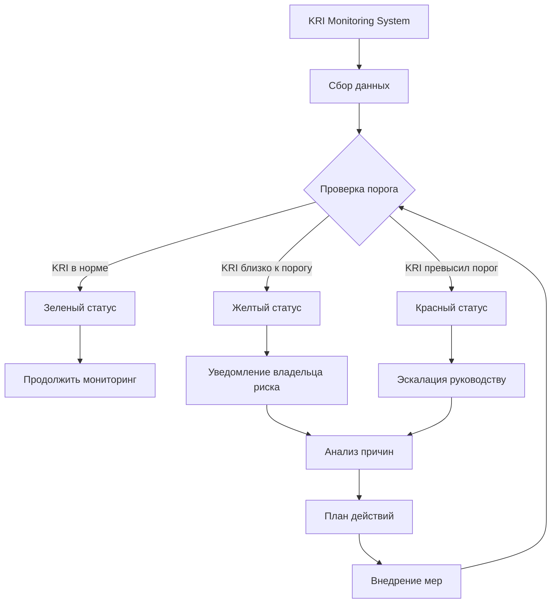

---

## 7. Управление рисками и митигация

### 7.1 Стратегии реагирования на риски

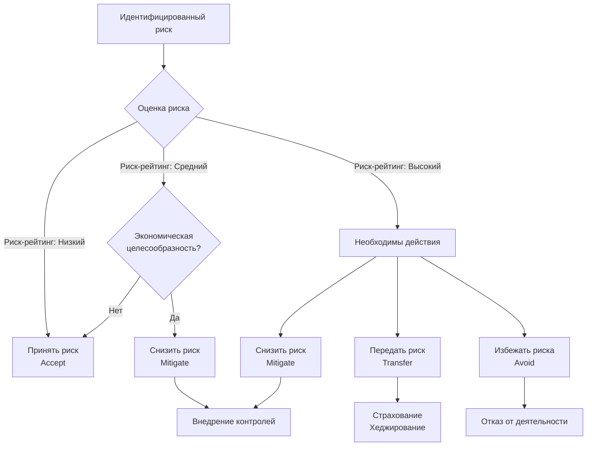

**Детальное описание стратегий:**

#### 7.1.1 Принятие риска (Accept)

- **Когда:** Риск-рейтинг низкий и остаточный риск в пределах риск-аппетита
- **Действия:** Мониторинг, периодический пересмотр
- **Пример:** Риск мелких операционных ошибок (<10,000 сом каждая)

#### 7.1.2 Снижение риска (Mitigate)

- **Когда:** Риск средний/высокий, но деятельность стратегически важна
- **Действия:** Внедрение контролей, диверсификация, лимиты
- **Пример:** Диверсификация портфеля для снижения концентрационного риска

#### 7.1.3 Передача риска (Transfer)

- **Когда:** Риск высокий, но можно передать третьей стороне
- **Действия:** Страхование, хеджирование, аутсорсинг
- **Пример:** Страхование профессиональной ответственности (E&O insurance)

#### 7.1.4 Избежание риска (Avoid)

- **Когда:** Риск неприемлемо высокий и не может быть снижен
- **Действия:** Отказ от деятельности или выход из бизнес-линии
- **Пример:** Отказ от работы с высокорисковыми юрисдикциями для ПОД/ФТ

### 7.2 Лимиты и ограничения

**Система лимитов — ключевой инструмент управления рисками.**

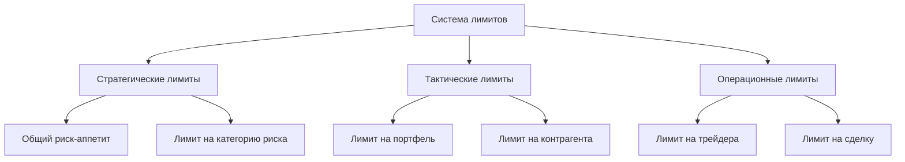

**Примеры лимитов для брокера:**

| Тип лимита         | Метрика                       | Значение лимита | Эскалация         |
| ------------------ | ----------------------------- | --------------- | ----------------- |
| **Стратегический** | VaR всего портфеля            | <3% капитала    | Совет директоров  |
| **Тактический**    | Экспозиция на один сектор     | <25% портфеля   | CRO               |
| **Тактический**    | Экспозиция на одного эмитента | <10% капитала   | CRO               |
| **Операционный**   | Лимит на трейдера (intraday)  | <1% капитала    | Head of Trading   |
| **Операционный**   | Размер одной сделки           | <500,000 сом    | Trader supervisor |
| **Ликвидность**    | Минимальный кэш               | >2 млн сом      | CFO               |

**Процесс управления лимитами:**

1. **Установление:** На основе риск-аппетита и капитала
2. **Мониторинг:** Ежедневная проверка соблюдения (автоматизированная)
3. **Эскалация:** При нарушении лимита — немедленное уведомление
4. **Превышение лимита:** Только с одобрения соответствующего уровня управления
5. **Пересмотр:** Ежеквартально или при изменении условий

### 7.3 Хеджирование рисков

**Распространенные стратегии хеджирования для участников рынка КР:**

#### 7.3.1 Валютный риск

**Проблема:** Брокер имеет long позицию $500,000 (экспозиция на USD)
**Решение:**

- Фьючерсы USD/KGS (если доступны на бирже)
- Форварды с банком
- Natural hedge: балансирование валютных активов и обязательств

#### 7.3.2 Процентный риск

**Проблема:** Управляющая компания имеет портфель облигаций duration = 5 лет
**Решение:**

- Interest rate swaps (если рынок развит)
- Балансирование портфеля короткими облигациями
- Floating rate notes для части портфеля

#### 7.3.3 Фондовый риск

**Проблема:** Маркет-мейкер имеет инвентарь акций
**Решение:**

- Индексные фьючерсы (если доступны)
- Опционы для асимметричной защиты
- Delta-hedging для портфеля опционов

**Примечание:** На развивающемся рынке КР многие производные инструменты недоступны. В таких случаях основные методы — диверсификация и лимиты.

---

## 8. Регуляторные требования к управлению рисками

### 8.1 Требования ГСФР (Госфиннадзор КР)

**Обязательные элементы системы управления рисками:**

1. **Политика управления рисками** (утверждается Советом директоров)
   - Риск-философия и риск-аппетит
   - Таксономия рисков
   - Распределение ролей и ответственности

2. **Процедуры управления рисками**
   - Методология идентификации, оценки, мониторинга
   - Процесс установления лимитов
   - Процесс эскалации и принятия решений

3. **Организационная структура**
   - Назначение CRO (Chief Risk Officer) или эквивалента
   - Комитет по рискам (для крупных участников)
   - Независимость функции риск-менеджмента от бизнеса

4. **Системы и инструменты**
   - Автоматизированный мониторинг лимитов
   - Система учета операционных убытков
   - Стресс-тестирование (минимум ежеквартально)

5. **Отчетность**
   - Риск-отчеты руководству (минимум ежемесячно)
   - Отчет Совету директоров (минимум ежеквартально)
   - Регуляторная отчетность (по требованию ГСФР)

### 8.2 Соответствие международным стандартам

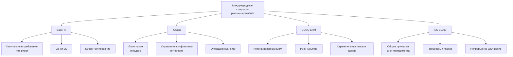

---

## 9. Практические кейсы

### 9.1 Кейс 1: Брокер "Альфа" — управление рыночным риском

**Ситуация:**

- Брокер "Альфа" имеет собственный портфель акций: 8 млн сом
- Портфель концентрирован: топ-3 позиции = 60% портфеля
- VaR (95%, 1 день) = 280,000 сом (3.5% капитала)
- Капитал: 8 млн сом
- Лимит VaR/Капитал: <3%

**Проблема:** Превышение лимита VaR

**Решение:**

1. **Диверсификация:** Сократить топ-3 позиции с 60% до 40%
2. **Снижение экспозиции:** Продать 15% портфеля, конвертировать в кэш
3. **Пересмотр лимита:** Обосновать повышение лимита до 3.5% (учитывая исторически низкую волатильность)

**Результат:**

- Новый VaR: 220,000 сом (2.75% капитала)
- Соответствие лимиту восстановлено
- Концентрация снижена до 45%

### 9.2 Кейс 2: Управляющая компания "Бета" — кредитный риск

**Ситуация:**

- Портфель облигаций: 50 млн сом AUM
- Эмитент "X" (рейтинг B+): 8 млн сом (16% портфеля)
- Лимит на одного эмитента: 10% портфеля
- "X" объявляет о финансовых трудностях, рейтинг понижен до B-
- PD для B- рейтинга: 8% (vs 3% для B+)

**Проблема:** Превышение лимита + рост кредитного риска

**Решение:**

1. **Немедленные действия:** Продать 3 млн сом облигаций "X" для соответствия лимиту
2. **Провести углубленный кредитный анализ "X":** привлечь аналитиков
3. **Информировать клиентов:** раскрыть информацию об экспозиции и действиях
4. **Резерв:** Создать резерв под ожидаемые убытки:
   - EL = 8% × 50% × 5,000,000 = 200,000 сом
5. **Watch list:** Добавить "X" в список усиленного мониторинга

**Результат:**

- Экспозиция снижена до 5 млн сом (10%)
- Резерв создан
- При последующем дефолте "X" убыток покрыт резервом, репутация сохранена

### 9.3 Кейс 3: Депозитарий "Гамма" — операционный риск

**Ситуация:**

- Депозитарий "Гамма" обслуживает 50 эмитентов
- Инцидент: В результате ошибки ПО произошел сбой учета прав на акции эмитента "Y"
- 500 акционеров затронуты
- Потенциальная ответственность: 10 млн сом

**Проблема:** Критический операционный риск, угроза репутации и регуляторных санкций

**Решение:**

1. **Кризисная команда:** Немедленное формирование, включая IT, комплаенс, юристов
2. **Анализ причин:** Root cause analysis — выявлена ошибка в обновлении ПО
3. **Восстановление данных:** Из резервных копий, верификация корректности
4. **Коммуникация:**
   - Уведомить ГСФР в течение 24 часов
   - Информировать затронутых акционеров
   - Публичное заявление с извинениями и планом действий
5. **Внедрение контролей:**
   - Усиленное тестирование обновлений ПО
   - Резервные системы в режиме hot standby
   - Независимая верификация критических операций
6. **Страховой клейм:** Подать заявку на возмещение по полису E&O insurance

**Результат:**

- Данные восстановлены в течение 48 часов
- Страховка покрыла 60% ущерба (6 млн сом)
- Репутационный ущерб минимизирован благодаря прозрачности
- Регулятор наложил штраф 500,000 сом (ниже максимального благодаря быстрому реагированию)
- Система усилена, вероятность повторения снижена с 15% до 2%

---

## 10. Внедрение риск-культуры

### 10.1 Элементы сильной риск-культуры

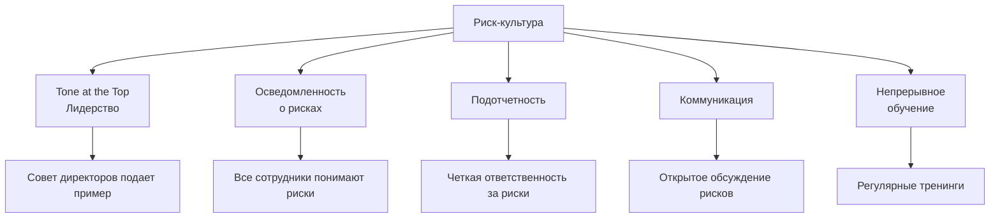

**Признаки сильной риск-культуры:**

- ✅ Риски обсуждаются открыто без страха наказания
- ✅ Сотрудники понимают свою роль в управлении рисками
- ✅ Решения принимаются с учетом соотношения риск/доходность
- ✅ Вознаграждение учитывает риск-взвешенную производительность
- ✅ "Near-miss" инциденты анализируются как возможность обучения

### 10.2 Программа обучения по рискам

**Уровни обучения:**

1. **Базовый (для всех сотрудников):**
   - Введение в риск-менеджмент
   - Таксономия рисков компании
   - Процесс эскалации инцидентов
   - Роль каждого в управлении рисками

2. **Средний (для менеджеров):**
   - RCSA и риск-регистр
   - Интерпретация KRI
   - Принятие риск-информированных решений
   - Владение рисками

3. **Продвинутый (для риск-специалистов):**
   - Количественные методы (VaR, ES, кредитные модели)
   - Stress-тестирование
   - Разработка и калибровка моделей
   - Регуляторные требования

### 10.3 Three Lines of Defense Model

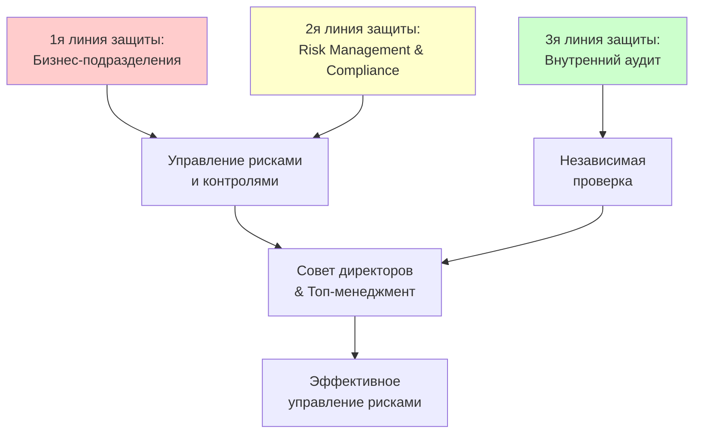

**Распределение ответственности:**

- **1я линия (Бизнес):**
  - Владеют рисками
  - Внедряют контроли
  - Отчитываются о рисках

- **2я линия (Risk & Compliance):**
  - Разрабатывают методологию
  - Мониторят риски
  - Консультируют бизнес
  - Независимый вызов (challenge) решений

- **3я линия (Internal Audit):**
  - Независимая проверка
  - Аудит эффективности 1й и 2й линий
  - Отчетность Совету директоров

---

## 11. Технологии в риск-менеджменте

### 11.1 RegTech и RiskTech решения

**Тренды автоматизации риск-менеджмента:**

1. **Автоматизированный мониторинг лимитов**
   - Real-time проверка лимитов
   - Автоматические алерты при приближении к лимиту
   - Блокировка сделок при превышении

2. **Машинное обучение для операционного риска**
   - Предсказание вероятности операционных сбоев
   - Anomaly detection в транзакциях
   - Natural Language Processing для анализа жалоб клиентов

3. **Стресс-тестирование как сервис**
   - Облачные платформы для сложных вычислений
   - Библиотеки готовых сценариев
   - Интеграция с рыночными данными

4. **Risk Data Aggregation**
   - Консолидация рисков из разных источников
   - Единая картина рисков организации
   - Соответствие BCBS 239 (для крупных участников)

### 11.2 Рекомендуемые решения для участников рынка КР

| Размер компании                 | Решение                                                                                | Стоимость (ориентировочно) |
| ------------------------------- | -------------------------------------------------------------------------------------- | -------------------------- |
| Малые брокеры (<10 сотрудников) | Excel + Power BI для KRI dashboard                                                     | $1,000-$3,000 в год        |
| Средние брокеры, управляющие    | Специализированное ПО (напр., Riskalyze, Aladdin)                                      | $10,000-$30,000 в год      |
| Крупные участники               | Enterprise Risk Management система (напр., Moody's RiskAuthority, SAS Risk Management) | $50,000-$200,000 в год     |

**Критерии выбора решения:**

- ✅ Соответствие регуляторным требованиям КР
- ✅ Интеграция с существующими системами
- ✅ Масштабируемость
- ✅ Поддержка и обновления
- ✅ Соотношение цена/качество

---

## 12. Выводы и рекомендации

### 12.1 Ключевые выводы

1. **Риск-менеджмент — не только комплаенс, но и стратегическое преимущество**
   - Компании с зрелым риск-менеджментом демонстрируют на 15-25% более высокую устойчивость в кризисы

2. **Интегрированный подход (ERM) более эффективен**
   - Силосный риск-менеджмент упускает взаимозависимости между рисками

3. **Количественные методы должны дополняться качественным суждением**
   - VaR и модели — инструменты, но не замена экспертизы

4. **Технологии критически важны**
   - Ручной мониторинг рисков не справляется с объемом и скоростью современных рынков

5. **Риск-культура — основа всего**
   - Лучшие методологии бесполезны без культуры осознания рисков

### 12.2 Roadmap внедрения

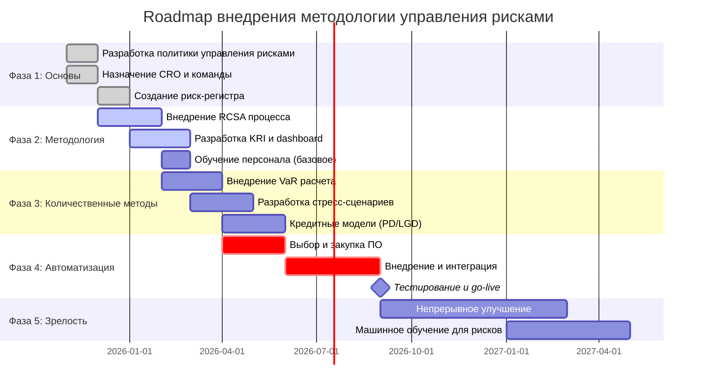

### 12.3 Рекомендации КФА участникам рынка

**Для малых участников (<20 сотрудников):**

1. Начните с простого: риск-регистр в Excel, базовые KRI
2. Используйте шаблоны КФА (доступны для членов)
3. Фокус на операционных рисках и комплаенсе
4. Постепенное внедрение количественных методов

**Для средних участников (20-100 сотрудников):**

1. Формализованная политика управления рисками
2. Назначение CRO (может совмещать с другими ролями)
3. Автоматизированный мониторинг лимитов
4. VaR и стресс-тестирование (минимум ежеквартально)
5. Обучение персонала по рискам

**Для крупных участников (>100 сотрудников):**

1. Зрелая ERM система с полным функционалом
2. Выделенный департамент управления рисками
3. Комитет по рискам на уровне Совета директоров
4. Продвинутые модели (кредитные модели, Монте-Карло)
5. Enterprise Risk Management ПО
6. Сертификация персонала (FRM, PRM и т.д.)

---

## Контакты и ресурсы

**Департамент управления рисками КФА**
📧 risk@kfa.kg
📞 +996 (312) 90-XX-XX

**Полезные ресурсы:**

- 📚 Библиотека шаблонов риск-документов: https://kfa.kg/risk-templates
- 🎓 Курсы по риск-менеджменту: https://kfa.kg/education/risk
- 🤝 Сообщество риск-специалистов КР: https://kfa.kg/community/risk

**Рекомендуемая литература:**

1. "Quantitative Risk Management" — McNeil, Frey, Embrechts
2. "The Essentials of Risk Management" — Crouhy, Galai, Mark
3. "Operational Risk Management" — Chapelle, Hubner, Peters
4. Basel Committee on Banking Supervision — принципы управления рисками

---

## Приложения

### Приложение A: Глоссарий

- **VaR (Value at Risk)**: Максимальный убыток портфеля с заданной вероятностью за определенный период
- **Expected Shortfall (ES)**: Средний убыток в худших (1-α)% случаев
- **LCR (Liquidity Coverage Ratio)**: Коэффициент покрытия ликвидности
- **PD (Probability of Default)**: Вероятность дефолта
- **LGD (Loss Given Default)**: Потери при дефолте
- **KRI (Key Risk Indicator)**: Ключевой индикатор риска
- **RCSA (Risk & Control Self-Assessment)**: Самооценка рисков и контролей
- **ERM (Enterprise Risk Management)**: Интегрированное управление рисками

### Приложение B: Шаблон политики управления рисками

_(Доступен для членов КФА на сайте https://kfa.kg/templates/risk-policy)_

**Структура документа:**

1. Цель и область применения
2. Риск-философия и риск-аппетит
3. Governance: роли и ответственность
4. Таксономия рисков
5. Процесс управления рисками (идентификация → оценка → управление → мониторинг)
6. Система лимитов
7. Стресс-тестирование
8. Отчетность
9. Пересмотр политики

---

**Версия:** 1.0
**Дата утверждения:** 22 октября 2025
**Следующий пересмотр:** 22 октября 2026
**Статус:** Утверждено Правлением КФА
