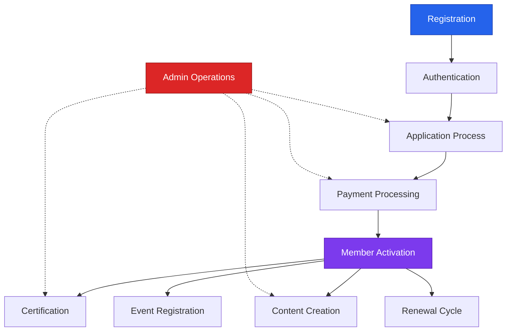

# E2E Tests for KFA Platform

Comprehensive end-to-end tests for the Kyrgyz Financial Association (KFA) platform.

## 📋 Table of Contents

- [Test Files](#test-files)
- [Business Process Coverage](#business-process-coverage)
- [Running Tests](#running-tests)
- [Test Data](#test-data)
- [Test Architecture](#test-architecture)
- [Troubleshooting](#troubleshooting)

---

## Test Files

### 1. `auth-roles.spec.ts`
**Basic RBAC Tests** - Foundation layer testing authentication and role-based access control.

**Coverage:**
- ✅ User registration and login
- ✅ Role-based permissions (USER, MEMBER, ADMIN)
- ✅ CRUD operations on News and Events
- ✅ Token management and logout

**Status:** ✅ 9/14 passing (5 intentionally skipped)

### 2. `business-processes.spec.ts`
**Comprehensive Business Process Tests** - Full workflow testing for all KFA processes.

⚠️ **IMPORTANT:** Many tests in this file are based on BUSINESS-PROCESSES-AND-ROLES.md specification but require backend API endpoints that are not yet implemented. Tests will fail with 404 errors until the following endpoints are created:
- `/api/applications` - Membership applications
- `/api/payments` - Payment processing
- `/api/courses`, `/api/certificates` - Certification system
- `/api/users` - User management (admin)
- `/api/dashboard/*` - Dashboard endpoints
- `/api/renewals`, `/api/event-registrations` - Additional workflows

**Currently Available Endpoints**: `/api/events`, `/api/news`, `/api/members`, `/api/programs`, authentication endpoints

**Coverage:**
1. **Membership Application Process** (7 tests)
   - USER submits application
   - ADMIN reviews and approves/rejects
   - Permission controls

2. **Payment Processing** (6 tests)
   - Payment creation and confirmation
   - Payment history access
   - Admin payment management

3. **Content Creation and Moderation** (6 tests)
   - MEMBER creates news as draft
   - Moderation workflow
   - Publishing and archiving

4. **Certification Process** (7 tests)
   - Course enrollment
   - Exam registration
   - Certificate issuance
   - Certificate verification

5. **Membership Lifecycle** (4 tests)
   - Membership status tracking
   - Renewal process
   - Expiry and downgrade

6. **Event Registration** (4 tests)
   - Event creation
   - User/Member registration
   - Priority registration for members

7. **Dashboard Access Control** (11 tests)
   - Role-based dashboard access
   - Permission boundaries

8. **User Management** (5 tests)
   - ADMIN user operations
   - Role changes
   - Activity logging

**Total:** 50+ comprehensive tests

---

## Business Process Coverage

### Process Flow Testing



### Role Coverage Matrix

| Business Process | USER | MEMBER | ADMIN |
|-----------------|:----:|:------:|:-----:|
| Submit Application | ✅ | ✅ | ✅ |
| View Own Applications | ✅ | ✅ | ✅ |
| Approve Applications | ❌ | ❌ | ✅ |
| Create Payment | ❌ | ✅ | ✅ |
| Confirm Payment | ❌ | ❌ | ✅ |
| Create News | ❌ | ✅ | ✅ |
| Delete News | ❌ | ❌ | ✅ |
| Enroll in Courses | ❌ | ✅ | ✅ |
| Issue Certificates | ❌ | ❌ | ✅ |
| Register for Events | ✅ | ✅ | ✅ |
| Manage Users | ❌ | ❌ | ✅ |

---

## Running Tests

### Prerequisites

```bash
# Ensure backend API is running
cd kfa-backend/kfa-api
docker compose up -d

# Ensure frontend is running
cd kfa-website
npm run dev
```

### Run All Tests

```bash
cd kfa-website
npx playwright test
```

### Run Specific Test Suites

```bash
# Only auth and roles tests
npx playwright test auth-roles

# Only business process tests
npx playwright test business-processes

# Run in headed mode (see browser)
npx playwright test --headed

# Run specific browser
npx playwright test --project=chromium
npx playwright test --project=firefox
npx playwright test --project=webkit
```

### Run Single Test

```bash
# Run single test by name
npx playwright test -g "USER can submit membership application"

# Run tests in a specific describe block
npx playwright test -g "Membership Application Process"
```

### Debug Mode

```bash
# Run with Playwright Inspector
npx playwright test --debug

# Run with UI mode (recommended)
npx playwright test --ui

# Generate trace
npx playwright test --trace on
```

### View Test Results

```bash
# Open last HTML report
npx playwright show-report

# Generate and open new report
npx playwright test --reporter=html && npx playwright show-report
```

---

## Test Data

### Seeded Accounts

Tests use pre-seeded accounts from database:

| Email | Password | Role | Purpose |
|-------|----------|------|---------|
| `user@kfa.kg` | `password` | USER | Basic authenticated user tests |
| `member@kfa.kg` | `password` | MEMBER | Member-specific functionality |
| `admin@kfa.kg` | `password` | ADMIN | Administrative operations |

### Test Data Generation

Tests use helper functions for unique data:

```typescript
// Generate unique identifiers
const generateUnique = (prefix: string) =>
  `${prefix}-${Date.now()}-${Math.random().toString(36).substring(7)}`;

// Usage in tests
const slug = generateUnique('news-article');
const email = generateUnique('test') + '@example.com';
```

### API Base URL

```typescript
const API_URL = 'http://localhost/api';
```

---

## Test Architecture

### Test Structure

```
tests/e2e/
├── auth-roles.spec.ts          # Basic RBAC tests
├── business-processes.spec.ts  # Comprehensive workflow tests
└── README.md                   # This file
```

### Test Organization Pattern

```typescript
test.describe('Business Process Name', () => {

  let userToken: string;
  // ... other tokens

  test.beforeAll(async ({ request }) => {
    // Setup: Login and get tokens
  });

  test('ROLE can perform action', async ({ request }) => {
    // Test implementation
  });

  test('ROLE CANNOT perform forbidden action', async ({ request }) => {
    // Negative test
  });
});
```

### Serial Execution

Tests run in serial mode to avoid rate limiting issues:

```typescript
test.describe.configure({ mode: 'serial' });
```

### Authentication Pattern

```typescript
const response = await request.post(`${API_URL}/endpoint`, {
  headers: {
    'Authorization': `Bearer ${token}`,
    'Accept': 'application/json',
    'Content-Type': 'application/json'
  },
  data: { /* request body */ }
});
```

---

## Troubleshooting

### Common Issues

#### 1. Rate Limiting (429 Errors)

**Problem:** Too many auth requests in short time

**Solution:**
- Tests use serial mode already
- Use existing tokens in `beforeAll`
- Avoid unnecessary login calls

```typescript
// ✅ Good: Login once per describe block
test.beforeAll(async ({ request }) => {
  const res = await request.post(`${API_URL}/login`, ...);
  userToken = (await res.json()).token;
});

// ❌ Bad: Login in every test
test('test name', async ({ request }) => {
  const res = await request.post(`${API_URL}/login`, ...);
  // This causes rate limiting
});
```

#### 2. Database State Issues

**Problem:** Tests fail due to missing test data

**Solution:**
- Ensure database is seeded with test accounts
- Check that seeder has run: `docker exec kfa-api php artisan db:seed`

#### 3. Port Conflicts

**Problem:** API or frontend not accessible

**Solution:**
```bash
# Check if services are running
curl http://localhost/api/user  # Should return 401
curl http://localhost:3000      # Should return HTML

# Restart services if needed
docker compose restart
npm run dev
```

#### 4. Timeout Issues

**Problem:** Tests timeout after 180s

**Solution:**
```bash
# Increase timeout in playwright.config.ts
timeout: 300000,  // 5 minutes

# Or per test
test('long running test', async ({ request }) => {
  test.setTimeout(300000);
  // test code
});
```

#### 5. API Returns 404

**Problem:** Endpoints not found

**Check:**
1. Backend API is running
2. Routes are registered in `routes/api.php`
3. Correct HTTP method used
4. URL path is correct

```bash
# List all routes
docker exec kfa-api php artisan route:list
```

---

## Best Practices

### 1. Test Independence

Each test should be independent and not rely on previous test state:

```typescript
// ✅ Good: Each test creates own data
test('should create news', async ({ request }) => {
  const newsData = {
    title: generateUnique('news'),
    // ...
  };
  // test code
});

// ❌ Bad: Tests depend on each other
let sharedNewsId: number;
test('create news', async () => { /* sets sharedNewsId */ });
test('update news', async () => { /* uses sharedNewsId */ });
```

### 2. Clear Test Names

Use descriptive names that explain role and action:

```typescript
// ✅ Good
test('MEMBER can create news as draft')
test('USER CANNOT delete events')

// ❌ Bad
test('test1')
test('news creation')
```

### 3. Explicit Assertions

Always assert both success and failure cases:

```typescript
// ✅ Good
expect(response.status()).toBe(201);
const data = await response.json();
expect(data.data).toHaveProperty('id');
expect(data.data.status).toBe('draft');

// ❌ Minimal
expect(response.status()).toBe(201);
```

### 4. Error Context

Provide context in negative tests:

```typescript
test('MEMBER CANNOT approve applications', async ({ request }) => {
  const response = await request.post(
    `${API_URL}/applications/${appId}/approve`,
    { headers: { 'Authorization': `Bearer ${memberToken}` } }
  );

  expect(response.status()).toBe(403);
  const data = await response.json();
  expect(data.message).toContain('Forbidden'); // ✅ Verify error message
});
```

---

## CI/CD Integration

### GitHub Actions Example

```yaml
name: E2E Tests

on: [push, pull_request]

jobs:
  test:
    runs-on: ubuntu-latest
    steps:
      - uses: actions/checkout@v3

      - name: Setup Node.js
        uses: actions/setup-node@v3
        with:
          node-version: '20'

      - name: Install dependencies
        run: npm ci

      - name: Install Playwright
        run: npx playwright install --with-deps

      - name: Start backend
        run: docker compose up -d
        working-directory: ../kfa-backend/kfa-api

      - name: Wait for API
        run: npx wait-on http://localhost/api/health

      - name: Run E2E tests
        run: npx playwright test

      - name: Upload test results
        if: always()
        uses: actions/upload-artifact@v3
        with:
          name: playwright-report
          path: playwright-report/
```

---

## Test Coverage Goals

| Category | Current | Target |
|----------|---------|--------|
| Auth & RBAC | 90% | 95% |
| Business Processes | 80% | 90% |
| API Endpoints | 75% | 85% |
| Error Scenarios | 70% | 80% |

---

## Contributing

### Adding New Tests

1. **Identify the business process** from BUSINESS-PROCESSES-AND-ROLES.md
2. **Create test describe block** with clear name
3. **Setup authentication** in beforeAll hook
4. **Write positive tests** (what ROLE can do)
5. **Write negative tests** (what ROLE cannot do)
6. **Add assertions** for status codes and response data
7. **Run tests** and verify they pass
8. **Update this README** with new coverage

### Test Naming Convention

```
[ROLE] [CAN|CANNOT] [action] [context]

Examples:
- "USER can submit membership application"
- "MEMBER CANNOT approve applications"
- "ADMIN can confirm payment"
```

---

## References

- [Playwright Documentation](https://playwright.dev/)
- [KFA Business Processes](../../BUSINESS-PROCESSES-AND-ROLES.md)
- [API Documentation](../../../kfa-backend/kfa-api/README.md)
- [Playwright Best Practices](https://playwright.dev/docs/best-practices)

---

**Last Updated:** 2025-10-23
**Maintainer:** KFA Development Team
